# Professor-Research-Quick-Insights

A repository for quickly accessing research insights into professors' expertise across various universities and fields. Each section is organized by university, school, and field, with individual professor links to in-depth Q&A summaries.

---

## Universities

## [Stanford](https://www.stanford.edu/)

Click to expand Stanford Professors

### [Mechanical Engineering](https://me.stanford.edu/)

- **Field**: Mix

  <table>
    <tr>
      <td align="center">
        <a href="research-quickview/stanford/me/matthew-edwards/research-overview.md">
           
          <b>Matthew Edwards</b>
        </a>
        
超快激光控制、等离子体光学、粒子加速技术

      </td>
      <td align="center">
        <a href="research-quickview/stanford/me/kenneth-goodson/research-overview.md">
           
          <b>Kenneth Goodson</b>
        </a>
        
微尺度散热、液气双相冷却、高热通量管理

      </td>
      <td align="center">
        <a href="research-quickview/stanford/me/ronald-hanson/research-overview.md">
           
          <b>Ronald Hanson</b>
        </a>
        
燃烧动力学、高温光谱诊断、激波管技术（模拟高温高压气体行为）

      </td>
    </tr>
  </table>

### [Electrical Engineering](https://ee.stanford.edu/)

- **Learn about Professor**: Stanford EE website->People->Faculty->Areas

- **Field**: Nanotechnology, nanofabrication, materials, advanced packaging and manufacturing technologies

<table>
  <tr>
    <td align="center">
      <a href="research-quickview/stanford/ee/joonhee-choi/research-overview.md">
        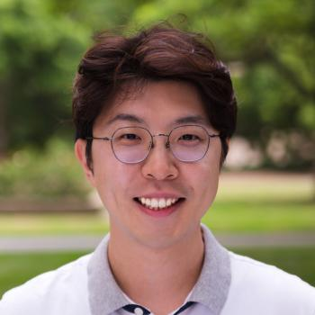 
        <b>Joonhee Choi</b>
      </a>
      
量子态操控、量子计算与通信、多体量子动力学

    </td>
    <td align="center">
      <a href="research-quickview/stanford/ee/srabanti-chowdhury/research-overview.md">
         
        <b>Srabanti Chowdhury</b>
      </a>
      
纳米技术、集成电路与系统

    </td>
    <td align="center">
      <a href="research-quickview/stanford/ee/daniel-congreve/research-overview.md">
         
        <b>Daniel Congreve</b>
      </a>
      
光子学、能源与可持续性

    </td>
    <td align="center">
      <a href="research-quickview/stanford/ee/jonathan-fan/research-overview.md">
        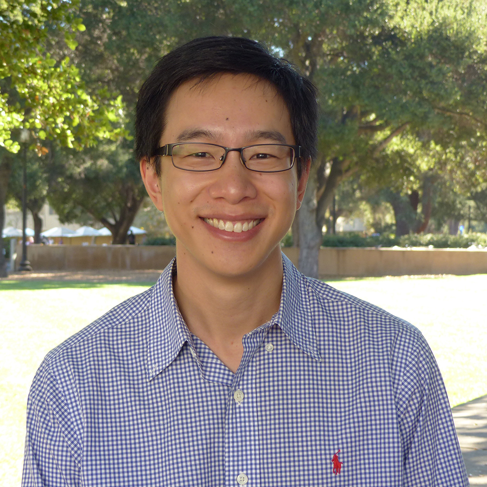 
        <b>Jonathan Fan</b>
      </a>
      
纳米技术、量子科学与工程

    </td>
  </tr>
  <tr>
    <td align="center">
      <a href="research-quickview/stanford/ee/siddharth-krishnan/research-overview.md">
         
        <b>Siddharth Krishnan</b>
      </a>
      
生物医学设备、传感器和系统

    </td>
    <td align="center">
      <a href="research-quickview/stanford/ee/piero-pianetta/research-overview.md">
         
        <b>Piero A. Pianetta</b>
      </a>
      
纳米技术、集成电路与系统

    </td>
    <td align="center">
      <a href="research-quickview/stanford/ee/james-plummer/research-overview.md">
         
        <b>James D. Plummer</b>
      </a>
      
纳米技术、能源与可持续性

    </td>
    <td align="center">
      <a href="research-quickview/stanford/ee/eric-pop/research-overview.md">
        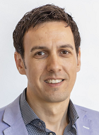 
        <b>Eric Pop</b>
      </a>
      
纳米尺度热管理、相变存储器、二维材料纳米电子器件

    </td>
  </tr>
  <tr>
    <td align="center">
      <a href="research-quickview/stanford/ee/juan-rivas/research-overview.md">
         
        <b>Juan Rivas</b>
      </a>
      
纳米技术、能源与可持续性

    </td>
    <td align="center">
      <a href="research-quickview/stanford/ee/krishna-saraswat/research-overview.md">
         
        <b>Krishna Saraswat</b>
      </a>
      
纳米技术、集成电路与系统

    </td>
    <td align="center">
      <a href="research-quickview/stanford/ee/debbie-senesky/research-overview.md">
         
        <b>Debbie Senesky</b>
      </a>
      
环境传感器、嵌入式系统

    </td>
    <td align="center">
      <a href="research-quickview/stanford/ee/jelena-vuckovic/research-overview.md">
        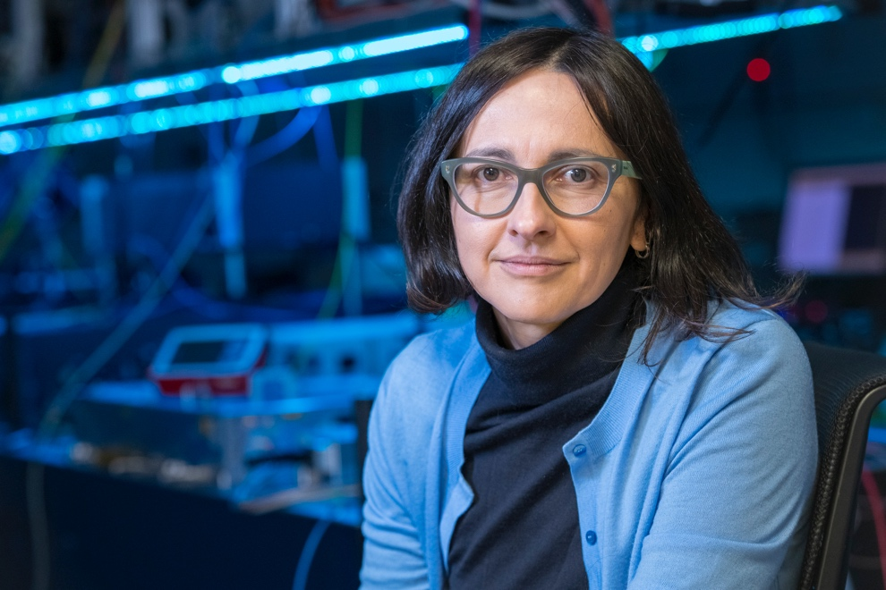 
        <b>Jelena Vuckovic</b>
      </a>
      
纳米光子器件、量子计算、光通信与光传感

    </td>
  </tr>
  <tr>
    <td align="center">
      <a href="research-quickview/stanford/ee/shan-wang/research-overview.md">
         
        <b>Shan X. Wang</b>
      </a>
      
生物医学设备、集成电路与系统

    </td>
    <td align="center">
      <a href="research-quickview/stanford/ee/h-s-philip-wong/research-overview.md">
        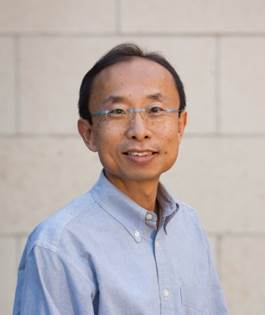 
        <b>H.-S. Philip Wong</b>
      </a>
      
碳纳米管晶体管，铁电场效应晶体管，存算一体架构，三维堆叠存储

    </td>
  </tr>
</table>

- **Field**: Quantum science and engineering, Photonics

  <table>
    <tr>
      <td align="center">
        <a href="research-quickview/stanford/ee/olav-solgaard/research-overview.md">
          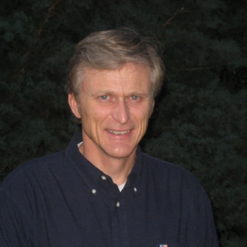 
          <b>Olav Solgaard</b>
        </a>
        
纳米光学结构、MEMS相移器与空间光调制器、光子区块链与光子计算、介质激光加速

      </td>
    </tr>
  </table>

<!-- End of Stanford University Section -->
<!-- End of Stanford University Section -->
<!-- End of Stanford University Section -->

## [UCB](https://www.berkeley.edu/)

Click to expand UCB Professors

  
## [University of California, Berkeley--UCB](https://www.berkeley.edu/)
### [Colleges and Schools](https://www.berkeley.edu/academics/schools-colleges/)
### [College of Engineering](https://engineering.berkeley.edu/)

### [Mechanical Engineering](https://me.berkeley.edu/)
- **Field**：[MEMS/Nano](https://me.berkeley.edu/faculty/faculty-by-research-area/?tx_subject_area=mems-nano)
<table>
    <tr>
        <td align="center">
            <a href="research-quickview/ucb/me/m-reza-alam/research-overview.md">
                 
                <b>M. Reza Alam</b>
            </a>
            
理论流体力学 非线性波力学 海洋与沿海波现象 海洋可再生能源

        </td>
        <td align="center">
            <a href="research-quickview/ucb/me/chris-dames/research-overview.md">
                 
                <b>Chris Dames</b>
            </a>
            
热传导 纳米材料热物理 热电材料 热管理

        </td>
        <td align="center">
            <a href="research-quickview/ucb/me/costas-grigoropoulos/research-overview.md">
                 
                <b>Costas Grigoropoulos</b>
            </a>
            
激光材料加工 微纳米制造 热传导 光学诊断

        </td>
        <td align="center">
            <a href="research-quickview/ucb/me/roberto-horowitz/research-overview.md">
                 
                <b>Roberto Horowitz</b>
            </a>
            
控制系统 机电一体化 精密运动控制 智能交通系统

        </td>
    </tr>
    <tr>
        <td align="center">
            <a href="research-quickview/ucb/me/david-horsley/research-overview.md">
                 
                <b>David Horsley</b>
            </a>
            
微机电系统（MEMS） 传感器和执行器设计 微机械谐振器 微流体

        </td>
        <td align="center">
            <a href="research-quickview/ucb/me/kyriakos-komvopoulos/research-overview.md">
                 
                <b>Kyriakos Komvopoulos</b>
            </a>
            
表面工程 纳米摩擦学 薄膜力学 微纳米制造

        </td>
        <td align="center">
            <a href="research-quickview/ucb/me/dorian-liepmann/research-overview.md">
                 
                <b>Dorian Liepmann</b>
            </a>
            
生物流体力学 微流体装置 生物医学工程 微机电系统（MEMS）

        </td>
        <td align="center">
            <a href="research-quickview/ucb/me/liwei-lin/research-overview.md">
                 
                <b>Liwei Lin</b>
            </a>
            
微纳米机电系统（MEMS/NEMS） 微传感器和执行器 纳米材料和纳米制造

        </td>
    </tr>
    <tr>
        <td align="center">
            <a href="research-quickview/ucb/me/mohammad-mofrad/research-overview.md">
                 
                <b>Mohammad R. K. Mofrad</b>
            </a>
            
细胞力学 生物力学 计算生物学 分子动力学模拟

        </td>
        <td align="center">
            <a href="research-quickview/ucb/me/ravi-prasher/research-overview.md">
                 
                <b>Ravi Prasher</b>
            </a>
            
热管理 纳米材料热物理 能源转换与存储 热电材料

        </td>
        <td align="center">
            <a href="research-quickview/ucb/me/lydia-sohn/research-overview.md">
                 
                <b>Lydia Sohn</b>
            </a>
            
生物物理学 微流体技术 单细胞分析 癌症检测

        </td>
        <td align="center">
            <a href="research-quickview/ucb/me/hayden-taylor/research-overview.md">
                 
                <b>Hayden Taylor</b>
            </a>
            
增材制造 光刻技术 微纳米制造 光学工程

        </td>
    </tr>
    <tr>
        <td align="center">
            <a href="research-quickview/ucb/me/vassilia-zorba/research-overview.md">
                 
                <b>Vassilia Zorba</b>
            </a>
            
暂无公开的研究兴趣

        </td>
    </tr>
</table>

- **Field**：[Biomechanical Engineering](https://me.berkeley.edu/faculty/faculty-by-research-area/?tx_subject_area=bme)
<table>
    <tr>
        <td align="center">
            <a href="research-quickview/ucb/me/costas-grigoropoulos/research-overview.md">
                 
                <b>Costas Grigoropoulos</b>
            </a>
            
激光材料加工、微纳米制造、热传导、光学诊断

        </td>
        <td align="center">
            <a href="research-quickview/ucb/me/homayoon-kazerooni/research-overview.md">
                 
                <b>Homayoon Kazerooni</b>
            </a>
            
机器人技术、外骨骼系统、人机交互、控制系统

        </td>
        <td align="center">
            <a href="research-quickview/ucb/me/tony-keaveny/research-overview.md">
                 
                <b>Tony M. Keaveny</b>
            </a>
            
生物力学、骨骼力学、骨质疏松症、骨折风险评估

        </td>
        <td align="center">
            <a href="research-quickview/ucb/me/kyriakos-komvopoulos/research-overview.md">
                 
                <b>Kyriakos Komvopoulos</b>
            </a>
            
表面工程、纳米摩擦学、薄膜力学、微纳米制造

        </td>
    </tr>
    <tr>
        <td align="center">
            <a href="research-quickview/ucb/me/dorian-liepmann/research-overview.md">
                 
                <b>Dorian Liepmann</b>
            </a>
            
生物流体力学、微流体装置、生物医学工程、微机电系统（MEMS）

        </td>
        <td align="center">
            <a href="research-quickview/ucb/me/liwei-lin/research-overview.md">
                 
                <b>Liwei Lin</b>
            </a>
            
微纳米机电系统（MEMS/NEMS）、微传感器和执行器、纳米材料和纳米制造

        </td>
        <td align="center">
            <a href="research-quickview/ucb/me/mohammad-mofrad/research-overview.md">
                 
                <b>Mohammad R. K. Mofrad</b>
            </a>
            
细胞力学、生物力学、计算生物学、分子动力学模拟

        </td>
        <td align="center">
            <a href="research-quickview/ucb/me/grace-oconnell/research-overview.md">
                 
                <b>Grace D. O’Connell</b>
            </a>
            
软组织力学、脊柱生物力学、组织工程、计算建模

        </td>
    </tr>
    <tr>
        <td align="center">
            <a href="research-quickview/ucb/me/oliver-oreilly/research-overview.md">
                 
                <b>Oliver M. O’Reilly</b>
            </a>
            
非线性动力学、连续介质力学、振动分析、机械系统建模

        </td>
        <td align="center">
            <a href="research-quickview/ucb/me/panayiotis-papadopoulos/research-overview.md">
                 
                <b>Panayiotis Papadopoulos</b>
            </a>
            
固体力学、计算力学、生物力学、材料行为

        </td>
        <td align="center">
            <a href="research-quickview/ucb/me/lisa-pruitt/research-overview.md">
                 
                <b>Lisa Pruitt</b>
            </a>
            
生物材料、聚合物力学、组织工程、医疗器械设计

        </td>
        <td align="center">
            <a href="research-quickview/ucb/me/omer-savas/research-overview.md">
                 
                <b>Ömer Savaş</b>
            </a>
            
流体动力学、涡流动力学、湍流流动、实验流体力学

        </td>
        <td align="center">
            <a href="research-quickview/ucb/me/shawn-shadden/research-overview.md">
                 
                <b>Shawn Shadden</b>
            </a>
            
计算生物流体力学、心血管系统建模、血流动力学、数据驱动建模

        </td>
        <td align="center">
            <a href="research-quickview/ucb/me/lydia-sohn/research-overview.md">
                 
                <b>Lydia Sohn</b>
            </a>
            
生物物理学、微流体技术、单细胞分析、癌症检测

        </td>
        <td align="center">
            <a href="research-quickview/ucb/me/david-steigmann/research-overview.md">
                 
                <b>David Steigmann</b>
            </a>
            
连续介质力学、弹性理论、计算力学、材料建模

        </td>
    </tr>
    <tr>
        <td align="center">
            <a href="research-quickview/ucb/me/tarek-zohdi/research-overview.md">
                 
                <b>Tarek I. Zohdi</b>
            </a>
            
计算力学、多尺度建模、材料科学、增材制造

        </td>
    </tr>
</table>

 

### [Electrical Engineering and Computer Sciences](https://eecs.berkeley.edu/)
- **Field**：EE
<table>
    <tr>
        <td align="center">
            <a href="research-quickview/ucb/eecs/elad-alon/research-overview.md">
                 
                <b>Elad Alon</b>
            </a>
            
集成电路设计、建模与分析，信息、数据和网络科学，计算机体系结构与工程。

        </td>
        <td align="center">
            <a href="research-quickview/ucb/eecs/venkat-anantharam/research-overview.md">
                 
                <b>Venkat Anantharam</b>
            </a>
            
信息理论与编码、人工智能、控制系统与机器人学、信号处理和安全。

        </td>
        <td align="center">
            <a href="research-quickview/ucb/eecs/gopala-krishna-anumanchipalli/research-overview.md">
                 
                <b>Gopala Krishna Anumanchipalli</b>
            </a>
            
人工智能、生物系统与计算生物学、信号处理、人机交互。

        </td>
        <td align="center">
            <a href="research-quickview/ucb/eecs/murat-arcak/research-overview.md">
                 
                <b>Murat Arcak</b>
            </a>
            
控制系统、智能系统与机器人、网络化控制系统、分布式优化、非线性系统。

        </td>
    </tr>
    <tr>
        <td align="center">
            <a href="research-quickview/ucb/eecs/ana-claudia-arias/research-overview.md">
                 
                <b>Ana Claudia Arias</b>
            </a>
            
物理电子学，功率和能源，微纳电子学和材料科学。

        </td>
        <td align="center">
            <a href="research-quickview/ucb/eecs/david-attwood/research-overview.md">
                 
                <b>David Attwood</b>
            </a>
            
物理电子学，生物系统与计算生物学，纳米技术。

        </td>
        <td align="center">
            <a href="research-quickview/ucb/eecs/babak-ayazifar/research-overview.md">
                 
                <b>Babak Ayazifar</b>
            </a>
            
信号处理，教育技术，通信系统和数据分析。

        </td>
        <td align="center">
            <a href="research-quickview/ucb/eecs/ruzena-bajcsy/research-overview.md">
                 
                <b>Ruzena Bajcsy</b>
            </a>
            
人工智能、机器人学、人机交互、控制系统、生物系统与计算生物学。

        </td>
    </tr>
    <tr>
        <td align="center">
            <a href="research-quickview/ucb/eecs/alexandre-bayen/research-overview.md">
                 
                <b>Alexandre Bayen</b>
            </a>
            
控制、智能系统与机器人，网络化控制，电力系统，智能交通系统。

        </td>
        <td align="center">
            <a href="research-quickview/ucb/eecs/jeffrey-bokor/research-overview.md">
                 
                <b>Jeffrey Bokor</b>
            </a>
            
物理电子学，量子计算，纳米电子学。

        </td>
        <td align="center">
            <a href="research-quickview/ucb/eecs/jessica-boles/research-overview.md">
                 
                <b>Jessica Boles</b>
            </a>
            
功率和能源，集成电路，微纳电机械系统，物理电子学。

        </td>
        <td align="center">
            <a href="research-quickview/ucb/eecs/bernhard-boser/research-overview.md">
                 
                <b>Bernhard Boser</b>
            </a>
            
设计、建模和分析（DMA）、集成电路、物理电子学。

        </td>
    </tr>
    <tr>
        <td align="center">
            <a href="research-quickview/ucb/eecs/john-chuang/research-overview.md">
                 
                <b>John Chuang</b>
            </a>
            
生物系统与计算生物学，信息、数据、网络与通信科学，操作系统与网络，安全。

        </td>
        <td align="center">
            <a href="research-quickview/ucb/eecs/steven-conolly/research-overview.md">
                 
                <b>Steven Conolly</b>
            </a>
            
生物系统与计算生物学，信号处理，医学成像。

        </td>
        <td align="center">
            <a href="research-quickview/ucb/eecs/thomas-courtade/research-overview.md">
                 
                <b>Thomas Courtade</b>
            </a>
            
信息、数据、网络与通信科学，人工智能，控制系统与机器人，生物系统与计算生物学。

        </td>
        <td align="center">
            <a href="research-quickview/ucb/eecs/trevor-darrell/research-overview.md">
                 
                <b>Trevor Darrell</b>
            </a>
            
人工智能，控制系统与机器人。

        </td>
    </tr>
    <tr>
        <td align="center">
            <a href="research-quickview/ucb/eecs/prabal-dutta/research-overview.md">
                 
                <b>Prabal Dutta</b>
            </a>
            
计算机体系结构，网络化控制系统，嵌入式系统，操作系统。

        </td>
        <td align="center">
            <a href="research-quickview/ucb/eecs/alexei-efros/research-overview.md">
                 
                <b>Alexei Efros</b>
            </a>
            
人工智能，计算机视觉，计算摄影学。

        </td>
        <td align="center">
            <a href="research-quickview/ucb/eecs/laurent-el-ghaoui/research-overview.md">
                 
                <b>Laurent El Ghaoui</b>
            </a>
            
控制系统与智能系统，优化与系统理论。

        </td>
        <td align="center">
            <a href="research-quickview/ucb/eecs/ronald-fearing/research-overview.md">
                 
                <b>Ronald Fearing</b>
            </a>
            
控制系统与智能系统，生物系统与计算生物学，机器人学。

        </td>
    </tr>
    <tr>
        <td align="center">
            <a href="research-quickview/ucb/eecs/robert-full/research-overview.md">
                 
                <b>Robert Full</b>
            </a>
            
生物系统与计算生物学，生物学机器人学，生物力学。

        </td>
        <td align="center">
            <a href="research-quickview/ucb/eecs/paul-gray/research-overview.md">
                 
                <b>Paul R. Gray</b>
            </a>
            
设计、建模与分析，集成电路。

        </td>
        <td align="center">
            <a href="research-quickview/ucb/eecs/t-kenneth-gustafson/research-overview.md">
                 
                <b>T. Kenneth Gustafson</b>
            </a>
            
控制系统与智能系统，优化系统理论。

        </td>
        <td align="center">
            <a href="research-quickview/ucb/eecs/bjorn-hartmann/research-overview.md">
                 
                <b>Björn Hartmann</b>
            </a>
            
人机交互，编程系统，网络化控制系统，图形学。

        </td>
    </tr>
    <tr>
        <td align="center">
            <a href="research-quickview/ucb/eecs/chenming-hu/research-overview.md">
                 
                <b>Chenming Hu</b>
            </a>
            
集成电路，物理电子学，半导体技术。

        </td>
        <td align="center">
            <a href="research-quickview/ucb/eecs/vikram-jain/research-overview.md">
                 
                <b>Vikram Jain</b>
            </a>
            
计算机体系结构，集成电路。

        </td>
        <td align="center">
            <a href="research-quickview/ucb/eecs/ali-javey/research-overview.md">
                 
                <b>Ali Javey</b>
            </a>
            
物理电子学，功率和能源，微纳电机械系统。

        </td>
        <td align="center">
            <a href="research-quickview/ucb/eecs/jiantao-jiao/research-overview.md">
                 
                <b>Jiantao Jiao</b>
            </a>
            
人工智能，信息、数据、网络与通信科学，控制系统与机器人，信号处理。

        </td>
    </tr>
    <tr>
        <td align="center">
            <a href="research-quickview/ucb/eecs/boubacar-kante/research-overview.md">
                 
                <b>Boubacar Kanté</b>
            </a>
            
物理电子学，功率和能源。

        </td>
        <td align="center">
            <a href="research-quickview/ucb/eecs/sagar-karandikar/research-overview.md">
                 
                <b>Sagar Karandikar</b>
            </a>
            
计算机体系结构，操作系统与网络，集成电路。

        </td>
        <td align="center">
            <a href="research-quickview/ucb/eecs/edward-l-keller/research-overview.md">
                 
                <b>Edward L. Keller</b>
            </a>
            
生物医学工程，医学图像处理。

        </td>
        <td align="center">
            <a href="research-quickview/ucb/eecs/kurt-keutzer/research-overview.md">
                 
                <b>Kurt Keutzer</b>
            </a>
            
人工智能，计算机体系结构，科学计算。

        </td>
    </tr>
    <tr>
        <td align="center">
            <a href="research-quickview/ucb/eecs/preeya-khanna/research-overview.md">
                 
                <b>Preeya Khanna</b>
            </a>
            
生物系统与计算生物学，人机交互，信号处理，人工智能。

        </td>
        <td align="center">
            <a href="research-quickview/ucb/eecs/tsu-jae-king-liu/research-overview.md">
                 
                <b>Tsu-Jae King Liu</b>
            </a>
            
物理电子学，微纳电机械系统。

        </td>
    </tr>
    <tr>
        <td align="center">
            <a href="research-quickview/ucb/eecs/kam-lau/research-overview.md">
                 
                <b>Kam Y. Lau</b>
            </a>
            
信息、数据、网络与通信科学（IDNCS）

        </td>
        <td align="center">
            <a href="research-quickview/ucb/eecs/edward-lee/research-overview.md">
                 
                <b>Edward A. Lee</b>
            </a>
            
网络物理系统与设计自动化（CPSDA），编程系统（PS），信号处理（SP），计算机体系结构与工程（ARC），信息、数据、网络与通信科学（IDNCS），设计、建模与分析（DMA）

        </td>
        <td align="center">
            <a href="research-quickview/ucb/eecs/luke-lee/research-overview.md">
                 
                <b>Luke Lee</b>
            </a>
            
生物系统与计算生物学（BIO），微纳电子机械系统（MEMS），物理电子学（PHY）

        </td>
        <td align="center">
            <a href="research-quickview/ucb/eecs/edwin-lewis/research-overview.md">
                 
                <b>Edwin R. Lewis</b>
            </a>
            
生物系统与计算生物学（BIO）

        </td>
    </tr>
    <tr>
        <td align="center">
            <a href="research-quickview/ucb/eecs/michael-lieberman/research-overview.md">
                 
                <b>Michael A. Lieberman</b>
            </a>
            
电力与能源（ENE）

        </td>
        <td align="center">
            <a href="research-quickview/ucb/eecs/chunlei-liu/research-overview.md">
                 
                <b>Chunlei Liu</b>
            </a>
            
生物系统与计算生物学（BIO），信号处理（SP）

        </td>
        <td align="center">
            <a href="research-quickview/ucb/eecs/michael-lustig/research-overview.md">
                 
                <b>Michael Lustig</b>
            </a>
            
信号处理（SP），医学成像

        </td>
        <td align="center">
            <a href="research-quickview/ucb/eecs/eric-ma/research-overview.md">
                 
                <b>Eric Y. Ma</b>
            </a>
            
物理电子学（PHY），电力与能源（ENE），人机交互（HCI）

        </td>
    </tr>
    <tr>
        <td align="center">
            <a href="research-quickview/ucb/eecs/yi-ma/research-overview.md">
                 
                <b>Yi Ma</b>
            </a>
            
人工智能（AI），控制、智能系统与机器人（CIR），信号处理（SP）

        </td>
        <td align="center">
            <a href="research-quickview/ucb/eecs/michel-maharbiz/research-overview.md">
                 
                <b>Michel Maharbiz</b>
            </a>
            
生物系统与计算生物学（BIO），微纳电子机械系统（MEMS）

        </td>
        <td align="center">
            <a href="research-quickview/ucb/eecs/jitendra-malik/research-overview.md">
                 
                <b>Jitendra Malik</b>
            </a>
            
人工智能（AI），控制、智能系统与机器人（CIR），信号处理（SP）

        </td>
        <td align="center">
        </td>
    </tr>
    <tr>
        <td align="center">
            <a href="research-quickview/ucb/eecs/song-mei/research-overview.md">
                 
                <b>Song Mei</b>
            </a>
            
人工智能（AI），信号处理（SP），理论（THY），控制、智能系统与机器人（CIR），信息、数据、网络与通信科学（IDNCS）

        </td>
        <td align="center">
            <a href="research-quickview/ucb/eecs/david-messerschmitt/research-overview.md">
                 
                <b>David G. Messerschmitt</b>
            </a>
            
信息、数据、网络与通信科学（IDNCS），信号处理（SP）

        </td>
        <td align="center">
            <a href="research-quickview/ucb/eecs/robert-meyer/research-overview.md">
                 
                <b>Robert G. Meyer</b>
            </a>
            
集成电路（INC）

        </td>
        <td align="center">
            <a href="research-quickview/ucb/eecs/nelson-morgan/research-overview.md">
                 
                <b>Nelson Morgan</b>
            </a>
            
信号处理（SP）

        </td>
    </tr>
    <tr>
        <td align="center">
            <a href="research-quickview/ucb/eecs/richard-muller/research-overview.md">
                 
                <b>Richard S. Muller</b>
            </a>
            
集成电路（INC）

        </td>
        <td align="center">
            <a href="research-quickview/ucb/eecs/rikky-muller/research-overview.md">
                 
                <b>Rikky Muller</b>
            </a>
            
集成电路（INC），生物系统与计算生物学（BIO），微纳电子机械系统（MEMS），物理电子学（PHY）

        </td>
        <td align="center">
            <a href="research-quickview/ucb/eecs/andrew-neureuther/research-overview.md">
                 
                <b>Andrew R. Neureuther</b>
            </a>
            
集成电路（INC）

        </td>
        <td align="center">
            <a href="research-quickview/ucb/eecs/clark-nguyen/research-overview.md">
                 
                <b>Clark Nguyen</b>
            </a>
            
微纳电子机械系统（MEMS），集成电路（INC），物理电子学（PHY），设计、建模与分析（DMA）

        </td>
    </tr>
    <tr>
        <td align="center">
            <a href="research-quickview/ucb/eecs/ali-niknejad/research-overview.md">
                 
                <b>Ali Niknejad</b>
            </a>
            
集成电路（INC），物理电子学（PHY），信号处理（SP），信息、数据、网络与通信科学（IDNCS），设计、建模与分析（DMA）

        </td>
        <td align="center">
            <a href="research-quickview/ucb/eecs/borivoje-nikolic/research-overview.md">
                 
                <b>Borivoje Nikolic</b>
            </a>
            
集成电路（INC），信息、数据、网络与通信科学（IDNCS），设计、建模与分析（DMA），计算机体系结构与工程（ARC）

        </td>
        <td align="center">
            <a href="research-quickview/ucb/eecs/pierluigi-nuzzo/research-overview.md">
                 
                <b>Pierluigi Nuzzo</b>
            </a>
            
网络物理系统与设计自动化（CPSDA），控制、智能系统与机器人（CIR），集成电路（INC），计算机体系结构与工程（ARC），人工智能（AI），电力与能源（ENE），编程系统（PS），安全（SEC），理论（THY）

        </td>
        <td align="center">
            <a href="research-quickview/ucb/eecs/william-oldham/research-overview.md">
                 
                <b>William G. Oldham</b>
            </a>
            
无

        </td>
    </tr>
    <tr>
        <td align="center">
            <a href="research-quickview/ucb/eecs/bruno-olshausen/research-overview.md">
                 
                <b>Bruno Olshausen</b>
            </a>
            
生物系统与计算生物学（BIO）

        </td>
        <td align="center">
            <a href="research-quickview/ucb/eecs/shyam-parekh/research-overview.md">
                 
                <b>Shyam Parekh</b>
            </a>
            
信息、数据、网络与通信科学（IDNCS）

        </td>
        <td align="center">
            <a href="research-quickview/ucb/eecs/robert-pilawa-podgurski/research-overview.md">
                 
                <b>Robert Pilawa-Podgurski</b>
            </a>
            
电力与能源（ENE），集成电路（INC），物理电子学（PHY）

        </td>
        <td align="center">
            <a href="research-quickview/ucb/eecs/kristofer-pister/research-overview.md">
                 
                <b>Kristofer Pister</b>
            </a>
            
微纳电子机械系统（MEMS），控制、智能系统与机器人（CIR），集成电路（INC）

        </td>
    </tr>
    <tr>
        <td align="center">
            <a href="research-quickview/ucb/eecs/elijah-polak/research-overview.md">
                 
                <b>Elijah Polak</b>
            </a>
            
控制、智能系统与机器人（CIR）

        </td>
        <td align="center">
            <a href="research-quickview/ucb/eecs/kameshwar-poolla/research-overview.md">
                 
                <b>Kameshwar Poolla</b>
            </a>
            
控制、智能系统与机器人（CIR），设计、建模与分析（DMA），物理电子学（PHY）

        </td>
        <td align="center">
            <a href="research-quickview/ucb/eecs/jan-rabaey/research-overview.md">
                 
                <b>Jan M. Rabaey</b>
            </a>
            
信息、数据、网络与通信科学（IDNCS），设计、建模与分析（DMA），电力与能源（ENE），集成电路（INC），信号处理（SP）

        </td>
        <td align="center">
            <a href="research-quickview/ucb/eecs/kannan-ramchandran/research-overview.md">
                 
                <b>Kannan Ramchandran</b>
            </a>
            
信息、数据、网络与通信科学（IDNCS），信号处理（SP），人工智能（AI），控制、智能系统与机器人（CIR）

        </td>
    </tr>
    <tr>
        <td align="center">
            <a href="research-quickview/ucb/eecs/somayeh-sojoudi/research-overview.md">
                 
                <b>Somayeh Sojoudi</b>
            </a>
            
人工智能，控制、智能系统与机器人，电力与能源。

        </td>
        <td align="center">
            <a href="research-quickview/ucb/eecs/costas-spanos/research-overview.md">
                 
                <b>Costas J. Spanos</b>
            </a>
            
电力与能源，集成电路，物理电子学。

        </td>
        <td align="center">
            <a href="research-quickview/ucb/eecs/vladimir-stojanovic/research-overview.md">
                 
                <b>Vladimir Stojanovic</b>
            </a>
            
集成电路，微/纳米机电系统，计算机架构与工程，物理电子学，信息、数据、网络与通信科学。

        </td>
        <td align="center">
            <a href="research-quickview/ucb/eecs/vivek-subramanian/research-overview.md">
                 
                <b>Vivek Subramanian</b>
            </a>
            
物理电子学，电力与能源，集成电路。

        </td>
    </tr>
    <tr>
        <td align="center">
            <a href="research-quickview/ucb/eecs/jean-paul-tennant/research-overview.md">
                 
                <b>Jean-Paul Tennant</b>
            </a>
            
暂无公开的研究兴趣。

        </td>
        <td align="center">
            <a href="research-quickview/ucb/eecs/grigory-tikhomirov/research-overview.md">
                 
                <b>Grigory Tikhomirov</b>
            </a>
            
生物系统与计算生物学，控制、智能系统与机器人，电力与能源，集成电路，微/纳米机电系统，物理电子学。

        </td>
        <td align="center">
            <a href="research-quickview/ucb/eecs/claire-tomlin/research-overview.md">
                 
                <b>Claire Tomlin</b>
            </a>
            
控制、智能系统与机器人，生物系统与计算生物学。

        </td>
        <td align="center">
            <a href="research-quickview/ucb/eecs/alexandra-von-meier/research-overview.md">
                 
                <b>Alexandra von Meier</b>
            </a>
            
电力与能源。

        </td>
    </tr>
    <tr>
        <td align="center">
            <a href="research-quickview/ucb/eecs/martin-wainwright/research-overview.md">
                 
                <b>Martin Wainwright</b>
            </a>
            
人工智能，控制、智能系统与机器人，信息、数据、网络与通信科学，信号处理，理论。

        </td>
        <td align="center">
            <a href="research-quickview/ucb/eecs/laura-waller/research-overview.md">
                 
                <b>Laura Waller</b>
            </a>
            
物理电子学，信号处理，生物系统与计算生物学，图形学。

        </td>
        <td align="center">
            <a href="research-quickview/ucb/eecs/jean-walrand/research-overview.md">
                 
                <b>Jean Walrand</b>
            </a>
            
信息、数据、网络与通信科学。

        </td>
        <td align="center">
            <a href="research-quickview/ucb/eecs/john-wawrzynek/research-overview.md">
                 
                <b>John Wawrzynek</b>
            </a>
            
计算机架构与工程，设计、建模和分析。

        </td>
    </tr>
    <tr>
        <td align="center">
            <a href="research-quickview/ucb/eecs/eugene-wong/research-overview.md">
                 
                <b>Eugene Wong</b>
            </a>
            
信息、数据、网络与通信科学。

        </td>
        <td align="center">
            <a href="research-quickview/ucb/eecs/felix-wu/research-overview.md">
                 
                <b>Felix F. Wu</b>
            </a>
            
暂无公开的研究兴趣。

        </td>
        <td align="center">
            <a href="research-quickview/ucb/eecs/ming-wu/research-overview.md">
                 
                <b>Ming C. Wu</b>
            </a>
            
微/纳米机电系统，物理电子学。

        </td>
        <td align="center">
            <a href="research-quickview/ucb/eecs/eli-yablonovitch/research-overview.md">
                 
                <b>Eli Yablonovitch</b>
            </a>
            
物理电子学。

        </td>
    </tr>
    <tr>
        <td align="center">
            <a href="research-quickview/ucb/eecs/bin-yu/research-overview.md">
                 
                <b>Bin Yu</b>
            </a>
            
信号处理。

        </td>
        <td align="center">
            <a href="research-quickview/ucb/eecs/mengjie-yu/research-overview.md">
                 
                <b>Mengjie Yu</b>
            </a>
            
物理电子学，人工智能，集成电路，微/纳米机电系统。

        </td>
        <td align="center">
            <a href="research-quickview/ucb/eecs/avideh-zakhor/research-overview.md">
                 
                <b>Avideh Zakhor</b>
            </a>
            
信号处理，人工智能，控制、智能系统与机器人，图形学。

        </td>
    </tr>
</table>

<!-- End of UCB Section -->
<!-- End of UCB Section -->
<!-- End of UCB Section -->

## [UCLA](https://www.ucla.edu/)

Click to expand UCLA Professors

### [Electrical & Computer Engineering](https://www.ee.ucla.edu/ucla-ee-research/)

- **Field**: Semiconductors and Packaging Technology

  <table>
    <tr>
      <td align="center">
        <a href="research-quickview/ucla/ece/elaheh-ahmadi/research-overview.md">
          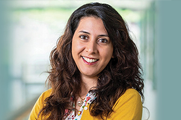 
          <b>Elaheh Ahmadi</b>
        </a>
        
芯片掺杂、分子束外延

      </td>
      <td align="center">
        <a href="research-quickview/ucla/ece/robert-candler/research-overview.md">
          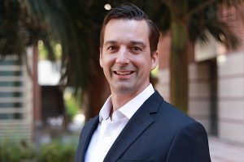 
          <b>Robert Candler</b>
        </a>
        
纳米磁铁材料设计制造、生物医学应用

      </td>
      <td align="center">
        <a href="research-quickview/ucla/ece/frank-chang/research-overview.md">
          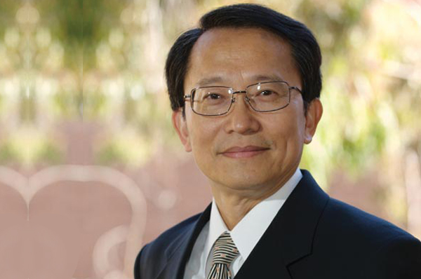 
          <b>Frank Chang</b>
        </a>
        
射频芯片设计与集成

      </td>
      <td align="center">
        <a href="research-quickview/ucla/ece/sam-emamjinejad/research-overview.md">
           
          <b>Sam Emamjinejad</b>
        </a>
        
可穿戴生物电子传感器、健康监测

      </td>
    </tr>
    <tr>
      <td align="center">
        <a href="research-quickview/ucla/ece/puneet-gupta/research-overview.md">
          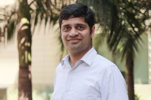 
          <b>Puneet Gupta</b>
        </a>
        
芯片设计、光子计算和存储

      </td>
      <td align="center">
        <a href="research-quickview/ucla/ece/subramanian-iyer/research-overview.md">
          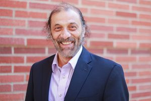 
          <b>Subramanian Iyer</b>
        </a>
        
芯片封装和光刻

      </td>
      <td align="center">
        <a href="research-quickview/ucla/ece/sudhakar-pamarti/research-overview.md">
          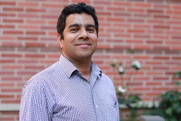 
          <b>Sudhakar Pamarti</b>
        </a>
        
低功耗芯片设计

      </td>
      <td align="center">
        <a href="research-quickview/ucla/ece/kang-wang/research-overview.md">
          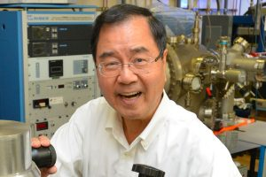 
          <b>Kang L. Wang</b>
        </a>
        
量子材料和自旋电子器

      </td>
    </tr>
    <tr>
      <td align="center">
        <a href="research-quickview/ucla/ece/benjamin-williams/research-overview.md">
           
          <b>Benjamin Williams</b>
        </a>
        
太赫兹，量子级联激光器，超表面激光器

      </td>
      <td align="center">
        <a href="research-quickview/ucla/ece/chee-wei-wong/research-overview.md">
          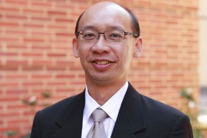 
          <b>Chee Wei Wong</b>
        </a>
        
频率梳，微腔光子器件，量子通信

      </td>
      <td align="center">
        <a href="research-quickview/ucla/ece/jason-woo/research-overview.md">
          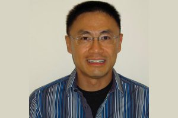 
          <b>Jason Woo</b>
        </a>
        
疑似退休

      </td>
      <td align="center">
        <a href="research-quickview/ucla/ece/ken-yang/research-overview.md">
          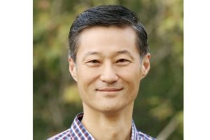 
          <b>C. K. "Ken" Yang</b>
        </a>
        
无课题组网站

      </td>
    </tr>
    <tr>
      <td align="center">
        <a href="research-quickview/ucla/ece/mona-jarrahi/research-overview.md">
          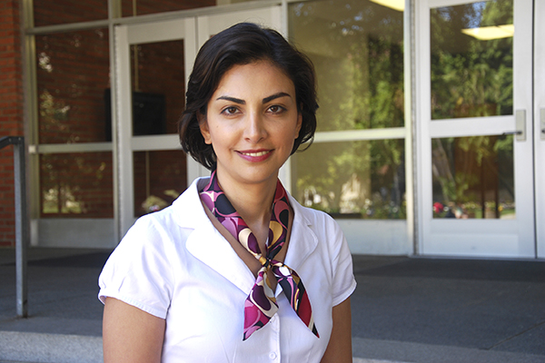 
          <b>Mona Jarrahi</b>
        </a>
        
太赫兹成像、光学处理、光子计算

      </td>
    </tr>
  </table>

<!-- End of UCLA Section -->
<!-- End of UCLA Section -->
<!-- End of UCLA Section -->

## [Caltech](https://www.caltech.edu/)

Click to expand Caltech Professors

### [Mechanical and Civil Engineering](https://mce.caltech.edu/)

- [**Faculty**](https://mce.caltech.edu/people)

<table>
  <tr>
    <td align="center">
      <a href="research-quickview/caltech/mce/aaron-ames/research-overview.md">
         
        <b>Aaron Ames</b>
      </a>
      
机器人学、控制理论、动态系统

    </td>
    <td align="center">
      <a href="research-quickview/caltech/mce/jose-andrade/research-overview.md">
         
        <b>José E. Andrade</b>
      </a>
      
固体力学、材料科学、地震工程

    </td>
    <td align="center">
      <a href="research-quickview/caltech/mce/domniki-asimaki/research-overview.md">
         
        <b>Domniki Asimaki</b>
      </a>
      
地震工程、结构健康监测、材料力学

    </td>
    <td align="center">
      <a href="research-quickview/caltech/mce/jean-philippe-avouac/research-overview.md">
         
        <b>Jean-Philippe Avouac</b>
      </a>
      
地质学、地震学、地球动力学

    </td>
  </tr>
  <tr>
    <td align="center">
      <a href="research-quickview/caltech/mce/kaushik-bhattacharya/research-overview.md">
         
        <b>Kaushik Bhattacharya</b>
      </a>
      
材料科学、力学、微观结构

    </td>
    <td align="center">
      <a href="research-quickview/caltech/mce/guillaume-blanquart/research-overview.md">
         
        <b>Guillaume Blanquart</b>
      </a>
      
计算流体力学、燃烧、传热

    </td>
    <td align="center">
      <a href="research-quickview/caltech/mce/john-brady/research-overview.md">
         
        <b>John F. Brady</b>
      </a>
      
流体力学、颗粒流、软物质

    </td>
    <td align="center">
      <a href="research-quickview/caltech/mce/joel-burdick/research-overview.md">
         
        <b>Joel W. Burdick</b>
      </a>
      
机器人学、生物力学、控制系统

    </td>
  </tr>
  <tr>
    <td align="center">
      <a href="research-quickview/caltech/mce/tim-colonius/research-overview.md">
         
        <b>Tim Colonius</b>
      </a>
      
声学、流体力学、计算科学

    </td>
    <td align="center">
      <a href="research-quickview/caltech/mce/john-dabiri/research-overview.md">
         
        <b>John O. Dabiri</b>
      </a>
      
生物力学、流体力学、能源

    </td>
    <td align="center">
      <a href="research-quickview/caltech/mce/chiara-daraio/research-overview.md">
         
        <b>Chiara Daraio</b>
      </a>
      
材料科学、纳米技术、机器人学

    </td>
    <td align="center">
      <a href="research-quickview/caltech/mce/ruby-fu/research-overview.md">
         
        <b>Xiaojing (Ruby) Fu</b>
      </a>
      
机器人学、控制理论、动态系统

    </td>
  </tr>
  <tr>
    <td align="center">
      <a href="research-quickview/caltech/mce/julia-greer/research-overview.md">
         
        <b>Julia R. Greer</b>
      </a>
      
材料科学、机械工程、医学工程

    </td>
    <td align="center">
      <a href="research-quickview/caltech/mce/melany-hunt/research-overview.md">
         
        <b>Melany L. Hunt</b>
      </a>
      
机械工程、工程教育、流体力学

    </td>
    <td align="center">
      <a href="research-quickview/caltech/mce/monica-kohler/research-overview.md">
         
        <b>Monica Kohler</b>
      </a>
      
结构工程、材料科学、可持续性

    </td>
    <td align="center">
      <a href="research-quickview/caltech/mce/nadia-lapusta/research-overview.md">
         
        <b>Nadia Lapusta</b>
      </a>
      
地震学、材料力学、地球动力学

    </td>
  </tr>
  <tr>
    <td align="center">
      <a href="research-quickview/caltech/mce/michael-mello/research-overview.md">
         
        <b>Michael Mello</b>
      </a>
      
机械与土木工程、教学、工程设计

    </td>
    <td align="center">
      <a href="research-quickview/caltech/mce/austin-minnich/research-overview.md">
         
        <b>Austin Minnich</b>
      </a>
      
机械工程、应用物理、热科学

    </td>
    <td align="center">
      <a href="research-quickview/caltech/mce/richard-murray/research-overview.md">
         
        <b>Richard M. Murray</b>
      </a>
      
控制与动态系统、生物工程、复杂系统

    </td>
    <td align="center">
      <a href="research-quickview/caltech/mce/gunter-niemeyer/research-overview.md">
         
        <b>Gunter Niemeyer</b>
      </a>
      
教学、机械与土木工程、工程教育

    </td>
  </tr>
  <tr>
    <td align="center">
      <a href="research-quickview/caltech/mce/sergio-pellegrino/research-overview.md">
         
        <b>Sergio Pellegrino</b>
      </a>
      
航空航天与土木工程、空间科学、材料设计

    </td>
    <td align="center">
      <a href="research-quickview/caltech/mce/guruswami-ravichandran/research-overview.md">
         
        <b>Guruswami (Ravi) Ravichandran</b>
      </a>
      
航空航天与机械工程、材料科学

    </td>
    <td align="center">
      <a href="research-quickview/caltech/mce/ares-rosakis/research-overview.md">
         
        <b>Ares J. Rosakis</b>
      </a>
      
气动与机械工程、材料科学、动态行为

    </td>
    <td align="center">
      <a href="research-quickview/caltech/mce/joseph-shepherd/research-overview.md">
         
        <b>Joseph E. Shepherd</b>
      </a>
      
航空航天与机械工程、流体力学、推进技术

    </td>
  </tr>
  <tr>
    <td align="center">
      <a href="research-quickview/caltech/mce/sandra-troian/research-overview.md">
         
        <b>Sandra M. Troian</b>
      </a>
      
应用物理、航空学、机械工程

    </td>
  </tr>
</table>

 

### [Electrical Engineering](https://www.ee.caltech.edu/)

- [**Faculty**](https://www.ee.caltech.edu/people)

<table>
  <tr>
    <td align="center">
      <a href="research-quickview/caltech/ee/yaser-abu-mostafa/research-overview.md">
         
        <b>Yaser Abu-Mostafa</b>
      </a>
      
机器学习、计算智能、金融工程

    </td>
    <td align="center">
      <a href="research-quickview/caltech/ee/katherine-bouman/research-overview.md">
         
        <b>Katherine L. (Katie) Bouman</b>
      </a>
      
计算成像、计算摄影、机器学习

    </td>
    <td align="center">
      <a href="research-quickview/caltech/ee/jehoshua-bruck/research-overview.md">
         
        <b>Jehoshua (Shuki) Bruck</b>
      </a>
      
信息理论、数据存储、计算生物学

    </td>
    <td align="center">
      <a href="research-quickview/caltech/ee/venkat-chandrasekaran/research-overview.md">
         
        <b>Venkat Chandrasekaran</b>
      </a>
      
优化、统计推断、计算复杂性

    </td>
  </tr>
  <tr>
    <td align="center">
      <a href="research-quickview/caltech/ee/john-doyle/research-overview.md">
         
        <b>John Doyle</b>
      </a>
      
控制理论、复杂系统、系统生物学

    </td>
    <td align="center">
      <a href="research-quickview/caltech/ee/michelle-effros/research-overview.md">
         
        <b>Michelle Effros</b>
      </a>
      
信息理论、数据压缩、网络编码

    </td>
    <td align="center">
      <a href="research-quickview/caltech/ee/azita-emami/research-overview.md">
         
        <b>Azita Emami</b>
      </a>
      
集成电路设计、生物医学器件、光电系统

    </td>
    <td align="center">
      <a href="research-quickview/caltech/ee/andrei-faraon/research-overview.md">
         
        <b>Andrei Faraon</b>
      </a>
      
纳米光子学、量子光学、光学材料

    </td>
  </tr>
  <tr>
    <td align="center">
      <a href="research-quickview/caltech/ee/glen-george/research-overview.md">
         
        <b>Glen George</b>
      </a>
      
电路设计、嵌入式系统、工程教育

    </td>
    <td align="center">
      <a href="research-quickview/caltech/ee/georgia-gkioxari/research-overview.md">
         
        <b>Georgia Gkioxari</b>
      </a>
      
计算机视觉、机器学习、人工智能

    </td>
    <td align="center">
      <a href="research-quickview/caltech/ee/ali-hajimiri/research-overview.md">
         
        <b>Ali Hajimiri</b>
      </a>
      
电路与系统、微波光子学、无线电力传输

    </td>
    <td align="center">
      <a href="research-quickview/caltech/ee/babak-hassibi/research-overview.md">
         
        <b>Babak Hassibi</b>
      </a>
      
通信、信号处理、控制理论

    </td>
  </tr>
  <tr>
    <td align="center">
      <a href="research-quickview/caltech/ee/victoria-kostina/research-overview.md">
         
        <b>Victoria Kostina</b>
      </a>
      
信息理论、编码理论、统计学习

    </td>
    <td align="center">
      <a href="research-quickview/caltech/ee/steven-low/research-overview.md">
         
        <b>Steven Low</b>
      </a>
      
网络控制、优化、智能电网

    </td>
    <td align="center">
      <a href="research-quickview/caltech/ee/alireza-marandi/research-overview.md">
         
        <b>Alireza Marandi</b>
      </a>
      
非线性光学、量子光子学、激光科学

    </td>
    <td align="center">
      <a href="research-quickview/caltech/ee/mohammad-mirhosseini/research-overview.md">
         
        <b>Mohammad Mirhosseini</b>
      </a>
      
量子信息、光子学、超导量子电路

    </td>
  </tr>
  <tr>
    <td align="center">
      <a href="research-quickview/caltech/ee/pietro-perona/research-overview.md">
         
        <b>Pietro Perona</b>
      </a>
      
计算机视觉、机器学习、神经科学

    </td>
    <td align="center">
      <a href="research-quickview/caltech/ee/axel-scherer/research-overview.md">
         
        <b>Axel Scherer</b>
      </a>
      
纳米技术、微机电系统、光子学

    </td>
    <td align="center">
      <a href="research-quickview/caltech/ee/yu-chong-tai/research-overview.md">
         
        <b>Yu-Chong Tai</b>
      </a>
      
微机电系统、生物传感器、微流体

    </td>
    <td align="center">
      <a href="research-quickview/caltech/ee/p-p-vaidyanathan/research-overview.md">
         
        <b>P. P. Vaidyanathan</b>
      </a>
      
信号处理、滤波器设计、通信系统

    </td>
  </tr>
  <tr>
    <td align="center">
      <a href="research-quickview/caltech/ee/lihong-wang/research-overview.md">
         
        <b>Lihong Wang</b>
      </a>
      
光声成像、生物医学成像、光学成像

    </td>
    <td align="center">
      <a href="research-quickview/caltech/ee/changhuei-yang/research-overview.md">
         
        <b>Changhuei Yang</b>
      </a>
      
生物医学光学、成像技术、微流体

    </td>
    <td align="center">
      <a href="research-quickview/caltech/ee/amnon-yariv/research-overview.md">
         
        <b>Amnon Yariv</b>
      </a>
      
光子学、量子电子学、光通信

    </td>
  </tr>
</table>

### [Applied Physics]([https://www.ee.caltech.edu/](https://aph.caltech.edu/))

- [**Faculty**](https://aph.caltech.edu/people)

<table>
  <tr>
    <td align="center">
      <a href="research-quickview/caltech/aph/harry-atwater/research-overview.md">
         
        <b>Harry A. Atwater, Jr.</b>
      </a>
      
量子与纳米光子学、超材料与超表面、人造光合作用、二维材料、纳米和微结构光伏、空间太阳能和等离子体学

    </td>
    <td align="center">
      <a href="research-quickview/caltech/aph/paul-bellan/research-overview.md">
         
        <b>Paul M. Bellan</b>
      </a>
      
等离子体物理，应用于聚变能、太阳物理、天体物理学、高空大气现象和土星环

    </td>
    <td align="center">
      <a href="research-quickview/caltech/aph/marco-bernardi/research-overview.md">
         
        <b>Marco Bernardi</b>
      </a>
      
理论与计算材料物理，开发新的第一性原理方法，研究材料中的电子传输、超快动力学和光-物质相互作用

    </td>
    <td align="center">
      <a href="research-quickview/caltech/aph/chiara-daraio/research-overview.md">
         
        <b>Chiara Daraio</b>
      </a>
      
工程新材料，具有先进的机械和传感特性，应用于机器人技术、医疗设备和振动吸收

    </td>
  </tr>
  <tr>
    <td align="center">
      <a href="research-quickview/caltech/aph/paul-dimotakis/research-overview.md">
         
        <b>Paul E. Dimotakis</b>
      </a>
      
实验和计算研究，关注亚音速和超音速自由剪切流中的湍流混合和化学反应；高超音速推进；湍流中的混合和表面几何

    </td>
    <td align="center">
      <a href="research-quickview/caltech/aph/michael-elowitz/research-overview.md">
         
        <b>Michael Elowitz</b>
      </a>
      
创建和分析生物“电路”，通过编程活细胞中的新功能，揭示电路设计的基本原理，开发下一代细胞和基因疗法

    </td>
    <td align="center">
      <a href="research-quickview/caltech/aph/andrei-faraon/research-overview.md">
         
        <b>Andrei Faraon</b>
      </a>
      
固态量子光学和纳米光子学，应用于量子信息处理、片上光信号处理、节能传感器和生物光子学

    </td>
    <td align="center">
      <a href="research-quickview/caltech/aph/brent-fultz/research-overview.md">
         
        <b>Brent Fultz</b>
      </a>
      
材料物理和材料化学，研究熵的起源，使用中子散射和计算；新型能源存储材料，特别是氢存储材料

    </td>
  </tr>
  <tr>
    <td align="center">
      <a href="research-quickview/caltech/aph/william-goddard/research-overview.md">
         
        <b>William A. Goddard, III</b>
      </a>
      
开发量子力学、力场、反应动力学、电子动力学、分子动力学和蒙特卡罗预测化学、催化和生化材料系统的方法

    </td>
    <td align="center">
      <a href="research-quickview/caltech/aph/alireza-marandi/research-overview.md">
         
        <b>Alireza Marandi</b>
      </a>
      
非线性光子学的基础技术发展，探索超快光学、光频梳、量子光学、光信息处理、中红外光子学和激光光谱学的前沿

    </td>
    <td align="center">
      <a href="research-quickview/caltech/aph/austin-minnich/research-overview.md">
         
        <b>Austin Minnich</b>
      </a>
      
先进的微波和毫米波技术在无线电天文学、量子信息科学等应用中的研究

    </td>
    <td align="center">
      <a href="research-quickview/caltech/aph/mohammad-mirhosseini/research-overview.md">
         
        <b>Mohammad Mirhosseini</b>
      </a>
      
量子工程的实验研究，开发和结合超导电路与基于芯片的声子和光子设备

    </td>
  </tr>
  <tr>
    <td align="center">
      <a href="research-quickview/caltech/aph/stevan-nadj-perge/research-overview.md">
         
        <b>Stevan Nadj-Perge</b>
      </a>
      
开发用于量子信息处理的介观设备，探索在纳米尺度的异域电子状态

    </td>
    <td align="center">
      <a href="research-quickview/caltech/aph/oskar-painter/research-overview.md">
         
        <b>Oskar J. Painter</b>
      </a>
      
纳米光子学、量子光学和光机械学在精密测量和量子信息科学中的应用

    </td>
    <td align="center">
      <a href="research-quickview/caltech/aph/rob-phillips/research-overview.md">
         
        <b>Rob Phillips</b>
      </a>
      
细胞的物理生物学：转录和活性物质模型、物理基因组学和进化的生物物理方法

    </td>
    <td align="center">
      <a href="research-quickview/caltech/aph/michael-roukes/research-overview.md">
         
        <b>Michael L. Roukes</b>
      </a>
      
纳米生物技术、纳米技术、纳米尺度物理、纳米和分子力学

    </td>
  </tr>
  <tr>
    <td align="center">
      <a href="research-quickview/caltech/aph/axel-scherer/research-overview.md">
         
        <b>Axel Scherer</b>
      </a>
      
微制造应用于集成微系统，专注于低成本疾病检测和精确健康监测的传感器和诊断工具开发

    </td>
    <td align="center">
      <a href="research-quickview/caltech/aph/keith-schwab/research-overview.md">
         
        <b>Keith C. Schwab</b>
      </a>
      
开发用于超流氦-4的约瑟夫森结，旨在构建量子设备，如干涉仪和量子比特

    </td>
    <td align="center">
      <a href="research-quickview/caltech/aph/sandra-troian/research-overview.md">
         
        <b>Sandra M. Troian</b>
      </a>
      
通过调节表面力的时空调制来控制微纳米尺度系统中的液体、热量或光的流动

    </td>
  </tr>
  <tr>
    <td align="center">
      <a href="research-quickview/caltech/aph/kerry-vahala/research-overview.md">
         
        <b>Kerry J. Vahala</b>
      </a>
      
高Q光微腔中的非线性光学，应用于精密计量系统和微型光学陀螺仪

    </td>
    <td align="center">
      <a href="research-quickview/caltech/aph/amnon-yariv/research-overview.md">
         
        <b>Amnon Yariv</b>
      </a>
      
光通信的理论和技术基础，包括新型半导体激光器和光相位锁系统

    </td>
  </tr>
</table>

<!-- End of Caltech Section -->
<!-- End of Caltech Section -->
<!-- End of Caltech Section -->

## [USC](https://www.usc.edu/)

Click to expand USC Professors

## [University of Southern California](https://www.usc.edu/)

### [Aerospace and Mechanical Engineering](https://ame.usc.edu/)

- **Field**: [Advanced Manufacturing](https://ame.usc.edu/research/research-areas/advanced-manufacturing/)

<table>
  <tr>
    <td align="center">
      <a href="research-quickview/usc/ame/yong-chen/research-overview.md">
         
        <b>Yong Chen</b>
      </a>
      
增材制造、多材料和多功能制造、制造过程建模、设计与优化

    </td>
    <td align="center">
      <a href="research-quickview/usc/ame/satyandra-gupta/research-overview.md">
         
        <b>Satyandra K. Gupta</b>
      </a>
      
增材制造、灵活制造自动化、智能制造、机器人技术

    </td>
    <td align="center">
      <a href="research-quickview/usc/ame/yan-jin/research-overview.md">
         
        <b>Yan Jin</b>
      </a>
      
先进制造技术、智能制造、过程建模与控制、资源优化

    </td>
    <td align="center">
      <a href="research-quickview/usc/ame/hangbo-zhao/research-overview.md">
         
        <b>Hangbo Zhao</b>
      </a>
      
增材制造、灵活制造自动化、机械驱动制造、过程优化

    </td>
  </tr>
</table>

- **Field**: [Biomechanics and Biotransport](https://ame.usc.edu/research/research-areas/bio-inspired-engineering/)
<table>
  <tr>
    <td align="center">
      <a href="research-quickview/usc/ame/yong-chen/research-overview.md">
         
        <b>Yong Chen</b>
      </a>
      
生物力学、生物材料、组织工程、细胞力学、微流体系统

    </td>
    <td align="center">
      <a href="research-quickview/usc/ame/henryk-flashner/research-overview.md">
         
        <b>Henryk Flashner</b>
      </a>
      
生物力学、流体力学、计算流体力学、血流动力学、组织工程

    </td>
    <td align="center">
      <a href="research-quickview/usc/ame/eva-kanso/research-overview.md">
         
        <b>Eva Kanso</b>
      </a>
      
生物流体力学、运动学、细胞力学、微流体系统、运动控制

    </td>
    <td align="center">
      <a href="research-quickview/usc/ame/mitul-luhar/research-overview.md">
         
        <b>Mitul Luhar</b>
      </a>
      
生物流体力学、计算生物学、传输现象、微流体系统、细胞力学

    </td>
  </tr>
  <tr>
    <td align="center">
      <a href="research-quickview/usc/ame/paul-newton/research-overview.md">
         
        <b>Paul Newton</b>
      </a>
      
生物传输、生物力学、运动分析、细胞力学、微流体系统

    </td>
    <td align="center">
      <a href="research-quickview/usc/ame/neda-maghsoodi/research-overview.md">
         
        <b>Neda Maghsoodi</b>
      </a>
      
生物力学、运动学、动力学、软材料、仿生学

    </td>
    <td align="center">
      <a href="research-quickview/usc/ame/niema-pahlevan/research-overview.md">
         
        <b>Niema M. Pahlevan</b>
      </a>
      
生物力学、流体力学、运动生物力学、细胞力学、微流体系统

    </td>
    <td align="center">
      <a href="research-quickview/usc/ame/satwindar-sadhal/research-overview.md">
         
        <b>Satwindar Sadhal</b>
      </a>
      
生物力学、流体力学、热传递、微流体系统、细胞力学

    </td>
  </tr>
  <tr>
    <td align="center">
      <a href="research-quickview/usc/ame/geoff-spedding/research-overview.md">
         
        <b>Geoff Spedding</b>
      </a>
      
流体力学、气动声学、生物力学、运动学、细胞力学

    </td>
    <td align="center">
      <a href="research-quickview/usc/ame/hangbo-zhao/research-overview.md">
         
        <b>Hangbo Zhao</b>
      </a>
      
生物力学、流体力学、计算流体动力学、细胞力学、微流体系统

    </td>
  </tr>
</table>

- **Field**: [Combustion and Propulsion](https://ame.usc.edu/research/research-areas/combustion-heat-transfer/)
<table>
  <tr>
    <td align="center">
      <a href="research-quickview/usc/ame/fokion-egolfopoulos/research-overview.md">
         
        <b>Fokion Egolfopoulos</b>
      </a>
      
燃烧动力学、化学反应流动、燃料-空气混合物的火焰特性

    </td>
    <td align="center">
      <a href="research-quickview/usc/ame/carlos-pantano-rubino/research-overview.md">
         
        <b>Carlos Pantano-Rubino</b>
      </a>
      
化学反应动力学、喷雾燃烧、燃烧模型的数值模拟

    </td>
    <td align="center">
      <a href="research-quickview/usc/ame/paul-ronney/research-overview.md">
         
        <b>Paul Ronney</b>
      </a>
      
燃烧过程中的热量与质量传递、自由基动力学、推进系统的燃烧特性

    </td>
    <td align="center">
      <a href="research-quickview/usc/ame/satwindar-sadhal/research-overview.md">
         
        <b>Satwindar Sadhal</b>
      </a>
      
燃烧、推进技术、气体动力学及其在航天应用中的作用

    </td>
  </tr>
</table>

- **Field**: [Physics- & Data-Informed Computational Modeling](https://ame.usc.edu/research/research-areas/computational-engineering/)

<table>
  <tr>
    <td align="center">
      <a href="research-quickview/usc/ame/ivan-bermejo-moreno/research-overview.md">
         
        <b>Iván Bermejo-Moreno</b>
      </a>
      
计算力学、有限元分析、非线性固体力学、材料建模

    </td>
    <td align="center">
      <a href="research-quickview/usc/ame/julian-domaradzki/research-overview.md">
         
        <b>Julian Domaradzki</b>
      </a>
      
计算流体力学、湍流建模、统计流体力学、数值方法

    </td>
    <td align="center">
      <a href="research-quickview/usc/ame/roger-ghanem/research-overview.md">
         
        <b>Roger Ghanem</b>
      </a>
      
随机建模、计算力学、数据驱动建模、量化不确定性

    </td>
    <td align="center">
      <a href="research-quickview/usc/ame/paul-newton/research-overview.md">
         
        <b>Paul Newton</b>
      </a>
      
计算力学、有限元方法、非线性固体力学、材料建模

    </td>
  </tr>
  <tr>
    <td align="center">
      <a href="research-quickview/usc/ame/assad-oberai/research-overview.md">
         
        <b>Assad A. Oberai</b>
      </a>
      
计算力学、有限元分析、非线性固体力学、材料建模

    </td>
    <td align="center">
      <a href="research-quickview/usc/ame/carlos-pantano-rubino/research-overview.md">
         
        <b>Carlos Pantano-Rubino</b>
      </a>
      
计算流体力学、湍流建模、数值方法、计算物理

    </td>
    <td align="center">
      <a href="research-quickview/usc/ame/alejandra-uranga/research-overview.md">
         
        <b>Alejandra Uranga</b>
      </a>
      
计算力学、有限元分析、非线性固体力学、材料建模

    </td>
  </tr>
</table>

- **Field**: [Design Informatics](https://ame.usc.edu/research/research-areas/design-informatics/)

<table>
  <tr>
    <td align="center">
      <a href="research-quickview/usc/ame/yan-jin/research-overview.md">
         
        <b>Yan Jin</b>
      </a>
      
设计认知与方法、协作工程、企业建模、复杂系统与复杂性

    </td>
  </tr>
</table>

- **Field**: [Dynamical Systems and Controls](https://ame.usc.edu/research/research-areas/dynamical-systems-controls/)

<table>
  <tr>
    <td align="center">
      <a href="research-quickview/usc/ame/henryk-flashner/research-overview.md">
         
        <b>Henryk Flashner</b>
      </a>
      
生物力学、软物质力学、非线性动力学

    </td>
    <td align="center">
      <a href="research-quickview/usc/ame/roger-ghanem/research-overview.md">
         
        <b>Roger Ghanem</b>
      </a>
      
随机建模、计算力学、数据驱动建模、量化不确定性

    </td>
    <td align="center">
      <a href="research-quickview/usc/ame/eva-kanso/research-overview.md">
         
        <b>Eva Kanso</b>
      </a>
      
流体动力学、非线性动力学、机器人学、控制理论

    </td>
    <td align="center">
      <a href="research-quickview/usc/ame/neda-maghsoodi/research-overview.md">
         
        <b>Neda Maghsoodi</b>
      </a>
      
非线性动力学、控制理论、机器人学、智能系统

    </td>
  </tr>
  <tr>
    <td align="center">
      <a href="research-quickview/usc/ame/paul-newton/research-overview.md">
         
        <b>Paul Newton</b>
      </a>
      
计算力学、有限元方法、非线性固体力学、材料建模

    </td>
    <td align="center">
      <a href="research-quickview/usc/ame/quan-nguyen/research-overview.md">
         
        <b>Quan Nguyen</b>
      </a>
      
计算机视觉、机器人学、机器学习、控制理论

    </td>
    <td align="center">
      <a href="research-quickview/usc/ame/firdaus-udwadia/research-overview.md">
         
        <b>Firdaus Udwadia</b>
      </a>
      
动力学、控制理论、机器人学、智能系统

    </td>
    <td align="center">
      <a href="research-quickview/usc/ame/bingen-yang/research-overview.md">
         
        <b>Bingen Yang</b>
      </a>
      
动力学、振动、结构、控制、应用力学、应用数学

    </td>
  </tr>
</table>

- **Field**: [Fluid Mechanics and Aerodynamics](https://ame.usc.edu/research/research-areas/fluid-mechanics-aerodynamics/)

<table>
  <tr>
    <td align="center">
      <a href="research-quickview/usc/ame/ivan-bermejo-moreno/research-overview.md">
         
        <b>Iván Bermejo-Moreno</b>
      </a>
      
流体动力学、数值模拟、湍流研究

    </td>
    <td align="center">
      <a href="research-quickview/usc/ame/julian-domaradzki/research-overview.md">
         
        <b>Julian Domaradzki</b>
      </a>
      
计算流体力学、湍流与复杂流动、气动学

    </td>
    <td align="center">
      <a href="research-quickview/usc/ame/eva-kanso/research-overview.md">
         
        <b>Eva Kanso</b>
      </a>
      
流体动力学、非线性动力学、机器人学

    </td>
    <td align="center">
      <a href="research-quickview/usc/ame/mitul-luhar/research-overview.md">
         
        <b>Mitul Luhar</b>
      </a>
      
生物流体力学、数值模拟、湍流与气动学

    </td>
  </tr>
  <tr>
    <td align="center">
      <a href="research-quickview/usc/ame/paul-newton/research-overview.md">
         
        <b>Paul Newton</b>
      </a>
      
计算流体力学、气动学、材料建模

    </td>
    <td align="center">
      <a href="research-quickview/usc/ame/assad-oberai/research-overview.md">
         
        <b>Assad A. Oberai</b>
      </a>
      
流体动力学、计算力学、优化与控制

    </td>
    <td align="center">
      <a href="research-quickview/usc/ame/niema-pahlevan/research-overview.md">
         
        <b>Niema M. Pahlevan</b>
      </a>
      
流体力学、可持续能源、数值分析

    </td>
    <td align="center">
      <a href="research-quickview/usc/ame/carlos-pantano-rubino/research-overview.md">
         
        <b>Carlos Pantano-Rubino</b>
      </a>
      
多相流、化学反应流动、气动学

    </td>
  </tr>
  <tr>
    <td align="center">
      <a href="research-quickview/usc/ame/geoff-spedding/research-overview.md">
         
        <b>Geoff Spedding</b>
      </a>
      
流体动力学、气动学、非线性动力学

    </td>
    <td align="center">
      <a href="research-quickview/usc/ame/alejandra-uranga/research-overview.md">
         
        <b>Alejandra Uranga</b>
      </a>
      
流体动力学、计算模型、湍流

    </td>
  </tr>
</table>

- **Field**: [Materials](https://ame.usc.edu/research/research-areas/materials/)

<table>
  <tr>
    <td align="center">
      <a href="research-quickview/usc/ame/yong-chen/research-overview.md">
         
        <b>Yong Chen</b>
      </a>
      
材料科学、先进材料加工、增材制造

    </td>
    <td align="center">
      <a href="research-quickview/usc/ame/andrea-hodge/research-overview.md">
         
        <b>Andrea Hodge</b>
      </a>
      
纳米材料、复合材料、材料表征与性能

    </td>
    <td align="center">
      <a href="research-quickview/usc/ame/terence-langdon/research-overview.md">
         
        <b>Terence Langdon</b>
      </a>
      
材料冶金、超塑性、合金设计

    </td>
    <td align="center">
      <a href="research-quickview/usc/ame/neda-maghsoodi/research-overview.md">
         
        <b>Neda Maghsoodi</b>
      </a>
      
材料科学与工程、塑性变形、纳米材料

    </td>
  </tr>
  <tr>
    <td align="center">
      <a href="research-quickview/usc/ame/paul-plucinsky/research-overview.md">
         
        <b>Paul Plucinsky</b>
      </a>
      
复合材料、材料性能评估、结构健康监测

    </td>
    <td align="center">
      <a href="research-quickview/usc/ame/hangbo-zhao/research-overview.md">
         
        <b>Hangbo Zhao</b>
      </a>
      
材料设计、材料力学、相变材料

    </td>
  </tr>
</table>

- **Field**: [Micro/Nano Technology](https://ame.usc.edu/research/research-areas/micro-nano-tech/)

<table>
  <tr>
    <td align="center">
      <a href="research-quickview/usc/ame/yong-chen/research-overview.md">
         
        <b>Yong Chen</b>
      </a>
      
微纳米制造、增材制造、微机电系统（MEMS）

    </td>
    <td align="center">
      <a href="research-quickview/usc/ame/neda-maghsoodi/research-overview.md">
         
        <b>Neda Maghsoodi</b>
      </a>
      
微纳米制造、纳米材料、微结构设计

    </td>
    <td align="center">
      <a href="research-quickview/usc/ame/paul-ronney/research-overview.md">
         
        <b>Paul Ronney</b>
      </a>
      
微纳米燃烧、微型推进系统、能源转换

    </td>
    <td align="center">
      <a href="research-quickview/usc/ame/hangbo-zhao/research-overview.md">
         
        <b>Hangbo Zhao</b>
      </a>
      
微纳米制造、复合材料、三维多功能结构

    </td>
  </tr>
</table>

- **Field**: [Robotics](https://ame.usc.edu/research/research-areas/robotics/)

<table>
    <tr>
        <td align="center">
            <a href="research-quickview/usc/ame/satyandra-gupta/research-overview.md">
                 
                <b>Satyandra K. Gupta</b>
            </a>
            
机器人技术、智能系统、优化与规划

        </td>
        <td align="center">
            <a href="research-quickview/usc/ame/eva-kanso/research-overview.md">
                 
                <b>Eva Kanso</b>
            </a>
            
流体动力学、机器人学、控制理论

        </td>
        <td align="center">
            <a href="research-quickview/usc/ame/mitul-luhar/research-overview.md">
                 
                <b>Mitul Luhar</b>
            </a>
            
流体与固体相互作用、机器人控制

        </td>
        <td align="center">
            <a href="research-quickview/usc/ame/neda-maghsoodi/research-overview.md">
                 
                <b>Neda Maghsoodi</b>
            </a>
            
机器人技术、机器学习、自动化

        </td>
    </tr>
    <tr>
        <td align="center">
            <a href="research-quickview/usc/ame/quan-nguyen/research-overview.md">
                 
                <b>Quan Nguyen</b>
            </a>
            
智能控制、机器人感知与决策

        </td>
        <td align="center">
            <a href="research-quickview/usc/ame/bingen-yang/research-overview.md">
                 
                <b>Bingen Yang</b>
            </a>
            
机器人学、动态系统、控制理论

        </td>
        <td align="center"></td>
        <td align="center"></td>
    </tr>
</table>

- **Field**: [Solid and Applied Mechanics](https://ame.usc.edu/research/research-areas/solid-applied-mechanics/)

<table>
    <tr>
        <td align="center">
            <a href="research-quickview/usc/ame/henryk-flashner/research-overview.md">
                 
                <b>Henryk Flashner</b>
            </a>
            
固体力学、非线性分析、结构健康监测

        </td>
        <td align="center">
            <a href="research-quickview/usc/ame/neda-maghsoodi/research-overview.md">
                 
                <b>Neda Maghsoodi</b>
            </a>
            
材料力学、流体-固体相互作用

        </td>
        <td align="center">
            <a href="research-quickview/usc/ame/assad-oberai/research-overview.md">
                 
                <b>Assad Oberai</b>
            </a>
            
应用数学、计算力学、材料行为

        </td>
        <td align="center">
            <a href="research-quickview/usc/ame/paul-plucinsky/research-overview.md">
                 
                <b>Paul Plucinsky</b>
            </a>
            
固体力学、结构分析、振动

        </td>
    </tr>
    <tr>
        <td align="center">
            <a href="research-quickview/usc/ame/bingen-yang/research-overview.md">
                 
                <b>Bingen Yang</b>
            </a>
            
固体力学、材料科学、流体力学

        </td>
        <td align="center">
            <a href="research-quickview/usc/ame/hangbo-zhao/research-overview.md">
                 
                <b>Hangbo Zhao</b>
            </a>
            
非线性动力学、材料性能、结构分析

        </td>
        <td align="center"></td>
        <td align="center"></td>
    </tr>
</table>

### [Electrical and Computer Engineering](https://minghsiehece.usc.edu/research/)

- **Field**: [Biological, Medical and Biomedical](https://minghsiehece.usc.edu/research/area/biological-medical-and-biomedical/)

<table>
    <tr>
        <td align="center">
            <a href="research-quickview/usc/ece/corey-baker/research-overview.md">
                 
                <b>Corey E. Baker</b>
            </a>
            
生物医学信号处理、影像处理、神经工程

        </td>
        <td align="center">
            <a href="research-quickview/usc/ece/justin-haldar/research-overview.md">
                 
                <b>Justin P. Haldar</b>
            </a>
            
医学成像、信号处理、机器学习

        </td>
        <td align="center">
            <a href="research-quickview/usc/ece/hossein-hashemi/research-overview.md">
                 
                <b>Hossein Hashemi</b>
            </a>
            
微电子学、生物医学电子设备、无线通信

        </td>
        <td align="center">
            <a href="research-quickview/usc/ece/yasser-khan/research-overview.md">
                 
                <b>Yasser Khan</b>
            </a>
            
信号处理、图像分析、生物信息学

        </td>
    </tr>
    <tr>
        <td align="center">
            <a href="research-quickview/usc/ece/eun-sok-kim/research-overview.md">
                 
                <b>Eun Sok Kim</b>
            </a>
            
生物医学信号处理、医疗成像、光学传感器

        </td>
        <td align="center">
            <a href="research-quickview/usc/ece/richard-leahy/research-overview.md">
                 
                <b>Richard M. Leahy</b>
            </a>
            
医学成像、计算成像、信号处理

        </td>
        <td align="center">
            <a href="research-quickview/usc/ece/urbashi-mitra/research-overview.md">
                 
                <b>Urbashi Mitra</b>
            </a>
            
无线通信、生物医学信号处理、系统理论

        </td>
        <td align="center">
            <a href="research-quickview/usc/ece/mahta-moghaddam/research-overview.md">
                 
                <b>Mahta Moghaddam</b>
            </a>
            
毫米波成像、生物医学应用、传感器技术

        </td>
    </tr>
    <tr>
        <td align="center">
            <a href="research-quickview/usc/ece/shrikanth-narayanan/research-overview.md">
                 
                <b>Shrikanth Narayanan</b>
            </a>
            
语音与语言处理、情感计算、医疗信号处理

        </td>
        <td align="center">
            <a href="research-quickview/usc/ece/krishna-nayak/research-overview.md">
                 
                <b>Krishna Shrinivas Nayak</b>
            </a>
            
医学成像、磁共振成像、超声成像

        </td>
        <td align="center">
            <a href="research-quickview/usc/ece/maryam-shanechi/research-overview.md">
                 
                <b>Maryam Shanechi</b>
            </a>
            
脑机接口、神经工程、医疗信号处理

        </td>
        <td align="center">
            <a href="research-quickview/usc/ece/constantine-sideris/research-overview.md">
                 
                <b>Constantine Sideris</b>
            </a>
            
信号处理、图像处理、传感器网络

        </td>
    </tr>
    <tr>
        <td align="center">
            <a href="research-quickview/usc/ece/joshua-yang/research-overview.md">
                 
                <b>J. Joshua Yang</b>
            </a>
            
生物医学电子设备、无线传感器、健康监测

        </td>
    </tr>
</table>

- **Field**: [Control Systems](https://minghsiehece.usc.edu/research/area/control-systems/)

<table>
    <tr>
        <td align="center">
            <a href="research-quickview/usc/ece/paul-bogdan/research-overview.md">
                 
                <b>Paul Bogdan</b>
            </a>
            
控制系统、网络控制、系统动力学

        </td>
        <td align="center">
            <a href="research-quickview/usc/ece/petros-ioannou/research-overview.md">
                 
                <b>Petros A. Ioannou</b>
            </a>
            
控制系统、动态系统、机器人学

        </td>
        <td align="center">
            <a href="research-quickview/usc/ece/rahul-jain/research-overview.md">
                 
                <b>Rahul Jain</b>
            </a>
            
控制理论、优化、系统工程

        </td>
        <td align="center">
            <a href="research-quickview/usc/ece/mihailo-jovanovic/research-overview.md">
                 
                <b>Mihailo Jovanovic</b>
            </a>
            
控制系统、非线性系统、动态系统

        </td>
    </tr>
    <tr>
        <td align="center">
            <a href="research-quickview/usc/ece/bart-kosko/research-overview.md">
                 
                <b>Bart Andrew Kosko</b>
            </a>
            
控制系统、模糊逻辑、系统理论

        </td>
        <td align="center">
            <a href="research-quickview/usc/ece/daniel-lidar/research-overview.md">
                 
                <b>Daniel Amihud Lidar</b>
            </a>
            
量子控制、量子计算、信息科学

        </td>
        <td align="center">
            <a href="research-quickview/usc/ece/ashutosh-nayyar/research-overview.md">
                 
                <b>Ashutosh Nayyar</b>
            </a>
            
控制系统、信号处理、系统设计

        </td>
        <td align="center">
            <a href="research-quickview/usc/ece/feifei-qian/research-overview.md">
                 
                <b>Feifei Qian</b>
            </a>
            
控制系统、自动化、数据驱动建模

        </td>
    </tr>
</table>

- **Field**: [Electromagnetics and Energy Conversion](https://minghsiehece.usc.edu/research/area/electromagnetics-and-energy-conversion-research-area/)

<table>
    <tr>
        <td align="center">
            <a href="research-quickview/usc/ece/mercedeh-khajavikhan/research-overview.md">
                 
                <b>Mercedeh Khajavikhan</b>
            </a>
            
电磁场理论、能量转换、电磁兼容性

        </td>
        <td align="center">
            <a href="research-quickview/usc/ece/eun-sok-kim/research-overview.md">
                 
                <b>Eun Sok Kim</b>
            </a>
            
电磁场、无线通信、信号处理

        </td>
        <td align="center">
            <a href="research-quickview/usc/ece/mahta-moghaddam/research-overview.md">
                 
                <b>Mahta Moghaddam</b>
            </a>
            
电磁波传播、传感器技术、无线能量传输

        </td>
        <td align="center">
            <a href="research-quickview/usc/ece/aluizio-prata/research-overview.md">
                 
                <b>Aluizio Prata</b>
            </a>
            
电磁理论、微波工程、电力电子

        </td>
    </tr>
    <tr>
        <td align="center">
            <a href="research-quickview/usc/ece/constantine-sideris/research-overview.md">
                 
                <b>Constantine Sideris</b>
            </a>
            
电磁场、信号处理、控制系统

        </td>
        <td align="center">
            <a href="research-quickview/usc/ece/mengjie-yu/research-overview.md">
                 
                <b>Mengjie Yu</b>
            </a>
            
电磁能量转换、无线能量传输、纳米技术

        </td>
    </tr>
</table>

- **Field**: [Integrated Circuits and Systems](https://minghsiehece.usc.edu/research/area/integrated-circuits-and-systems/)

<table>
    <tr>
        <td align="center">
            <a href="research-quickview/usc/ece/peter-beerel/research-overview.md">
                 
                <b>Peter A. Beerel</b>
            </a>
            
集成电路设计、数字电路、时序分析

        </td>
        <td align="center">
            <a href="research-quickview/usc/ece/shuo-wei-chen/research-overview.md">
                 
                <b>Shuo-Wei (Mike) Chen</b>
            </a>
            
集成电路设计、系统级集成、计算机架构

        </td>
        <td align="center">
            <a href="research-quickview/usc/ece/hossein-hashemi/research-overview.md">
                 
                <b>Hossein Hashemi</b>
            </a>
            
模拟和混合信号电路、RF集成电路

        </td>
        <td align="center">
            <a href="research-quickview/usc/ece/eun-sok-kim/research-overview.md">
                 
                <b>Eun Sok Kim</b>
            </a>
            
电磁场、无线通信、信号处理

        </td>
    </tr>
    <tr>
        <td align="center">
            <a href="research-quickview/usc/ece/viktor-prasanna/research-overview.md">
                 
                <b>Viktor K. Prasanna</b>
            </a>
            
计算机体系结构、并行处理、集成电路

        </td>
        <td align="center">
            <a href="research-quickview/usc/ece/constantine-sideris/research-overview.md">
                 
                <b>Constantine Sideris</b>
            </a>
            
电路设计、信号处理、控制系统

        </td>
        <td align="center">
            <a href="research-quickview/usc/ece/christopher-torng/research-overview.md">
                 
                <b>Christopher Torng</b>
            </a>
            
集成电路设计、计算机视觉、机器学习

        </td>
        <td align="center">
            <a href="research-quickview/usc/ece/j-joshua-yang/research-overview.md">
                 
                <b>J. Joshua Yang</b>
            </a>
            
微电子学、量子电路、集成电路设计

        </td>
    </tr>
    <tr>
        <td align="center">
            <a href="research-quickview/usc/ece/chongwu-zhou/research-overview.md">
                 
                <b>Chongwu Zhou</b>
            </a>
            
半导体器件、集成电路、纳米电子学

        </td>
    </tr>
</table>

- **Field**: [Nanotechnology & Micro Electrical-Mechanical Systems](https://minghsiehece.usc.edu/research/area/nanotechnology-micro-electrical-mechanical-systems-research-area/)

<table>
    <tr>
        <td align="center">
            <a href="research-quickview/usc/ece/stephen-cronin/research-overview.md">
                 
                <b>Stephen Burke Cronin</b>
            </a>
            
纳米技术、光电子学、MEMS

        </td>
        <td align="center">
            <a href="research-quickview/usc/ece/rehan-kapadia/research-overview.md">
                 
                <b>Rehan Kapadia</b>
            </a>
            
微纳制造、MEMS、集成电路

        </td>
        <td align="center">
            <a href="research-quickview/usc/ece/mercedeh-khajavikhan/research-overview.md">
                 
                <b>Mercedeh Khajavikhan</b>
            </a>
            
MEMS、传感器、纳米技术

        </td>
        <td align="center">
            <a href="research-quickview/usc/ece/yasser-khan/research-overview.md">
                 
                <b>Yasser Khan</b>
            </a>
            
微电子器件、纳米材料、MEMS

        </td>
    </tr>
    <tr>
        <td align="center">
            <a href="research-quickview/usc/ece/eun-sok-kim/research-overview.md">
                 
                <b>Eun Sok Kim</b>
            </a>
            
纳米电子学、无线通信、信号处理

        </td>
        <td align="center">
            <a href="research-quickview/usc/ece/daniel-lidar/research-overview.md">
                 
                <b>Daniel Amihud Lidar</b>
            </a>
            
量子信息、量子计算、材料科学

        </td>
        <td align="center">
            <a href="research-quickview/usc/ece/wei-wu/research-overview.md">
                 
                <b>Wei Wu</b>
            </a>
            
纳米技术、材料性能、电子学

        </td>
        <td align="center">
            <a href="research-quickview/usc/ece/j-joshua-yang/research-overview.md">
                 
                <b>J. Joshua Yang</b>
            </a>
            
微电子学、量子电路、集成电路设计

        </td>
    </tr>
    <tr>
        <td align="center">
            <a href="research-quickview/usc/ece/mengjie-yu/research-overview.md">
                 
                <b>Mengjie Yu</b>
            </a>
            
MEMS、微纳制造、集成电路

        </td>
        <td align="center">
            <a href="research-quickview/usc/ece/chongwu-zhou/research-overview.md">
                 
                <b>Chongwu Zhou</b>
            </a>
            
半导体器件、集成电路、纳米电子学

        </td>
    </tr>
</table>

- **Field**: [Parallel and Distributed Computing](https://minghsiehece.usc.edu/research/area/parallel-and-distributed-computing/)

<table>
    <tr>
        <td align="center">
            <a href="research-quickview/usc/ece/murali-annavaram/research-overview.md">
                 
                <b>Murali Annavaram</b>
            </a>
            
电力工程、并行和分布式计算

        </td>
        <td align="center">
            <a href="research-quickview/usc/ece/salman-avestimehr/research-overview.md">
                 
                <b>Salman Avestimehr</b>
            </a>
            
分布式系统、网络通信、数据科学

        </td>
        <td align="center">
            <a href="research-quickview/usc/ece/paul-bogdan/research-overview.md">
                 
                <b>Paul Bogdan</b>
            </a>
            
嵌入式系统、并行计算、智能电网

        </td>
        <td align="center">
            <a href="research-quickview/usc/ece/timothy-pinkston/research-overview.md">
                 
                <b>Timothy M. Pinkston</b>
            </a>
            
计算机架构、并行处理、网络系统

        </td>
    </tr>
    <tr>
        <td align="center">
            <a href="research-quickview/usc/ece/viktor-prasanna/research-overview.md">
                 
                <b>Viktor K. Prasanna</b>
            </a>
            
计算机科学、并行和分布式计算、系统设计

        </td>
        <td align="center">
            <a href="research-quickview/usc/ece/christopher-torng/research-overview.md">
                 
                <b>Christopher Torng</b>
            </a>
            
计算机系统、算法设计、并行计算

        </td>
    </tr>
</table>

- **Field**: [Photonics and Quantum Electronics](https://minghsiehece.usc.edu/research/area/photonics-and-quantum-electronics/)

<table>
    <tr>
        <td align="center">
            <a href="research-quickview/usc/ece/stephen-cronin/research-overview.md">
                 
                <b>Stephen B. Cronin</b>
            </a>
            
光子学、纳米光子学、量子电子学

        </td>
        <td align="center">
            <a href="research-quickview/usc/ece/hossein-hashemi/research-overview.md">
                 
                <b>Hossein Hashemi</b>
            </a>
            
集成光子学、量子信息、微纳米光学

        </td>
        <td align="center">
            <a href="research-quickview/usc/ece/mercedeh-khajavikhan/research-overview.md">
                 
                <b>Mercedeh Khajavikhan</b>
            </a>
            
光电集成、光信号处理、量子光学

        </td>
        <td align="center">
            <a href="research-quickview/usc/ece/anthony-levi/research-overview.md">
                 
                <b>Tony Levi</b>
            </a>
            
光学材料、量子光子学、光电技术

        </td>
    </tr>
    <tr>
        <td align="center">
            <a href="research-quickview/usc/ece/daniel-lidar/research-overview.md">
                 
                <b>Daniel A. Lidar</b>
            </a>
            
量子计算、量子信息、量子系统控制

        </td>
        <td align="center">
            <a href="research-quickview/usc/ece/michelle-povinelli/research-overview.md">
                 
                <b>Michelle L. Povinelli</b>
            </a>
            
光子学、光子集成电路、量子材料

        </td>
        <td align="center">
            <a href="research-quickview/usc/ece/alan-willner/research-overview.md">
                 
                <b>Alan E. Willner</b>
            </a>
            
光通信、量子光子学、光子信号处理

        </td>
        <td align="center">
            <a href="research-quickview/usc/ece/joshua-yang/research-overview.md">
                 
                <b>J. Joshua Yang</b>
            </a>
            
量子光学、非线性光学、光电系统

        </td>
    </tr>
    <tr>
        <td align="center">
            <a href="research-quickview/usc/ece/mengjie-yu/research-overview.md">
                 
                <b>Mengjie Yu</b>
            </a>
            
集成光子学、光子传感、纳米光学

        </td>
        <td align="center">
            <a href="research-quickview/usc/ece/chongwu-zhou/research-overview.md">
                 
                <b>Chongwu Zhou</b>
            </a>
            
光子学、光电器件、量子材料

        </td>
    </tr>
</table>

- **Field**: [Quantum Information Processing](https://minghsiehece.usc.edu/research/area/quantum-information-processing/)

<table>
    <tr>
        <td align="center">
            <a href="research-quickview/usc/ece/todd-brun/research-overview.md">
                 
                <b>Todd A. Brun</b>
            </a>
            
量子计算、量子信息理论、量子算法

        </td>
        <td align="center">
            <a href="research-quickview/usc/ece/stephen-cronin/research-overview.md">
                 
                <b>Stephen B. Cronin</b>
            </a>
            
光子学、量子光学、量子信息处理

        </td>
        <td align="center">
            <a href="research-quickview/usc/ece/mercedeh-khajavikhan/research-overview.md">
                 
                <b>Mercedeh Khajavikhan</b>
            </a>
            
集成光子学、量子信息、光子电路

        </td>
        <td align="center">
            <a href="research-quickview/usc/ece/anthony-levi/research-overview.md">
                 
                <b>Tony Levi</b>
            </a>
            
量子光子学、材料科学、光学

        </td>
    </tr>
    <tr>
        <td align="center">
            <a href="research-quickview/usc/ece/daniel-lidar/research-overview.md">
                 
                <b>Daniel A. Lidar</b>
            </a>
            
量子系统、量子控制、量子计算

        </td>
        <td align="center">
            <a href="research-quickview/usc/ece/benjamin-reichardt/research-overview.md">
                 
                <b>Benjamin W. Reichardt</b>
            </a>
            
量子信息、量子算法、计算机科学

        </td>
        <td align="center">
            <a href="research-quickview/usc/ece/alan-willner/research-overview.md">
                 
                <b>Alan E. Willner</b>
            </a>
            
光子学、量子光子学、通信技术

        </td>
        <td align="center">
            <a href="research-quickview/usc/ece/joshua-yang/research-overview.md">
                 
                <b>J. Joshua Yang</b>
            </a>
            
量子系统、光学、量子计算

        </td>
    </tr>
    <tr>
        <td align="center">
            <a href="research-quickview/usc/ece/mengjie-yu/research-overview.md">
                 
                <b>Mengjie Yu</b>
            </a>
            
量子信息、量子计算、机器学习

        </td>
        <td align="center">
            <a href="research-quickview/usc/ece/qunta-zhuang/research-overview.md">
                 
                <b>Quntao Zhuang</b>
            </a>
            
量子通信、量子光学、量子探测

        </td>
    </tr>
</table>

- **Field**: [Signal and Image Processing](https://minghsiehece.usc.edu/research/area/signal-and-image-processing/)

<table>
    <tr>
        <td align="center">
            <a href="research-quickview/usc/ece/salman-avestimehr/research-overview.md">
                 
                <b>Salman Avestimehr</b>
            </a>
            
信号处理、图像处理、机器学习

        </td>
        <td align="center">
            <a href="research-quickview/usc/ece/keith-chugg/research-overview.md">
                 
                <b>Keith M. Chugg</b>
            </a>
            
信号处理、系统识别、估计理论

        </td>
        <td align="center">
            <a href="research-quickview/usc/ece/justin-haldar/research-overview.md">
                 
                <b>Justin P. Haldar</b>
            </a>
            
医学图像处理、计算成像、机器学习

        </td>
        <td align="center">
            <a href="research-quickview/usc/ece/brian-jenkins/research-overview.md">
                 
                <b>Keith Jenkins</b>
            </a>
            
图像处理、信号处理、通信系统

        </td>
    </tr>
    <tr>
        <td align="center">
            <a href="research-quickview/usc/ece/bart-kosko/research-overview.md">
                 
                <b>Bart A. Kosko</b>
            </a>
            
信息处理、模糊逻辑、法律与工程

        </td>
        <td align="center">
            <a href="research-quickview/usc/ece/chung-chieh-kuo/research-overview.md">
                 
                <b>C.-C. Jay Kuo</b>
            </a>
            
图像和视频编码、信号处理、计算机视觉

        </td>
        <td align="center">
            <a href="research-quickview/usc/ece/christos-kyriakakis/research-overview.md">
                 
                <b>Chris Kyriakakis</b>
            </a>
            
信号处理、声学、音频处理

        </td>
        <td align="center">
            <a href="research-quickview/usc/ece/richard-leahy/research-overview.md">
                 
                <b>Richard M. Leahy</b>
            </a>
            
医学图像分析、信号处理、生物医学工程

        </td>
    </tr>
    <tr>
        <td align="center">
            <a href="research-quickview/usc/ece/urbashi-mitra/research-overview.md">
                 
                <b>Urbashi Mitra</b>
            </a>
            
信号处理、通信系统、无线网络

        </td>
        <td align="center">
            <a href="research-quickview/usc/ece/shrikanth-narayanan/research-overview.md">
                 
                <b>Shrikanth Narayanan</b>
            </a>
            
语音处理、语言处理、人工智能

        </td>
        <td align="center">
            <a href="research-quickview/usc/ece/krishna-nayak/research-overview.md">
                 
                <b>Krishna S. Nayak</b>
            </a>
            
信号处理、生物医学工程、医学成像

        </td>
        <td align="center">
            <a href="research-quickview/usc/ece/antonio-ortega/research-overview.md">
                 
                <b>Antonio Ortega</b>
            </a>
            
视频编码、信号处理、数据压缩

        </td>
    </tr>
    <tr>
        <td align="center">
            <a href="research-quickview/usc/ece/maryam-shanechi/research-overview.md">
                 
                <b>Maryam Shanechi</b>
            </a>
            
生物医学信号处理、机器学习、脑机接口

        </td>
        <td align="center">
            <a href="research-quickview/usc/ece/mahdi-soltanolkotabi/research-overview.md">
                 
                <b>Mahdi Soltanolkotabi</b>
            </a>
            
信号处理、图像处理、机器学习

        </td>
        <td align="center">
            <a href="research-quickview/usc/ece/joshua-yang/research-overview.md">
                 
                <b>J. Joshua Yang</b>
            </a>
            
信号处理、图像处理、通信

        </td>
    </tr>
</table>

<!-- End of USC Section -->
<!-- End of USC Section -->
<!-- End of USC Section -->

## [MIT](https://www.mit.edu/)

Click to expand MIT Professors

  
### [Mechanical Engineering](https://meche.mit.edu/)

- **Field**: [Mechanics](https://meche.mit.edu/research/mechanics)

<table>
    <tr>
        <td align="center">
            <a href="research-quickview/mit/me/rohan-abeyaratne/research-overview.md">
                 
                <b>Rohan Abeyaratne</b>
            </a>
            
固体力学、材料科学、非线性力学

        </td>
        <td align="center">
            <a href="research-quickview/mit/me/triantaphyllos-akylas/research-overview.md">
                 
                <b>Triantaphyllos R. Akylas</b>
            </a>
            
流体动力学、波动理论、声学

        </td>
        <td align="center">
            <a href="research-quickview/mit/me/lallit-anand/research-overview.md">
                 
                <b>Lallit Anand</b>
            </a>
            
塑性力学、材料行为、计算力学

        </td>
        <td align="center">
            <a href="research-quickview/mit/me/george-barbastathis/research-overview.md">
                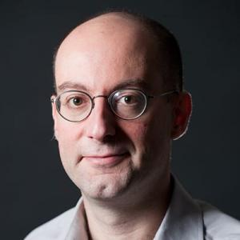 
                <b>George Barbastathis</b>
            </a>
            
光学、流体力学、材料科学

        </td>
    </tr>
    <tr>
        <td align="center">
            <a href="research-quickview/mit/me/klaus-bathe/research-overview.md">
                 
                <b>Klaus-Jürgen Bathe</b>
            </a>
            
有限元分析、结构力学、计算工程

        </td>
        <td align="center">
            <a href="research-quickview/mit/me/irmgard-bischofberger/research-overview.md">
                 
                <b>Irmgard Bischofberger</b>
            </a>
            
流体力学、传热、流体-结构相互作用

        </td>
        <td align="center">
            <a href="research-quickview/mit/me/lydia-bourouiba/research-overview.md">
                 
                <b>Lydia Bourouiba</b>
            </a>
            
流体动力学、流体力学、公共卫生

        </td>
        <td align="center">
            <a href="research-quickview/mit/me/tal-cohen/research-overview.md">
                 
                <b>Tal Cohen</b>
            </a>
            
材料力学、力学行为、工程应用

        </td>
    </tr>
    <tr>
        <td align="center">
            <a href="research-quickview/mit/me/lorna-gibson/research-overview.md">
                 
                <b>Lorna J. Gibson</b>
            </a>
            
复合材料、微结构、材料力学

        </td>
        <td align="center">
            <a href="research-quickview/mit/me/nicolas-hadjiconstantinou/research-overview.md">
                 
                <b>Nicolas Hadjiconstantinou</b>
            </a>
            
流体力学、微观力学、纳米流体

        </td>
        <td align="center">
            <a href="research-quickview/mit/me/anette-hosoi/research-overview.md">
                 
                <b>Anette (Peko) Hosoi</b>
            </a>
            
流体动力学、非线性动力学、生物力学

        </td>
        <td align="center">
            <a href="research-quickview/mit/me/nicholas-makris/research-overview.md">
                 
                <b>Nicholas Makris</b>
            </a>
            
振动、结构动力学、声学

        </td>
    </tr>
    <tr>
        <td align="center">
            <a href="research-quickview/mit/me/gareth-mckinley/research-overview.md">
                 
                <b>Gareth H McKinley</b>
            </a>
            
流变学、聚合物力学、软物质

        </td>
        <td align="center">
            <a href="research-quickview/mit/me/david-moore-parks/research-overview.md">
                 
                <b>David Moore Parks</b>
            </a>
            
流体动力学、材料力学、力学建模

        </td>
        <td align="center">
            <a href="research-quickview/mit/me/anthony-patera/research-overview.md">
                 
                <b>Anthony T Patera</b>
            </a>
            
流体力学、计算力学、非线性现象

        </td>
        <td align="center">
            <a href="research-quickview/mit/me/thomas-peacock/research-overview.md">
                 
                <b>Thomas Peacock</b>
            </a>
            
流体动力学、混合气体流动、非牛顿流体

        </td>
    </tr>
    <tr>
        <td align="center">
            <a href="research-quickview/mit/me/carlos-portela/research-overview.md">
                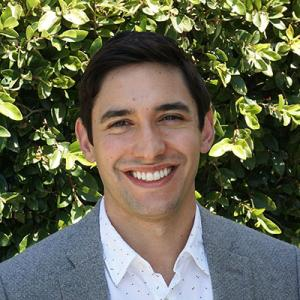 
                <b>Carlos Portela</b>
            </a>
            
机械设计、流体力学、动力学

        </td>
        <td align="center">
            <a href="research-quickview/mit/me/ritu-raman/research-overview.md">
                 
                <b>Ritu Raman</b>
            </a>
            
生物力学、流体动力学、材料科学

        </td>
        <td align="center">
            <a href="research-quickview/mit/me/vivishek-sudhir/research-overview.md">
                 
                <b>Vivishek Sudhir</b>
            </a>
            
流体力学、传热、微流体

        </td>
        <td align="center">
            <a href="research-quickview/mit/me/kripa-varanasi/research-overview.md">
                 
                <b>Kripa Varanasi</b>
            </a>
            
流体力学、表面现象、材料科学

        </td>
    </tr>
    <tr>
        <td align="center">
            <a href="research-quickview/mit/me/tomasz-wierzbicki/research-overview.md">
                 
                <b>Tomasz Wierzbicki</b>
            </a>
            
力学、材料科学、冲击力学

        </td>
        <td align="center">
            <a href="research-quickview/mit/me/james-williams-jr/research-overview.md">
                 
                <b>James H. Williams Jr.</b>
            </a>
            
材料力学、非线性力学、结构健康监测

        </td>
        <td align="center">
            <a href="research-quickview/mit/me/xuanhe-zhao/research-overview.md">
                 
                <b>Xuanhe Zhao</b>
            </a>
            
材料科学、软材料、结构力学

        </td>
    </tr>
</table>

- **Field**: [Design and Manufacturing](https://meche.mit.edu/research/design)

<table>
    <tr>
        <td align="center">
            <a href="research-quickview/mit/me/faez-ahmed/research-overview.md">
                 
                <b>Faez Ahmed</b>
            </a>
            
机械设计、制造技术、智能制造

        </td>
        <td align="center">
            <a href="research-quickview/mit/me/kaitlyn-becker/research-overview.md">
                 
                <b>Kaitlyn Becker</b>
            </a>
            
增材制造、设计创新、可持续性

        </td>
        <td align="center">
            <a href="research-quickview/mit/me/jung-hoon-chun/research-overview.md">
                 
                <b>Jung-Hoon Chun</b>
            </a>
            
计算机辅助设计、制造过程优化

        </td>
        <td align="center">
            <a href="research-quickview/mit/me/martin-culpepper/research-overview.md">
                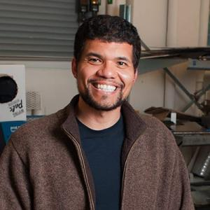 
                <b>Martin Culpepper</b>
            </a>
            
设计与制造、微纳米制造、智能材料

        </td>
    </tr>
    <tr>
        <td align="center">
            <a href="research-quickview/mit/me/daniel-frey/research-overview.md">
                 
                <b>Daniel Frey</b>
            </a>
            
设计理论、工程教育、设计方法

        </td>
        <td align="center">
            <a href="research-quickview/mit/me/timothy-gutowski/research-overview.md">
                 
                <b>Timothy G. Gutowski</b>
            </a>
            
绿色制造、能源效率、材料循环

        </td>
        <td align="center">
            <a href="research-quickview/mit/me/david-hardt/research-overview.md">
                 
                <b>David E. Hardt</b>
            </a>
            
制造过程建模、自动化与控制

        </td>
        <td align="center">
            <a href="research-quickview/mit/me/a-john-hart/research-overview.md">
                 
                <b>A. John Hart</b>
            </a>
            
先进制造技术、微制造、3D打印

        </td>
    </tr>
    <tr>
        <td align="center">
            <a href="research-quickview/mit/me/sangbae-kim/research-overview.md">
                 
                <b>Sangbae Kim</b>
            </a>
            
机器人设计、柔性制造、仿生学

        </td>
        <td align="center">
            <a href="research-quickview/mit/me/stefanie-mueller/research-overview.md">
                 
                <b>Stefanie Mueller</b>
            </a>
            
设计与制造、创意设计、原型制作

        </td>
        <td align="center">
            <a href="research-quickview/mit/me/nicholas-patrikalakis/research-overview.md">
                 
                <b>Nicholas M. Patrikalakis</b>
            </a>
            
CAD/CAM、逆向工程、几何建模

        </td>
        <td align="center">
            <a href="research-quickview/mit/me/ellen-roche/research-overview.md">
                 
                <b>Ellen Roche</b>
            </a>
            
生物材料、医疗器械设计、制造

        </td>
    </tr>
    <tr>
        <td align="center">
            <a href="research-quickview/mit/me/sanjay-sarma/research-overview.md">
                 
                <b>Sanjay E. Sarma</b>
            </a>
            
物联网、智能制造、数字制造

        </td>
        <td align="center">
            <a href="research-quickview/mit/me/warren-seering/research-overview.md">
                 
                <b>Warren Paul Seering</b>
            </a>
            
制造系统、供应链管理、工程管理

        </td>
        <td align="center">
            <a href="research-quickview/mit/me/alexander-slocum/research-overview.md">
                 
                <b>Alexander H. Slocum</b>
            </a>
            
机械设计、机器人技术、制造过程

        </td>
        <td align="center">
            <a href="research-quickview/mit/me/kripa-varanasi/research-overview.md">
                 
                <b>Kripa Varanasi</b>
            </a>
            
表面科学、流体力学、纳米制造

        </td>
    </tr>
</table>

- **Field**: [Control, Instrumentation, and Robotics](https://meche.mit.edu/research/controls)

<table>
    <tr>
        <td align="center">
            <a href="research-quickview/mit/me/harry-asada/research-overview.md">
                 
                <b>Harry Asada</b>
            </a>
            
机器人、控制理论、动态系统

        </td>
        <td align="center">
            <a href="research-quickview/mit/me/navid-azizan/research-overview.md">
                 
                <b>Navid Azizan</b>
            </a>
            
控制系统、优化、机器人技术

        </td>
        <td align="center">
            <a href="research-quickview/mit/me/george-barbastathis/research-overview.md">
                 
                <b>George Barbastathis</b>
            </a>
            
光学控制、成像系统、微型控制

        </td>
        <td align="center">
            <a href="research-quickview/mit/me/domitilla-del-vecchio/research-overview.md">
                 
                <b>Domitilla Del Vecchio</b>
            </a>
            
动态系统、控制理论、建模与优化

        </td>
    </tr>
    <tr>
        <td align="center">
            <a href="research-quickview/mit/me/douglas-hart/research-overview.md">
                 
                <b>Douglas Hart</b>
            </a>
            
机器人、控制系统、自动化技术

        </td>
        <td align="center">
            <a href="research-quickview/mit/me/neville-hogan/research-overview.md">
                 
                <b>Neville Hogan</b>
            </a>
            
生物力学、控制、机器人技术

        </td>
        <td align="center">
            <a href="research-quickview/mit/me/ian-hunter/research-overview.md">
                 
                <b>Ian Hunter</b>
            </a>
            
生物医学工程、微流体控制、动态系统

        </td>
        <td align="center">
            <a href="research-quickview/mit/me/john-leonard/research-overview.md">
                 
                <b>John J. Leonard</b>
            </a>
            
自主系统、计算机视觉、导航技术

        </td>
    </tr>
    <tr>
        <td align="center">
            <a href="research-quickview/mit/me/alberto-rodriguez/research-overview.md">
                 
                <b>Alberto Rodriguez</b>
            </a>
            
机器人学、力学、控制系统

        </td>
        <td align="center">
            <a href="research-quickview/mit/me/jean-jacques-slotine/research-overview.md">
                 
                <b>Jean-Jacques E. Slotine</b>
            </a>
            
控制理论、机器人、非线性系统

        </td>
        <td align="center">
            <a href="research-quickview/mit/me/russ-tedrake/research-overview.md">
                 
                <b>Russ Tedrake</b>
            </a>
            
机器人、学习控制、优化算法

        </td>
        <td align="center">
            <a href="research-quickview/mit/me/giovanni-traverso/research-overview.md">
                 
                <b>Giovanni Traverso</b>
            </a>
            
医疗设备、控制系统、自动化技术

        </td>
    </tr>
    <tr>
        <td align="center">
            <a href="research-quickview/mit/me/david-trumper/research-overview.md">
                 
                <b>David L. Trumper</b>
            </a>
            
控制系统、机电系统、动力学

        </td>
        <td align="center">
            <a href="research-quickview/mit/me/kamal-youcef-toumi/research-overview.md">
                 
                <b>Kamal Youcef-Toumi</b>
            </a>
            
智能系统、自动化控制、机器人学

        </td>
        <td align="center">
            <a href="research-quickview/mit/me/xuanhe-zhao/research-overview.md">
                 
                <b>Xuanhe Zhao</b>
            </a>
            
软体机器人、生物启发设计、控制理论

        </td>
    </tr>
</table>

- **Field**: [Energy Science and Engineering](https://meche.mit.edu/research/energy)

<table>
    <tr>
        <td align="center">
            <a href="research-quickview/mit/me/john-brisson/research-overview.md">
                 
                <b>John G. Brisson II</b>
            </a>
            
能源系统、热力学、可再生能源技术

        </td>
        <td align="center">
            <a href="research-quickview/mit/me/cullen-buie/research-overview.md">
                 
                <b>Cullen Buie</b>
            </a>
            
流体动力学、微流体系统、能源转化

        </td>
        <td align="center">
            <a href="research-quickview/mit/me/tonio-buonassisi/research-overview.md">
                 
                <b>Tonio Buonassisi</b>
            </a>
            
太阳能光伏、材料科学、能源效率

        </td>
        <td align="center">
            <a href="research-quickview/mit/me/gang-chen/research-overview.md">
                 
                <b>Gang Chen</b>
            </a>
            
热电材料、纳米技术、能源传输

        </td>
    </tr>
    <tr>
        <td align="center">
            <a href="research-quickview/mit/me/wai-k-cheng/research-overview.md">
                 
                <b>Wai K. Cheng</b>
            </a>
            
流体力学、热管理、能源应用

        </td>
        <td align="center">
            <a href="research-quickview/mit/me/sili-deng/research-overview.md">
                 
                <b>Sili Deng</b>
            </a>
            
可再生能源、能源存储技术、系统优化

        </td>
        <td align="center">
            <a href="research-quickview/mit/me/betar-gallant/research-overview.md">
                 
                <b>Betar Gallant</b>
            </a>
            
材料科学、能源转化、系统分析

        </td>
        <td align="center">
            <a href="research-quickview/mit/me/ahmed-ghoniem/research-overview.md">
                 
                <b>Ahmed F. Ghoniem</b>
            </a>
            
能源系统、化学反应、流体动力学

        </td>
    </tr>
    <tr>
        <td align="center">
            <a href="research-quickview/mit/me/asegun-henry/research-overview.md">
                 
                <b>Asegun Henry</b>
            </a>
            
热力学、材料设计、能源转换

        </td>
        <td align="center">
            <a href="research-quickview/mit/me/jeehwan-kim/research-overview.md">
                 
                <b>Jeehwan Kim</b>
            </a>
            
能源材料、储能技术、纳米材料

        </td>
        <td align="center">
            <a href="research-quickview/mit/me/john-lienhard/research-overview.md">
                 
                <b>John H. Lienhard V</b>
            </a>
            
水资源、热能转换、流体动力学

        </td>
        <td align="center">
            <a href="research-quickview/mit/me/paul-sclavounos/research-overview.md">
                 
                <b>Paul D. Sclavounos</b>
            </a>
            
能源管理、系统设计、优化

        </td>
    </tr>
    <tr>
        <td align="center">
            <a href="research-quickview/mit/me/yang-shao-horn/research-overview.md">
                 
                <b>Yang Shao-Horn</b>
            </a>
            
催化剂设计、能源转换、可再生能源

        </td>
        <td align="center">
            <a href="research-quickview/mit/me/kripa-varanasi/research-overview.md">
                 
                <b>Kripa Varanasi</b>
            </a>
            
表面工程、能源转化、水资源管理

        </td>
        <td align="center">
            <a href="research-quickview/mit/me/evelyn-wang/research-overview.md">
                 
                <b>Evelyn Wang</b>
            </a>
            
热能管理、能源系统、材料科学

        </td>
        <td align="center">
            <a href="research-quickview/mit/me/sherrie-wang/research-overview.md">
                 
                <b>Sherrie Wang</b>
            </a>
            
可再生能源技术、微流体、能源管理

        </td>
    </tr>
</table>

- **Field**: [Bioengineering](https://meche.mit.edu/research/bioengineering)
<table>
    <tr>
        <td align="center">
            <a href="research-quickview/mit/me/lydia-bourouiba/research-overview.md">
                 
                <b>Lydia Bourouiba</b>
            </a>
            
流体动力学、气溶胶传播、生物传输

        </td>
        <td align="center">
            <a href="research-quickview/mit/me/ming-guo/research-overview.md">
                 
                <b>Ming Guo</b>
            </a>
            
生物力学、纳米技术、细胞工程

        </td>
        <td align="center">
            <a href="research-quickview/mit/me/roger-kamm/research-overview.md">
                 
                <b>Roger Dale Kamm</b>
            </a>
            
组织工程、生物医学工程、流体力学

        </td>
        <td align="center">
            <a href="research-quickview/mit/me/mathias-kolle/research-overview.md">
                 
                <b>Mathias Kolle</b>
            </a>
            
软材料、聚合物工程、生物材料

        </td>
    </tr>
    <tr>
        <td align="center">
            <a href="research-quickview/mit/me/ritu-raman/research-overview.md">
                 
                <b>Ritu Raman</b>
            </a>
            
生物力学、智能材料、软机器人

        </td>
        <td align="center">
            <a href="research-quickview/mit/me/ellen-roche/research-overview.md">
                 
                <b>Ellen Roche</b>
            </a>
            
组织工程、机械工程、生物医学应用

        </td>
        <td align="center">
            <a href="research-quickview/mit/me/peter-so/research-overview.md">
                 
                <b>Peter T. So</b>
            </a>
            
生物成像、光学工程、微流体

        </td>
        <td align="center">
            <a href="research-quickview/mit/me/loza-tadesse/research-overview.md">
                 
                <b>Loza Tadesse</b>
            </a>
            
生物传输、生物力学、软材料

        </td>
    </tr>
    <tr>
        <td align="center">
            <a href="research-quickview/mit/me/giovanni-traverso/research-overview.md">
                 
                <b>Giovanni Traverso</b>
            </a>
            
消化系统工程、医疗器械、生物医学工程

        </td>
        <td align="center">
            <a href="research-quickview/mit/me/kripa-varanasi/research-overview.md">
                 
                <b>Kripa Varanasi</b>
            </a>
            
能源转化、水处理、界面科学

        </td>
        <td align="center">
            <a href="research-quickview/mit/me/ioannis-yannas/research-overview.md">
                 
                <b>Ioannis V. Yannas</b>
            </a>
            
生物材料、组织工程、再生医学

        </td>
        <td align="center">
            <a href="research-quickview/mit/me/xuanhe-zhao/research-overview.md">
                 
                <b>Xuanhe Zhao</b>
            </a>
            
生物材料、柔性电子、智能系统

        </td>
    </tr>
</table>

- **Field**: [Micro and Nanotechnology](https://meche.mit.edu/people?field_research_area_tid[]=12)

<table>
  <tr>
    <td align="center">
      <a href="research-quickview/mit/me/george-barbastathis/research-overview.md">
         
        <b>George Barbastathis</b>
      </a>
      
生物医学成像、药物冷冻干燥监控、计算光学与物理驱动AI

    </td>
    <td align="center">
      <a href="research-quickview/mit/me/gang-chen/research-overview.md">
         
        <b>Gang Chen</b>
      </a>
      
纳米尺度热传导、能量转换、热管理

    </td>
    <td align="center">
      <a href="research-quickview/mit/me/martin-culpepper/research-overview.md">
         
        <b>Martin Culpepper</b>
      </a>
      
精密机械设计、高精度仪器与系统、纳米技术

    </td>
    <td align="center">
      <a href="research-quickview/mit/me/alan-grodzinsky/research-overview.md">
         
        <b>Alan Grodzinsky</b>
      </a>
      
生物力学、生物组织电机械特性、关节疾病治疗

    </td>
  </tr>
  <tr>
    <td align="center">
      <a href="research-quickview/mit/me/nicolas-hadjiconstantinou/research-overview.md">
         
        <b>Nicolas Hadjiconstantinou</b>
      </a>
      
微纳尺度流体力学、热传导、传输现象计算方法

    </td>
    <td align="center">
      <a href="research-quickview/mit/me/john-hart/research-overview.md">
         
        <b>John Hart</b>
      </a>
      
碳纳米管纤维复合材料制造、增材制造

    </td>
    <td align="center">
      <a href="research-quickview/mit/me/joseph-jacobson/research-overview.md">
         
        <b>Joseph Jacobson</b>
      </a>
      
数字制造、分子电子学、生物与电子学界面

    </td>
    <td align="center">
      <a href="research-quickview/mit/me/rohit-karnik/research-overview.md">
         
        <b>Rohit Karnik</b>
      </a>
      
微流体和纳流体系统、流体传输、水净化和生物医学设备

    </td>
  </tr>
  <tr>
    <td align="center">
      <a href="research-quickview/mit/me/jeehwan-kim/research-overview.md">
         
        <b>Jeehwan Kim</b>
      </a>
      
二维材料、电子和光电子学、材料可扩展制造技术

    </td>
    <td align="center">
      <a href="research-quickview/mit/me/sang-gook-kim/research-overview.md">
         
        <b>Sang-Gook Kim</b>
      </a>
      
微机电系统、传感器和能量采集器、纳米技术

    </td>
    <td align="center">
      <a href="research-quickview/mit/me/robert-langer/research-overview.md">
         
        <b>Robert Langer</b>
      </a>
      
生物技术、材料科学、药物输送系统、组织工程

    </td>
    <td align="center">
      <a href="research-quickview/mit/me/scott-manalis/research-overview.md">
         
        <b>Scott Manalis</b>
      </a>
      
生物微机电系统、单细胞分析、诊断和治疗

    </td>
  </tr>
  <tr>
    <td align="center">
      <a href="research-quickview/mit/me/carlos-portela/research-overview.md">
         
        <b>Carlos Portela</b>
      </a>
      
军用超材料抗冲击承受高应力、声学聚焦超材料（水下）、自组装纳米超材料

    </td>
    <td align="center">
      <a href="research-quickview/mit/me/yang-shao-horn/research-overview.md">
         
        <b>Yang Shao-Horn</b>
      </a>
      
能量存储与转换、电池和燃料电池、催化剂材料

    </td>
    <td align="center">
      <a href="research-quickview/mit/me/vivishek-sudhir/research-overview.md">
         
        <b>Vivishek Sudhir</b>
      </a>
      
量子测量与控制、量子系统控制

    </td>
    <td align="center">
      <a href="research-quickview/mit/me/kripa-varanasi/research-overview.md">
         
        <b>Kripa Varanasi</b>
      </a>
      
界面现象、表面润湿性、能源与制造

    </td>
  </tr>
  <tr>
    <td align="center">
      <a href="research-quickview/mit/me/evelyn-wang/research-overview.md">
         
        <b>Evelyn Wang</b>
      </a>
      
热管理、能量收集、电子冷却和太阳能应用

    </td>
    <td align="center">
      <a href="research-quickview/mit/me/sherrie-wang/research-overview.md">
         
        <b>Sherrie Wang</b>
      </a>
      
可持续农业、食品系统、机器学习与遥感

    </td>
    <td align="center">
      <a href="research-quickview/mit/me/nicholas-x-fang/research-overview.md">
        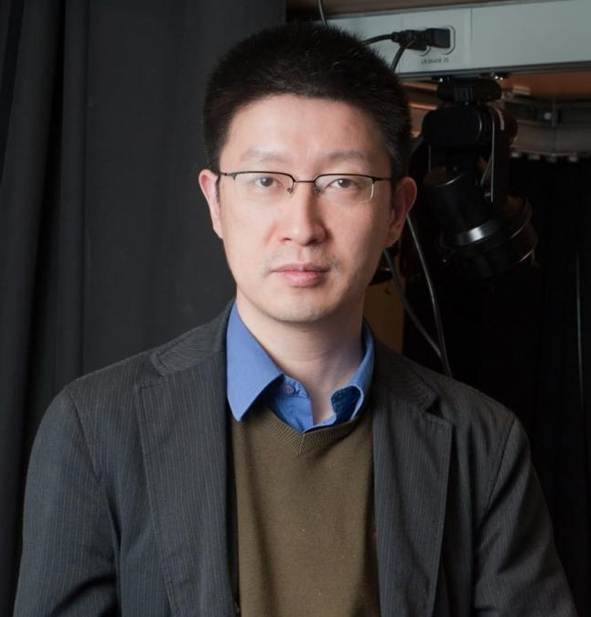 
        <b>Nicholas X. Fang</b>
      </a>
      
声学超材料、3D打印纳米结构、医疗声学诊断成像(2024年刚转去HKU港大)

    </td>
  </tr>
</table>

### [Electrical Engineering and Computer Science](https://www.eecs.mit.edu/)

- **Field**: Optics + Photonics
- [**Faculty**](https://www.eecs.mit.edu/people/?fwp_research=optics-and-photonics)

<table>
  <tr>
    <td align="center">
      <a href="research-quickview/mit/eecs/duane-boning/research-overview.md">
        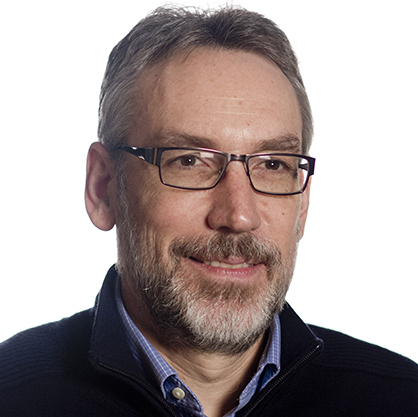 
        <b>Duane Boning</b>
      </a>
      
半导体工艺优化、设备可靠性评估、光子集成制造

    </td>
    <td align="center">
      <a href="research-quickview/mit/eecs/vladimir-bulovic/research-overview.md">
        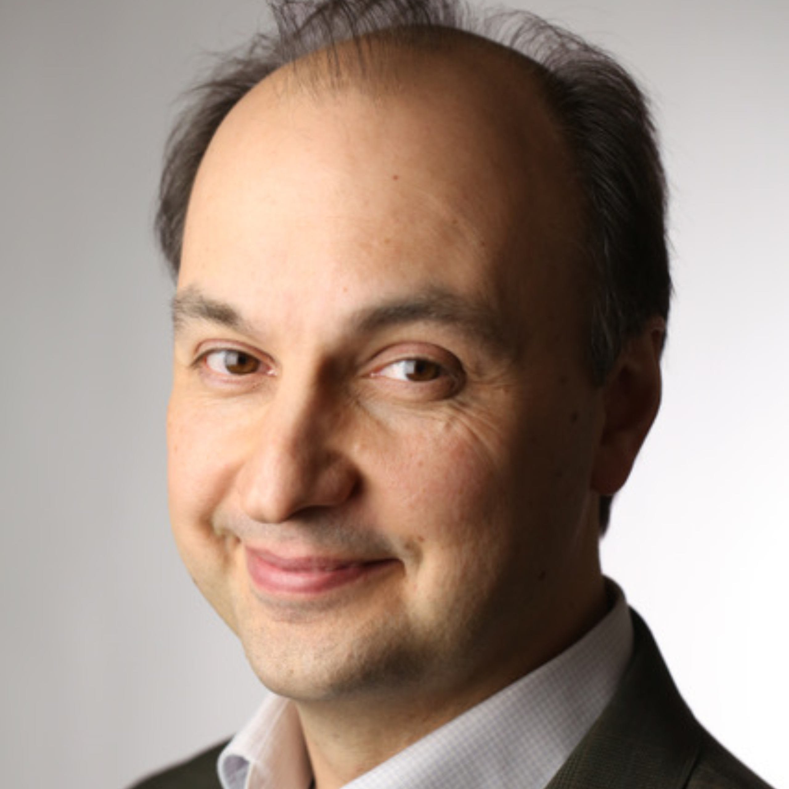 
        <b>Vladimir Bulović</b>
      </a>
      
钙钛矿光电材料、透明光伏技术（能源）、纳米尺度传感器

    </td>
    <td align="center">
      <a href="research-quickview/mit/eecs/dirk-englund/research-overview.md">
        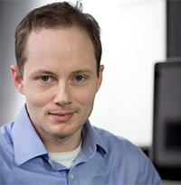 
        <b>Dirk Englund</b>
      </a>
      
量子光子器件、光学神经计算、高灵敏传感器与成像

    </td>
    <td align="center">
      <a href="research-quickview/mit/eecs/james-fujimoto/research-overview.md">
        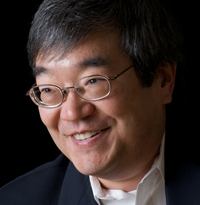 
        <b>James Fujimoto</b>
      </a>
      
光学相干断层扫描、高分辨率生物成像、临床诊断应用

    </td>
  </tr>
  <tr>
    <td align="center">
      <a href="research-quickview/mit/eecs/leslie-kolodziejski/research-overview.md">
        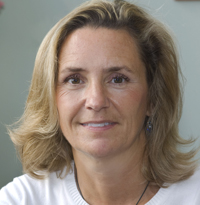 
        <b>Leslie Kolodziejski</b>
      </a>
      
（疑似退休或不在科研一线）

    </td>
    <td align="center">
      <a href="research-quickview/mit/eecs/wojciech-matusik/research-overview.md">
        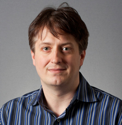 
        <b>Wojciech Matusik</b>
      </a>
      
视觉反馈制造、AI调节生产过程、自动优化材料、智能制造

    </td>
    <td align="center">
      <a href="research-quickview/mit/eecs/jelena-notaros/research-overview.md">
        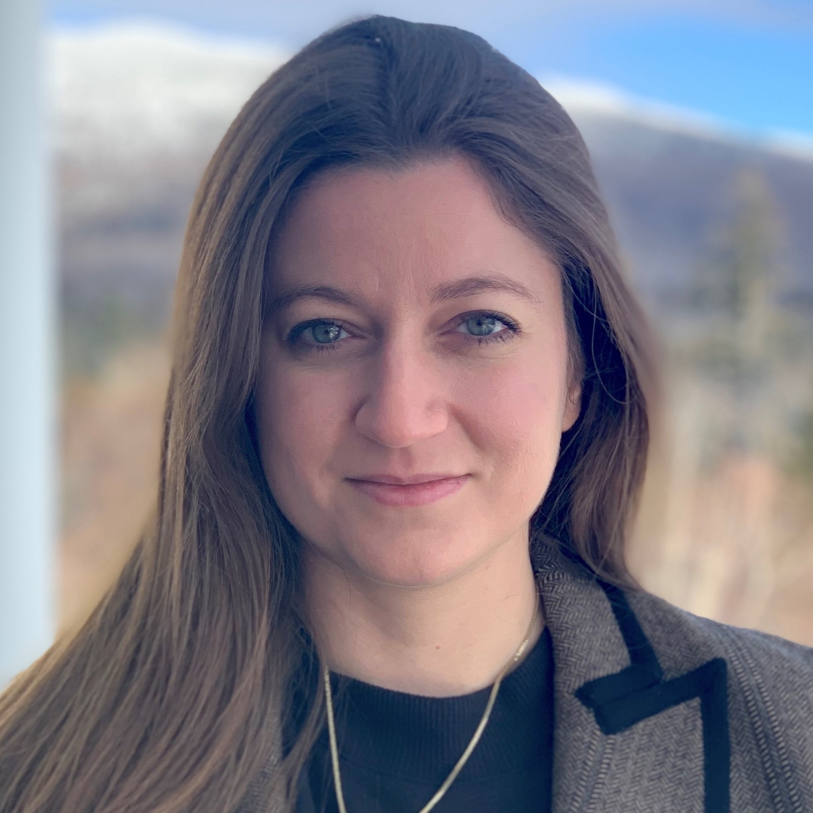 
        <b>Jelena Notaros</b>
      </a>
      
集成光子学、光学相控阵、量子信息处理

    </td>
    <td align="center">
      <a href="research-quickview/mit/eecs/william-d-oliver/research-overview.md">
        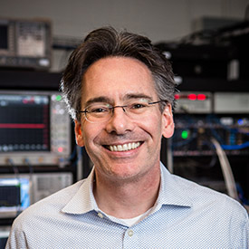 
        <b>William D. Oliver</b>
      </a>
      
超导量子计算、远程量子纠缠、量子噪声控制

    </td>
  </tr>
  <tr>
    <td align="center">
      <a href="research-quickview/mit/eecs/rajeev-ram/research-overview.md">
        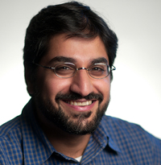 
        <b>Rajeev Ram</b>
      </a>
      
光电集成光通信、生物医疗光学传感、CMOS兼容的光学器件

    </td>
    <td align="center">
      <a href="research-quickview/mit/eecs/sixian-you/research-overview.md">
         
        <b>Sixian You</b>
      </a>
      
无标记光学显微成像、AI应成像算法、生物医学诊断

    </td>
  </tr>
</table>

- **Field**: Nanoscale Materials, Devices, and Systems
- [**Faculty**](https://www.eecs.mit.edu/people/?fwp_research=nanoscale-materials-devices-and-systems)

<table>
  <tr>
    <td align="center">
      <a href="research-quickview/mit/eecs/akintunde-akinwande/research-overview.md">
         
        <b>Akintunde Akinwande</b>
      </a>
      
微机电系统（MEMS）、纳米电子器件、传感器技术

    </td>
    <td align="center">
      <a href="research-quickview/mit/eecs/dimitri-antoniadis/research-overview.md">
         
        <b>Dimitri Antoniadis</b>
      </a>
      
纳米尺度半导体器件、先进CMOS技术、器件建模

    </td>
    <td align="center">
      <a href="research-quickview/mit/eecs/karl-berggren/research-overview.md">
        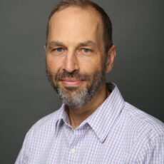 
        <b>Karl Berggren</b>
      </a>
      
纳米制造、超导纳米线单光子探测器、电子束光刻

    </td>
    <td align="center">
      <a href="research-quickview/mit/eecs/sangeeta-bhatia/research-overview.md">
         
        <b>Sangeeta Bhatia</b>
      </a>
      
微型生物技术、纳米医学、组织工程

    </td>
  </tr>
  <tr>
    <td align="center">
      <a href="research-quickview/mit/eecs/duane-boning/research-overview.md">
         
        <b>Duane Boning</b>
      </a>
      
半导体制造、工艺控制、统计建模

    </td>
    <td align="center">
      <a href="research-quickview/mit/eecs/vladimir-bulovic/research-overview.md">
         
        <b>Vladimir Bulović</b>
      </a>
      
有机和纳米结构电子学、柔性电子器件、太阳能电池

    </td>
    <td align="center">
      <a href="research-quickview/mit/eecs/anantha-chandrakasan/research-overview.md">
         
        <b>Anantha Chandrakasan</b>
      </a>
      
超低功耗电路设计、无线传感器网络、嵌入式系统

    </td>
    <td align="center">
      <a href="research-quickview/mit/eecs/isaac-chuang/research-overview.md">
         
        <b>Isaac Chuang</b>
      </a>
      
量子计算、量子信息科学、量子电路设计

    </td>
  </tr>
  <tr>
    <td align="center">
      <a href="research-quickview/mit/eecs/luca-daniel/research-overview.md">
         
        <b>Luca Daniel</b>
      </a>
      
电磁场计算、电子设计自动化、微机电系统建模

    </td>
    <td align="center">
      <a href="research-quickview/mit/eecs/jesus-del-alamo/research-overview.md">
         
        <b>Jesús del Alamo</b>
      </a>
      
高电子迁移率晶体管、宽带隙半导体器件、器件可靠性

    </td>
    <td align="center">
      <a href="research-quickview/mit/eecs/dirk-englund/research-overview.md">
         
        <b>Dirk Englund</b>
      </a>
      
量子光子学、纳米光子器件、量子通信

    </td>
    <td align="center">
      <a href="research-quickview/mit/eecs/jongyoon-han/research-overview.md">
         
        <b>Jongyoon Han</b>
      </a>
      
微流控技术、生物分离、纳米生物技术

    </td>
  </tr>
  <tr>
    <td align="center">
      <a href="research-quickview/mit/eecs/qing-hu/research-overview.md">
         
        <b>Qing Hu</b>
      </a>
      
太赫兹科学与技术、宽频带探测、亚波长光子学

    </td>
    <td align="center">
      <a href="research-quickview/mit/eecs/leslie-kolodziejski/research-overview.md">
         
        <b>Leslie Kolodziejski</b>
      </a>
      
光学材料、光子集成、量子光学

    </td>
    <td align="center">
      <a href="research-quickview/mit/eecs/jing-kong/research-overview.md">
         
        <b>Jing Kong</b>
      </a>
      
二维材料、纳米碳材料、柔性电子学

    </td>
    <td align="center">
      <a href="research-quickview/mit/eecs/jeffrey-lang/research-overview.md">
         
        <b>Jeffrey Lang</b>
      </a>
      
电机设计与建模、电磁学、能量收集

    </td>
  </tr>
  <tr>
    <td align="center">
      <a href="research-quickview/mit/eecs/luqiao-liu/research-overview.md">
         
        <b>Luqiao Liu</b>
      </a>
      
自旋电子学、磁性材料、量子材料

    </td>
    <td align="center">
      <a href="research-quickview/mit/eecs/farnaz-niroui/research-overview.md">
         
        <b>Farnaz Niroui</b>
      </a>
      
纳米制造、纳米电子学、纳米材料的自组装

    </td>
    <td align="center">
      <a href="research-quickview/mit/eecs/jelena-notaros/research-overview.md">
         
        <b>Jelena Notaros</b>
      </a>
      
集成光子学、光学相控阵、量子信息处理

    </td>
    <td align="center">
      <a href="research-quickview/mit/eecs/kevin-obrien/research-overview.md">
         
        <b>Kevin P. O’Brien</b>
      </a>
      
量子计算、光学非线性、量子传感

    </td>
  </tr>
</table>

<!-- End of MIT Section -->
<!-- End of MIT Section -->
<!-- End of MIT Section -->

## [Harvard](https://www.harvard.edu/)

Click to expand Harvard Professors

### [Materials and Mechanical Engineering](https://seas.harvard.edu/materials-science-mechanical-engineering/faculty-research)

Materials and Mechanical Engineering Faculty

- [**Faculty**](https://seas.harvard.edu/materials-science-mechanical-engineering/faculty-research)

- **Field**: Computational Materials Science
<table>
  <tr>
    <td align="center">
      <a href="research-quickview/harvard/mme/efthimios-kaxiras/research-overview.md">
         
        <b>Efthimios Kaxiras</b>
      </a>
      
计算材料科学、量子物理、纳米材料

    </td>
    <td align="center">
      <a href="research-quickview/harvard/mme/boris-kozinsky/research-overview.md">
         
        <b>Boris Kozinsky</b>
      </a>
      
计算材料科学、机器学习、材料建模

    </td>
    <td align="center">
      <a href="research-quickview/harvard/mme/xin-li/research-overview.md">
         
        <b>Xin Li</b>
      </a>
      
计算材料、纳米技术、光电材料

    </td>
  </tr>
</table>

- **Field**: Fluid Mechanics
<table>
  <tr>
    <td align="center">
      <a href="research-quickview/harvard/mme/michael-p-brenner/research-overview.md">
         
        <b>Michael P. Brenner</b>
      </a>
      
流体力学、气候科学、非线性动力学

    </td>
    <td align="center">
      <a href="research-quickview/harvard/mme/brian-f-farrell/research-overview.md">
         
        <b>Brian F. Farrell</b>
      </a>
      
流体力学、气候动力学、气候变化

    </td>
    <td align="center">
      <a href="research-quickview/harvard/mme/petros-koumoutsakos/research-overview.md">
         
        <b>Petros Koumoutsakos</b>
      </a>
      
计算流体力学、气候变化模拟、气候技术

    </td>
    <td align="center">
      <a href="research-quickview/harvard/mme/marianna-katherine-linz/research-overview.md">
         
        <b>Marianna Katherine Linz</b>
      </a>
      
流体力学、波动理论、非线性动力学

    </td>
  </tr>
  <tr>
    <td align="center">
      <a href="research-quickview/harvard/mme/maxim-prigozhin/research-overview.md">
         
        <b>Maxim Prigozhin</b>
      </a>
      
流体力学、复杂系统、材料科学

    </td>
    <td align="center">
      <a href="research-quickview/harvard/mme/james-r-rice/research-overview.md">
         
        <b>James R. Rice</b>
      </a>
      
固体力学、材料科学、流体动力学

    </td>
    <td align="center">
      <a href="research-quickview/harvard/mme/fiamma-straneo/research-overview.md">
         
        <b>Fiamma Straneo</b>
      </a>
      
海洋学、流体动力学、气候变化

    </td>
    <td align="center">
      <a href="research-quickview/harvard/mme/eli-tziperman/research-overview.md">
         
        <b>Eli Tziperman</b>
      </a>
      
气候动力学、流体力学、气候变化

    </td>
  </tr>
  <tr>
    <td align="center">
      <a href="research-quickview/harvard/mme/robin-wordsworth/research-overview.md">
         
        <b>Robin Wordsworth</b>
      </a>
      
气候科学、气候动力学、行星科学

    </td>
  </tr>
</table>

- **Field**: Materials
<table>
  <tr>
    <td align="center">
      <a href="research-quickview/harvard/mme/joanna-aizenberg/research-overview.md">
         
        <b>Joanna Aizenberg</b>
      </a>
      
智能材料、仿生材料、纳米技术

    </td>
    <td align="center">
      <a href="research-quickview/harvard/mme/michael-j-aziz/research-overview.md">
         
        <b>Michael J. Aziz</b>
      </a>
      
能量存储、材料科学、气候变化技术

    </td>
    <td align="center">
      <a href="research-quickview/harvard/mme/martin-bechthold/research-overview.md">
         
        <b>Martin Bechthold</b>
      </a>
      
机械设计、材料科学、工程

    </td>
    <td align="center">
      <a href="research-quickview/harvard/mme/katia-bertoldi/research-overview.md">
         
        <b>Katia Bertoldi</b>
      </a>
      
材料科学、软材料、结构材料

    </td>
  </tr>
  <tr>
    <td align="center">
      <a href="research-quickview/harvard/mme/david-clarke/research-overview.md">
         
        <b>David Clarke</b>
      </a>
      
材料科学、热物理、力学

    </td>
    <td align="center">
      <a href="research-quickview/harvard/mme/roy-g-gordon/research-overview.md">
         
        <b>Roy G. Gordon</b>
      </a>
      
材料科学、化学、物理

    </td>
    <td align="center">
      <a href="research-quickview/harvard/mme/donhee-ham/research-overview.md">
         
        <b>Donhee Ham</b>
      </a>
      
生物电子学、材料科学、集成电路

    </td>
    <td align="center">
      <a href="research-quickview/harvard/mme/jenny-hoffman/research-overview.md">
         
        <b>Jenny Hoffman</b>
      </a>
      
材料科学、量子材料、磁性

    </td>
  </tr>
  <tr>
    <td align="center">
      <a href="research-quickview/harvard/mme/evelyn-hu/research-overview.md">
         
        <b>Evelyn Hu</b>
      </a>
      
纳米光子学、量子材料、电子材料

    </td>
    <td align="center">
      <a href="research-quickview/harvard/mme/efthimios-kaxiras/research-overview.md">
         
        <b>Efthimios Kaxiras</b>
      </a>
      
材料科学、计算材料、量子物理

    </td>
    <td align="center">
      <a href="research-quickview/harvard/mme/philip-kim/research-overview.md">
         
        <b>Philip Kim</b>
      </a>
      
纳米材料、量子材料、低维材料

    </td>
    <td align="center">
      <a href="research-quickview/harvard/mme/boris-kozinsky/research-overview.md">
         
        <b>Boris Kozinsky</b>
      </a>
      
计算材料、材料设计、机器学习

    </td>
  </tr>
  <tr>
    <td align="center">
      <a href="research-quickview/harvard/mme/jennifer-lewis/research-overview.md">
         
        <b>Jennifer Lewis</b>
      </a>
      
3D打印、生物材料、纳米材料

    </td>
    <td align="center">
      <a href="research-quickview/harvard/mme/xin-li/research-overview.md">
         
        <b>Xin Li</b>
      </a>
      
计算材料、纳米材料、材料设计

    </td>
    <td align="center">
      <a href="research-quickview/harvard/mme/jia-liu/research-overview.md">
         
        <b>Jia Liu</b>
      </a>
      
材料科学、柔性材料、可持续技术

    </td>
    <td align="center">
      <a href="research-quickview/harvard/mme/vinothan-n-manoharan/research-overview.md">
         
        <b>Vinothan N. Manoharan</b>
      </a>
      
材料科学、流体力学、气候技术

    </td>
  </tr>
  <tr>
    <td align="center">
      <a href="research-quickview/harvard/mme/samir-mitragotri/research-overview.md">
         
        <b>Samir Mitragotri</b>
      </a>
      
生物材料、药物传递、纳米技术

    </td>
    <td align="center">
      <a href="research-quickview/harvard/mme/julia-a-mundy/research-overview.md">
         
        <b>Julia A. Mundy</b>
      </a>
      
生物材料、纳米材料、表面科学

    </td>
    <td align="center">
      <a href="research-quickview/harvard/mme/venkatesh-narayanamurti/research-overview.md">
         
        <b>Venkatesh Narayanamurti</b>
      </a>
      
材料科学、工程教育、技术开发

    </td>
    <td align="center">
      <a href="research-quickview/harvard/mme/daniel-needleman/research-overview.md">
         
        <b>Daniel Needleman</b>
      </a>
      
生物物理、材料科学、力学

    </td>
  </tr>
  <tr>
    <td align="center">
      <a href="research-quickview/harvard/mme/kit-parker/research-overview.md">
         
        <b>Kit Parker</b>
      </a>
      
生物力学、材料科学、柔性材料

    </td>
    <td align="center">
      <a href="research-quickview/harvard/mme/maxim-prigozhin/research-overview.md">
         
        <b>Maxim Prigozhin</b>
      </a>
      
材料科学、流体力学、气候技术

    </td>
    <td align="center">
      <a href="research-quickview/harvard/mme/james-r-rice/research-overview.md">
         
        <b>James R. Rice</b>
      </a>
      
固体力学、材料科学、气候变化

    </td>
    <td align="center">
      <a href="research-quickview/harvard/mme/zhigang-suo/research-overview.md">
         
        <b>Zhigang Suo</b>
      </a>
      
固体力学、材料科学、热力学

    </td>
  </tr>
  <tr>
    <td align="center">
      <a href="research-quickview/harvard/mme/joost-j-vlassak/research-overview.md">
         
        <b>Joost J. Vlassak</b>
      </a>
      
材料科学、力学、材料设计

    </td>
    <td align="center">
      <a href="research-quickview/harvard/mme/conor-j-walsh/research-overview.md">
         
        <b>Conor J Walsh</b>
      </a>
      
生物医学设备、机器人技术、控制系统

    </td>
    <td align="center">
      <a href="research-quickview/harvard/mme/david-a-weitz/research-overview.md">
         
        <b>David A. Weitz</b>
      </a>
      
材料科学、微流体、细胞生物学

    </td>
  </tr>
</table>

- **Field**: Robotics and Control
<table>
  <tr>
    <td align="center">
      <a href="research-quickview/harvard/mme/martin-bechthold/research-overview.md">
         
        <b>Martin Bechthold</b>
      </a>
      
机器人控制、机械设计、自动化

    </td>
    <td align="center">
      <a href="research-quickview/harvard/mme/david-clarke/research-overview.md">
         
        <b>David Clarke</b>
      </a>
      
材料科学、机器人技术、传感器

    </td>
    <td align="center">
      <a href="research-quickview/harvard/mme/yilun-du/research-overview.md">
         
        <b>Yilun Du</b>
      </a>
      
机器人技术、人工智能、控制系统

    </td>
    <td align="center">
      <a href="research-quickview/harvard/mme/stephanie-gil/research-overview.md">
         
        <b>Stephanie Gil</b>
      </a>
      
机器学习、智能机器人、控制系统

    </td>
  </tr>
  <tr>
    <td align="center">
      <a href="research-quickview/harvard/mme/robert-d-howe/research-overview.md">
         
        <b>Robert D. Howe</b>
      </a>
      
机器人控制、机械设计、医疗机器人

    </td>
    <td align="center">
      <a href="research-quickview/harvard/mme/vijay-janapa-reddi/research-overview.md">
         
        <b>Vijay Janapa Reddi</b>
      </a>
      
计算机体系结构、机器人、机器学习

    </td>
    <td align="center">
      <a href="research-quickview/harvard/mme/na-li/research-overview.md">
         
        <b>Na Li</b>
      </a>
      
机器人、机器学习、控制系统

    </td>
    <td align="center">
      <a href="research-quickview/harvard/mme/l-mahadevan/research-overview.md">
         
        <b>L Mahadevan</b>
      </a>
      
生物力学、软体机器人、流体力学

    </td>
  </tr>
  <tr>
    <td align="center">
      <a href="research-quickview/harvard/mme/patrick-slade/research-overview.md">
         
        <b>Patrick Slade</b>
      </a>
      
机器人学、控制理论、机械设计

    </td>
    <td align="center">
      <a href="research-quickview/harvard/mme/maurice-smith/research-overview.md">
         
        <b>Maurice Smith</b>
      </a>
      
材料科学、机器人技术、传感器技术

    </td>
    <td align="center">
      <a href="research-quickview/harvard/mme/shriya-srinivasan/research-overview.md">
         
        <b>Shriya Srinivasan</b>
      </a>
      
生物机器人、人工智能、控制系统

    </td>
    <td align="center">
      <a href="research-quickview/harvard/mme/conor-j-walsh/research-overview.md">
         
        <b>Conor J Walsh</b>
      </a>
      
生物医疗机器人、控制系统、传感器

    </td>
  </tr>
  <tr>
    <td align="center">
      <a href="research-quickview/harvard/mme/justin-werfel/research-overview.md">
         
        <b>Justin Werfel</b>
      </a>
      
机器人、人工智能、控制理论

    </td>
    <td align="center">
      <a href="research-quickview/harvard/mme/robert-j-wood/research-overview.md">
         
        <b>Robert J. Wood</b>
      </a>
      
微型机器人、人工智能、控制理论

    </td>
    <td align="center">
      <a href="research-quickview/harvard/mme/heng-yang/research-overview.md">
         
        <b>Heng Yang</b>
      </a>
      
机器学习、计算机视觉、机器人技术

    </td>
  </tr>
</table>

- **Field**: Science and Engineering for ClimateTech
<table>
  <tr>
    <td align="center">
      <a href="research-quickview/harvard/mme/joanna-aizenberg/research-overview.md">
         
        <b>Joanna Aizenberg</b>
      </a>
      
材料科学、可持续技术、气候变化研究

    </td>
    <td align="center">
      <a href="research-quickview/harvard/mme/michael-j-aziz/research-overview.md">
         
        <b>Michael J. Aziz</b>
      </a>
      
能量存储、材料科学、气候变化技术

    </td>
    <td align="center">
      <a href="research-quickview/harvard/mme/michael-p-brenner/research-overview.md">
         
        <b>Michael P. Brenner</b>
      </a>
      
流体力学、气候科学、计算物理

    </td>
    <td align="center">
      <a href="research-quickview/harvard/mme/david-brooks/research-overview.md">
         
        <b>David Brooks</b>
      </a>
      
气候技术、可持续计算、网络架构

    </td>
  </tr>
  <tr>
    <td align="center">
      <a href="research-quickview/harvard/mme/david-clarke/research-overview.md">
         
        <b>David Clarke</b>
      </a>
      
材料科学、机器人技术、气候变化技术

    </td>
    <td align="center">
      <a href="research-quickview/harvard/mme/lene-v-hau/research-overview.md">
         
        <b>Lene V. Hau</b>
      </a>
      
量子光学、气候科学、光子学

    </td>
    <td align="center">
      <a href="research-quickview/harvard/mme/frank-n-keutsch/research-overview.md">
         
        <b>Frank N Keutsch</b>
      </a>
      
大气科学、气候变化、气候技术

    </td>
    <td align="center">
      <a href="research-quickview/harvard/mme/petros-koumoutsakos/research-overview.md">
         
        <b>Petros Koumoutsakos</b>
      </a>
      
计算流体力学、气候变化模拟、气候技术

    </td>
  </tr>
  <tr>
    <td align="center">
      <a href="research-quickview/harvard/mme/boris-kozinsky/research-overview.md">
         
        <b>Boris Kozinsky</b>
      </a>
      
材料科学、计算材料学、气候技术

    </td>
    <td align="center">
      <a href="research-quickview/harvard/mme/jennifer-lewis/research-overview.md">
         
        <b>Jennifer Lewis</b>
      </a>
      
材料科学、3D打印、气候技术

    </td>
    <td align="center">
      <a href="research-quickview/harvard/mme/na-li/research-overview.md">
         
        <b>Na Li</b>
      </a>
      
机器人、机器学习、气候技术

    </td>
    <td align="center">
      <a href="research-quickview/harvard/mme/vinothan-n-manoharan/research-overview.md">
         
        <b>Vinothan N. Manoharan</b>
      </a>
      
材料科学、气候技术、流体力学

    </td>
  </tr>
  <tr>
    <td align="center">
      <a href="research-quickview/harvard/mme/zachary-schiffer/research-overview.md">
         
        <b>Zachary Schiffer</b>
      </a>
      
气候技术、环境工程、材料科学

    </td>
    <td align="center">
      <a href="research-quickview/harvard/mme/john-h-shaw/research-overview.md">
         
        <b>John H. Shaw</b>
      </a>
      
气候技术、环境科学、材料科学

    </td>
    <td align="center">
      <a href="research-quickview/harvard/mme/le-xie/research-overview.md">
         
        <b>Le Xie</b>
      </a>
      
电力系统、智能电网、气候变化技术

    </td>
  </tr>
</table>

- **Field**: Soft Matter
<table>
  <tr>
    <td align="center">
      <a href="research-quickview/harvard/mme/joanna-aizenberg/research-overview.md">
         
        <b>Joanna Aizenberg</b>
      </a>
      
软材料、仿生材料、纳米技术

    </td>
    <td align="center">
      <a href="research-quickview/harvard/mme/markus-thomas-basan/research-overview.md">
         
        <b>Markus Thomas Basan</b>
      </a>
      
软物质、流体力学、生物物理

    </td>
    <td align="center">
      <a href="research-quickview/harvard/mme/michael-p-brenner/research-overview.md">
         
        <b>Michael P. Brenner</b>
      </a>
      
流体力学、气候科学、非线性动力学

    </td>
    <td align="center">
      <a href="research-quickview/harvard/mme/david-clarke/research-overview.md">
         
        <b>David Clarke</b>
      </a>
      
材料科学、软物质、工程

    </td>
  </tr>
  <tr>
    <td align="center">
      <a href="research-quickview/harvard/mme/doeke-romke-hekstra/research-overview.md">
         
        <b>Doeke Romke Hekstra</b>
      </a>
      
软物质、流体力学、分子动力学

    </td>
    <td align="center">
      <a href="research-quickview/harvard/mme/petros-koumoutsakos/research-overview.md">
         
        <b>Petros Koumoutsakos</b>
      </a>
      
计算流体力学、气候变化模拟、软物质

    </td>
    <td align="center">
      <a href="research-quickview/harvard/mme/boris-kozinsky/research-overview.md">
         
        <b>Boris Kozinsky</b>
      </a>
      
计算材料、软物质、机器学习

    </td>
    <td align="center">
      <a href="research-quickview/harvard/mme/jennifer-lewis/research-overview.md">
         
        <b>Jennifer Lewis</b>
      </a>
      
3D打印、材料科学、软材料

    </td>
  </tr>
  <tr>
    <td align="center">
      <a href="research-quickview/harvard/mme/jia-liu/research-overview.md">
         
        <b>Jia Liu</b>
      </a>
      
柔性材料、生物材料、软物质

    </td>
    <td align="center">
      <a href="research-quickview/harvard/mme/l-mahadevan/research-overview.md">
         
        <b>L Mahadevan</b>
      </a>
      
生物力学、软物质、流体力学

    </td>
    <td align="center">
      <a href="research-quickview/harvard/mme/vinothan-n-manoharan/research-overview.md">
         
        <b>Vinothan N. Manoharan</b>
      </a>
      
材料科学、流体力学、气候技术

    </td>
    <td align="center">
      <a href="research-quickview/harvard/mme/daniel-needleman/research-overview.md">
         
        <b>Daniel Needleman</b>
      </a>
      
生物物理、材料科学、力学

    </td>
  </tr>
  <tr>
    <td align="center">
      <a href="research-quickview/harvard/mme/maxim-prigozhin/research-overview.md">
         
        <b>Maxim Prigozhin</b>
      </a>
      
材料科学、软物质、气候技术

    </td>
    <td align="center">
      <a href="research-quickview/harvard/mme/sharad-ramanathan/research-overview.md">
         
        <b>Sharad Ramanathan</b>
      </a>
      
材料科学、软物质、流体力学

    </td>
    <td align="center">
      <a href="research-quickview/harvard/mme/frans-a-spaepen/research-overview.md">
         
        <b>Frans A. Spaepen</b>
      </a>
      
材料科学、力学、热力学

    </td>
    <td align="center">
      <a href="research-quickview/harvard/mme/zhigang-suo/research-overview.md">
         
        <b>Zhigang Suo</b>
      </a>
      
固体力学、材料科学、热力学

    </td>
  </tr>
  <tr>
    <td align="center">
      <a href="research-quickview/harvard/mme/joost-j-vlassak/research-overview.md">
         
        <b>Joost J. Vlassak</b>
      </a>
      
材料科学、力学、材料设计

    </td>
    <td align="center">
      <a href="research-quickview/harvard/mme/conor-j-walsh/research-overview.md">
         
        <b>Conor J Walsh</b>
      </a>
      
生物医学设备、机器人技术、控制系统

    </td>
    <td align="center">
      <a href="research-quickview/harvard/mme/david-a-weitz/research-overview.md">
         
        <b>David A. Weitz</b>
      </a>
      
材料科学、微流体、细胞生物学

    </td>
  </tr>
</table>

### [Electrical Engineering](https://seas.harvard.edu/faculty/all-research-areas)

Electrical Engineering Faculty

- [**Faculty**](https://seas.harvard.edu/electrical-engineering/faculty-research)

- **Field**: Circuits and VLSI
<table>
  <tr>
    <td align="center">
      <a href="research-quickview/harvard/ee/donhee-ham/research-overview.md">
         
        <b>Donhee Ham</b>
      </a>
      
生物电子学、神经工程、集成电路设计

    </td>
    <td align="center">
      <a href="research-quickview/harvard/ee/gage-hills/research-overview.md">
         
        <b>Gage Hills</b>
      </a>
      
集成电路设计、射频电路、毫米波电路

    </td>
    <td align="center">
      <a href="research-quickview/harvard/ee/paul-horowitz/research-overview.md">
         
        <b>Paul Horowitz</b>
      </a>
      
电子学、实验物理、教育

    </td>
    <td align="center">
      <a href="research-quickview/harvard/ee/gu-yeon-wei/research-overview.md">
         
        <b>Gu-Yeon Wei</b>
      </a>
      
集成电路、计算机体系结构、机器学习硬件

    </td>
  </tr>
  <tr>
    <td align="center">
      <a href="research-quickview/harvard/ee/woodward-yang/research-overview.md">
         
        <b>Woodward Yang</b>
      </a>
      
集成电路设计、射频电路、毫米波电路

    </td>
  </tr>
</table>

- **Field**: Computer Engineering and Architecture
<table>
  <tr>
    <td align="center">
      <a href="research-quickview/harvard/ee/david-brooks/research-overview.md">
         
        <b>David Brooks</b>
      </a>
      
计算机体系结构、能源效率、机器学习

    </td>
    <td align="center">
      <a href="research-quickview/harvard/ee/donhee-ham/research-overview.md">
         
        <b>Donhee Ham</b>
      </a>
      
生物电子学、神经工程、集成电路设计

    </td>
    <td align="center">
      <a href="research-quickview/harvard/ee/gage-hills/research-overview.md">
         
        <b>Gage Hills</b>
      </a>
      
集成电路设计、射频电路、毫米波电路

    </td>
    <td align="center">
      <a href="research-quickview/harvard/ee/vijay-janapa-reddi/research-overview.md">
         
        <b>Vijay Janapa Reddi</b>
      </a>
      
计算机体系结构、能源效率、机器学习

    </td>
  </tr>
  <tr>
    <td align="center">
      <a href="research-quickview/harvard/ee/h-t-kung/research-overview.md">
         
        <b>H.T. Kung</b>
      </a>
      
计算机体系结构、并行计算、网络

    </td>
    <td align="center">
      <a href="research-quickview/harvard/ee/michael-d-smith/research-overview.md">
         
        <b>Michael D. Smith</b>
      </a>
      
计算机体系结构、并行计算、网络

    </td>
    <td align="center">
      <a href="research-quickview/harvard/ee/gu-yeon-wei/research-overview.md">
         
        <b>Gu-Yeon Wei</b>
      </a>
      
集成电路、计算机体系结构、机器学习硬件

    </td>
    <td align="center">
      <a href="research-quickview/harvard/ee/woodward-yang/research-overview.md">
         
        <b>Woodward Yang</b>
      </a>
      
集成电路设计、射频电路、毫米波电路

    </td>
  </tr>
</table>

- **Field**: Photonics
<table>
  <tr>
    <td align="center">
      <a href="research-quickview/harvard/ee/federico-capasso/research-overview.md">
         
        <b>Federico Capasso</b>
      </a>
      
光子学、纳米光子学、量子材料

    </td>
    <td align="center">
      <a href="research-quickview/harvard/ee/lene-v-hau/research-overview.md">
         
        <b>Lene V. Hau</b>
      </a>
      
光学、量子光学、冷原子物理

    </td>
    <td align="center">
      <a href="research-quickview/harvard/ee/gage-hills/research-overview.md">
         
        <b>Gage Hills</b>
      </a>
      
光子学、射频电路设计、毫米波电路

    </td>
    <td align="center">
      <a href="research-quickview/harvard/ee/evelyn-hu/research-overview.md">
         
        <b>Evelyn Hu</b>
      </a>
      
纳米光子学、量子工程、光电材料

    </td>
  </tr>
  <tr>
    <td align="center">
      <a href="research-quickview/harvard/ee/marko-loncar/research-overview.md">
         
        <b>Marko Loncar</b>
      </a>
      
纳米光子学、量子光学、集成光学

    </td>
    <td align="center">
      <a href="research-quickview/harvard/ee/eric-mazur/research-overview.md">
         
        <b>Eric Mazur</b>
      </a>
      
光子学、光学材料、教育技术

    </td>
    <td align="center">
      <a href="research-quickview/harvard/ee/maxim-prigozhin/research-overview.md">
         
        <b>Maxim Prigozhin</b>
      </a>
      
光学、非线性光学、光子学

    </td>
    <td align="center">
      <a href="research-quickview/harvard/ee/kiyoul-yang/research-overview.md">
         
        <b>Kiyoul Yang</b>
      </a>
      
光学、计算成像、机器学习

    </td>
  </tr>
</table>

- **Field**: Robotics and Control
<table>
  <tr>
    <td align="center">
      <a href="research-quickview/harvard/ee/martin-bechthold/research-overview.md">
         
        <b>Martin Bechthold</b>
      </a>
      
机器人控制、机械设计、自动化

    </td>
    <td align="center">
      <a href="research-quickview/harvard/ee/david-clarke/research-overview.md">
         
        <b>David Clarke</b>
      </a>
      
材料科学、机器人技术、传感器

    </td>
    <td align="center">
      <a href="research-quickview/harvard/ee/yilun-du/research-overview.md">
         
        <b>Yilun Du</b>
      </a>
      
机器人技术、人工智能、控制系统

    </td>
    <td align="center">
      <a href="research-quickview/harvard/ee/stephanie-gil/research-overview.md">
         
        <b>Stephanie Gil</b>
      </a>
      
机器学习、智能机器人、控制系统

    </td>
  </tr>
  <tr>
    <td align="center">
      <a href="research-quickview/harvard/ee/robert-d-howe/research-overview.md">
         
        <b>Robert D. Howe</b>
      </a>
      
机器人控制、机械设计、医疗机器人

    </td>
    <td align="center">
      <a href="research-quickview/harvard/ee/vijay-janapa-reddi/research-overview.md">
         
        <b>Vijay Janapa Reddi</b>
      </a>
      
计算机体系结构、机器人、机器学习

    </td>
    <td align="center">
      <a href="research-quickview/harvard/ee/na-li/research-overview.md">
         
        <b>Na Li</b>
      </a>
      
机器人、机器学习、控制系统

    </td>
    <td align="center">
      <a href="research-quickview/harvard/ee/l-mahadevan/research-overview.md">
         
        <b>L Mahadevan</b>
      </a>
      
生物力学、软体机器人、流体力学

    </td>
  </tr>
  <tr>
    <td align="center">
      <a href="research-quickview/harvard/ee/patrick-slade/research-overview.md">
         
        <b>Patrick Slade</b>
      </a>
      
机器人学、控制理论、机械设计

    </td>
    <td align="center">
      <a href="research-quickview/harvard/ee/maurice-smith/research-overview.md">
         
        <b>Maurice Smith</b>
      </a>
      
材料科学、机器人技术、传感器技术

    </td>
    <td align="center">
      <a href="research-quickview/harvard/ee/shriya-srinivasan/research-overview.md">
         
        <b>Shriya Srinivasan</b>
      </a>
      
生物机器人、人工智能、控制系统

    </td>
    <td align="center">
      <a href="research-quickview/harvard/ee/conor-j-walsh/research-overview.md">
         
        <b>Conor J Walsh</b>
      </a>
      
生物医疗机器人、控制系统、传感器

    </td>
  </tr>
  <tr>
    <td align="center">
      <a href="research-quickview/harvard/ee/justin-werfel/research-overview.md">
         
        <b>Justin Werfel</b>
      </a>
      
机器人、人工智能、控制理论

    </td>
    <td align="center">
      <a href="research-quickview/harvard/ee/robert-j-wood/research-overview.md">
         
        <b>Robert J. Wood</b>
      </a>
      
微型机器人、人工智能、控制理论

    </td>
    <td align="center">
      <a href="research-quickview/harvard/ee/heng-yang/research-overview.md">
         
        <b>Heng Yang</b>
      </a>
      
机器学习、计算机视觉、机器人技术

    </td>
  </tr>
</table>

- **Field**: Science and Engineering for ClimateTech
<table>
  <tr>
    <td align="center">
      <a href="research-quickview/harvard/ee/joanna-aizenberg/research-overview.md">
         
        <b>Joanna Aizenberg</b>
      </a>
      
材料科学、可持续技术、气候变化研究

    </td>
    <td align="center">
      <a href="research-quickview/harvard/ee/michael-j-aziz/research-overview.md">
         
        <b>Michael J. Aziz</b>
      </a>
      
能量存储、材料科学、气候变化技术

    </td>
    <td align="center">
      <a href="research-quickview/harvard/ee/michael-p-brenner/research-overview.md">
         
        <b>Michael P. Brenner</b>
      </a>
      
流体力学、气候科学、计算物理

    </td>
    <td align="center">
      <a href="research-quickview/harvard/ee/david-brooks/research-overview.md">
         
        <b>David Brooks</b>
      </a>
      
气候技术、可持续计算、网络架构

    </td>
  </tr>
  <tr>
    <td align="center">
      <a href="research-quickview/harvard/ee/david-clarke/research-overview.md">
         
        <b>David Clarke</b>
      </a>
      
材料科学、机器人技术、气候变化技术

    </td>
    <td align="center">
      <a href="research-quickview/harvard/ee/lene-v-hau/research-overview.md">
         
        <b>Lene V. Hau</b>
      </a>
      
量子光学、气候科学、光子学

    </td>
    <td align="center">
      <a href="research-quickview/harvard/ee/frank-n-keutsch/research-overview.md">
         
        <b>Frank N Keutsch</b>
      </a>
      
大气科学、气候变化、气候技术

    </td>
    <td align="center">
      <a href="research-quickview/harvard/ee/petros-koumoutsakos/research-overview.md">
         
        <b>Petros Koumoutsakos</b>
      </a>
      
计算流体力学、气候变化模拟、气候技术

    </td>
  </tr>
  <tr>
    <td align="center">
      <a href="research-quickview/harvard/ee/boris-kozinsky/research-overview.md">
         
        <b>Boris Kozinsky</b>
      </a>
      
材料科学、计算材料学、气候技术

    </td>
    <td align="center">
      <a href="research-quickview/harvard/ee/jennifer-lewis/research-overview.md">
         
        <b>Jennifer Lewis</b>
      </a>
      
材料科学、3D打印、气候技术

    </td>
    <td align="center">
      <a href="research-quickview/harvard/ee/na-li/research-overview.md">
         
        <b>Na Li</b>
      </a>
      
机器人、机器学习、气候技术

    </td>
    <td align="center">
      <a href="research-quickview/harvard/ee/vinothan-n-manoharan/research-overview.md">
         
        <b>Vinothan N. Manoharan</b>
      </a>
      
材料科学、气候技术、流体力学

    </td>
  </tr>
  <tr>
    <td align="center">
      <a href="research-quickview/harvard/ee/zachary-schiffer/research-overview.md">
         
        <b>Zachary Schiffer</b>
      </a>
      
气候技术、环境工程、材料科学

    </td>
    <td align="center">
      <a href="research-quickview/harvard/ee/john-h-shaw/research-overview.md">
         
        <b>John H. Shaw</b>
      </a>
      
气候技术、环境科学、材料科学

    </td>
    <td align="center">
      <a href="research-quickview/harvard/ee/le-xie/research-overview.md">
         
        <b>Le Xie</b>
      </a>
      
电力系统、智能电网、气候变化技术

    </td>
  </tr>
</table>

- **Field**: Signal Processing
<table>
  <tr>
    <td align="center">
      <a href="research-quickview/harvard/ee/demba-ba/research-overview.md">
         
        <b>Demba Ba</b>
      </a>
      
信号处理、统计学习、信息理论

    </td>
    <td align="center">
      <a href="research-quickview/harvard/ee/flavio-p-calmon/research-overview.md">
         
        <b>Flavio P. Calmon</b>
      </a>
      
信息理论、统计信号处理、机器学习

    </td>
    <td align="center">
      <a href="research-quickview/harvard/ee/frank-j-doyle/research-overview.md">
         
        <b>Frank J. Doyle</b>
      </a>
      
生物工程、信号处理、控制系统

    </td>
    <td align="center">
      <a href="research-quickview/harvard/ee/h-t-kung/research-overview.md">
         
        <b>H.T. Kung</b>
      </a>
      
计算机体系结构、并行计算、信号处理

    </td>
  </tr>
  <tr>
    <td align="center">
      <a href="research-quickview/harvard/ee/jia-liu/research-overview.md">
         
        <b>Jia Liu</b>
      </a>
      
信号处理、机器学习、数据分析

    </td>
    <td align="center">
      <a href="research-quickview/harvard/ee/yue-lu/research-overview.md">
         
        <b>Yue Lu</b>
      </a>
      
图像处理、信号处理、深度学习

    </td>
    <td align="center">
      <a href="research-quickview/harvard/ee/christin-y-sander/research-overview.md">
         
        <b>Christin Y. Sander</b>
      </a>
      
信号处理、统计学习、机器学习

    </td>
    <td align="center">
      <a href="research-quickview/harvard/ee/conor-j-walsh/research-overview.md">
         
        <b>Conor J Walsh</b>
      </a>
      
生物医疗信号处理、智能机器人、机器学习

    </td>
  </tr>
  <tr>
    <td align="center">
      <a href="research-quickview/harvard/ee/heng-yang/research-overview.md">
         
        <b>Heng Yang</b>
      </a>
      
信号处理、机器学习、图像处理

    </td>
    <td align="center">
      <a href="research-quickview/harvard/ee/woodward-yang/research-overview.md">
         
        <b>Woodward Yang</b>
      </a>
      
信号处理、机器学习、图像分析

    </td>
    <td align="center">
      <a href="research-quickview/harvard/ee/todd-zickler/research-overview.md">
         
        <b>Todd Zickler</b>
      </a>
      
计算机视觉、信号处理、图像重建

    </td>
  </tr>
</table>

<!-- End of Harvard Section -->
<!-- End of Harvard Section -->
<!-- End of Harvard Section -->
 

## [Columbia University](https://www.columbia.edu/)

Click to expand Columbia Professors

### [Mechanical Engineering](https://www.me.columbia.edu/)

<table>
  <tr>
    <td align="center">
      <a href="research-quickview/columbia/me/sunil-agrawal/research-overview.md">
         
        <b>Sunil K. Agrawal</b>
      </a>
      
生物力学、机器人技术和运动学

    </td>
    <td align="center">
      <a href="research-quickview/columbia/me/gerard-ateshian/research-overview.md">
         
        <b>Gerard A. Ateshian</b>
      </a>
      
生物材料的力学行为及其在关节组织中的应用

    </td>
    <td align="center">
      <a href="research-quickview/columbia/me/mary-boyce/research-overview.md">
         
        <b>Mary Boyce</b>
      </a>
      
材料科学、非线性力学、结构力学

    </td>
    <td align="center">
      <a href="research-quickview/columbia/me/adrian-buganza-tepole/research-overview.md">
         
        <b>Adrian Buganza Tepole</b>
      </a>
      
材料的热和流体动力学，特别是针对生物体的工程设计

    </td>
  </tr>
  <tr>
    <td align="center">
      <a href="research-quickview/columbia/me/michael-burke/research-overview.md">
         
        <b>Michael Burke</b>
      </a>
      
多相流、微流体、流体动力学

    </td>
    <td align="center">
      <a href="research-quickview/columbia/me/rene-chevray/research-overview.md">
         
        <b>Rene Chevray</b>
      </a>
      
流体力学、动态系统的控制与优化

    </td>
    <td align="center">
      <a href="research-quickview/columbia/me/matei-ciocarlie/research-overview.md">
         
        <b>Matei Ciocarlie</b>
      </a>
      
机器人技术、力学与控制系统

    </td>
    <td align="center">
      <a href="research-quickview/columbia/me/james-hone/research-overview.md">
         
        <b>James Hone</b>
      </a>
      
纳米技术、材料科学和力学

    </td>
  </tr>
  <tr>
    <td align="center">
      <a href="research-quickview/columbia/me/bianca-howard/research-overview.md">
         
        <b>Bianca Howard</b>
      </a>
      
材料与机械工程中的智能材料

    </td>
    <td align="center">
      <a href="research-quickview/columbia/me/karen-kasza/research-overview.md">
         
        <b>Karen E. Kasza</b>
      </a>
      
生物力学、软物质和生物材料

    </td>
    <td align="center">
      <a href="research-quickview/columbia/me/jeffrey-kysar/research-overview.md">
         
        <b>Jeffrey W. Kysar</b>
      </a>
      
材料力学、复合材料、损伤机制

    </td>
    <td align="center">
      <a href="research-quickview/columbia/me/w-michael-lai/research-overview.md">
         
        <b>W. Michael Lai</b>
      </a>
      
流体力学、材料科学、热传递

    </td>
  </tr>
  <tr>
    <td align="center">
      <a href="research-quickview/columbia/me/qiao-lin/research-overview.md">
         
        <b>Qiao Lin</b>
      </a>
      
材料科学、结构力学、计算力学

    </td>
    <td align="center">
      <a href="research-quickview/columbia/me/richard-longman/research-overview.md">
        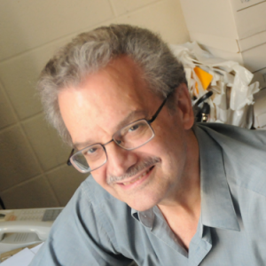 
        <b>Richard Longman</b>
      </a>
      
非线性控制、迭代学习、重复控制算法、航天器姿态控制/机器人/智能医疗设备控制

    </td>
    <td align="center">
      <a href="research-quickview/columbia/me/mike-massimino/research-overview.md">
         
        <b>Mike Massimino</b>
      </a>
      
专业实践、航天工程、宇航学

    </td>
    <td align="center">
      <a href="research-quickview/columbia/me/vijay-modi/research-overview.md">
         
        <b>Vijay Modi</b>
      </a>
      
可持续能源解决方案、环境工程

    </td>
  </tr>
  <tr>
    <td align="center">
      <a href="research-quickview/columbia/me/kristin-myers/research-overview.md">
         
        <b>Kristin M. Myers</b>
      </a>
      
生物材料、力学、细胞工程

    </td>
    <td align="center">
      <a href="research-quickview/columbia/me/arvind-narayanaswamy/research-overview.md">
         
        <b>Arvind Narayanaswamy</b>
      </a>
      
热力学、流体动力学和能量转换

    </td>
    <td align="center">
      <a href="research-quickview/columbia/me/p-james-schuck/research-overview.md">
         
        <b>P. James Schuck</b>
      </a>
      
纳米光子学、激光技术、材料表征

    </td>
    <td align="center">
      <a href="research-quickview/columbia/me/vijay-vedula/research-overview.md">
         
        <b>Vijay Vedula</b>
      </a>
      
动力学与控制、材料科学、机械设计

    </td>
  </tr>
  <tr>
    <td align="center">
      <a href="research-quickview/columbia/me/sinisa-vukelic/research-overview.md">
         
        <b>Sinisa Vukelic</b>
      </a>
      
激光加工、材料表征、力学

    </td>
    <td align="center">
      <a href="research-quickview/columbia/me/harry-west/research-overview.md">
         
        <b>Harry West</b>
      </a>
      
工业工程与运营研究、机械工程

    </td>
    <td align="center">
      <a href="research-quickview/columbia/me/y-lawrence-yao/research-overview.md">
        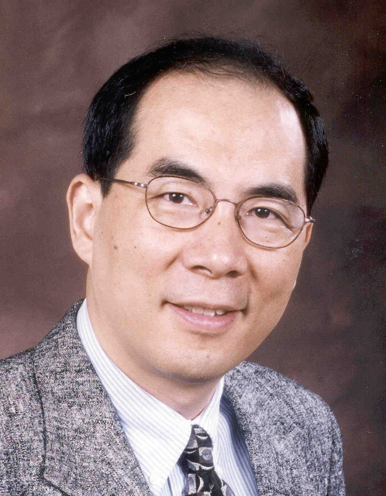 
        <b>Y. Lawrence Yao</b>
      </a>
      
激光加工、材料力学、微纳米制造

    </td>
    <td align="center">
      <a href="research-quickview/columbia/me/yevgeniy-yesilevskiy/research-overview.md">
         
        <b>Yevgeniy Yesilevskiy</b>
      </a>
      
力学、材料力学、工程教育

    </td>
  </tr>
</table>

### [Electrical Engineering](https://www.ee.columbia.edu/)

- **Field**: Nanoscale Structures and Integrated Devices

<table>
  <tr>
    <td align="center">
      <a href="research-quickview/columbia/ee/keren-bergman/research-overview.md">
         
        <b>Keren Bergman</b>
      </a>
      
集成光子学、光网络、光子设备设计与应用

    </td>
    <td align="center">
      <a href="research-quickview/columbia/ee/savannah-eisner/research-overview.md">
         
        <b>Savannah Eisner</b>
      </a>
      
机器学习算法、计算机架构、能源高效计算

    </td>
    <td align="center">
      <a href="research-quickview/columbia/ee/dion-khodagholy/research-overview.md">
         
        <b>Dion Khodagholy</b>
      </a>
      
生物电子学、神经接口、类脑计算

    </td>
    <td align="center">
      <a href="research-quickview/columbia/ee/ioannis-kymissis/research-overview.md">
         
        <b>Ioannis (John) Kymissis</b>
      </a>
      
能源系统、可再生能源技术、微电网

    </td>
  </tr>
  <tr>
    <td align="center">
      <a href="research-quickview/columbia/ee/michal-lipson/research-overview.md">
        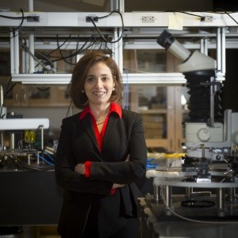 
        <b>Michal Lipson</b>
      </a>
      
集成/硅基光子学、克尔频率梳、异质集成、量子信息处理

    </td>
    <td align="center">
      <a href="research-quickview/columbia/ee/xiang-meng/research-overview.md">
         
        <b>Xiang Meng</b>
      </a>
      
应用电气工程、信号处理、创新教学方法

    </td>
    <td align="center">
      <a href="research-quickview/columbia/ee/wen-wang/research-overview.md">
         
        <b>Wen Wang</b>
      </a>
      
应用物理、工程力学、纳米技术及其应用

    </td>
  </tr>
</table>

- **Field**: Integrated Circuits and Systems

<table>
  <tr>
    <td align="center">
      <a href="research-quickview/columbia/ee/xiaofan-jiang/research-overview.md">
         
        <b>Xiaofan (Fred) Jiang</b>
      </a>
      
集成电路与系统、网络与通信、智能电能、计算机工程与计算机系统

    </td>
    <td align="center">
      <a href="research-quickview/columbia/ee/peter-kinget/research-overview.md">
         
        <b>Peter R. Kinget</b>
      </a>
      
集成电路与系统

    </td>
    <td align="center">
      <a href="research-quickview/columbia/ee/harish-krishnaswamy/research-overview.md">
         
        <b>Harish Krishnaswamy</b>
      </a>
      
集成电路与系统

    </td>
    <td align="center">
      <a href="research-quickview/columbia/ee/matthias-preindl/research-overview.md">
         
        <b>Matthias Preindl</b>
      </a>
      
智能电能、集成电路与系统、信号、信息与数据

    </td>
  </tr>
  <tr>
    <td align="center">
      <a href="research-quickview/columbia/ee/mingoo-seok/research-overview.md">
         
        <b>Mingoo Seok</b>
      </a>
      
集成电路与系统、计算机工程与计算机系统

    </td>
    <td align="center">
      <a href="research-quickview/columbia/ee/ken-shepard/research-overview.md">
         
        <b>Ken Shepard</b>
      </a>
      
集成电路与系统、系统生物学与神经工程、智能电能、计算机工程与计算机系统

    </td>
    <td align="center">
      <a href="research-quickview/columbia/ee/yannis-tsividis/research-overview.md">
         
        <b>Yannis P. Tsividis</b>
      </a>
      
集成电路与系统

    </td>
    <td align="center">
      <a href="research-quickview/columbia/ee/charles-zukowski/research-overview.md">
         
        <b>Charles A. Zukowski</b>
      </a>
      
集成电路与系统、计算机工程与计算机系统

    </td>
  </tr>
</table>

### [Applied Physics and Applied Mathematics](https://www.apam.columbia.edu/)

  <table>
    <tr>
      <td align="center">
        <a href="research-quickview/columbia/apam/alexander-gaeta/research-overview.md">
          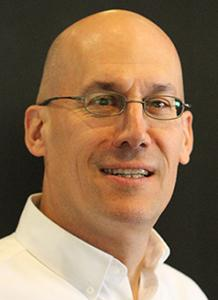 
          <b>Alexander Gaeta</b>
        </a>
        
非线性光学、芯片级光学器件、量子计算通信、生物医学成像、光子数据传输

      </td>
    </tr>
  </table>

<!-- End of Columbia Section -->
<!-- End of Columbia Section -->
<!-- End of Columbia Section -->

## [Duke University](https://duke.edu/)

Click to expand Duke Professors

### [Electrical and Computer Engineering](https://ece.duke.edu/)

Electrical and Computer Engineering Faculty

- **Field**: [Microelectronics, Photonics And Nanotechnology](https://ece.duke.edu/people?s=&group=&research_themes=&custom_taxonomy=microelectronics-photonics-and-nanotechnology)

<table>
  <tr>
    <td align="center">
      <a href="research-quickview/duke/ece/martin-brooke/research-overview.md">
         
        <b>Martin A. Brooke</b>
      </a>
      
模拟、射频和光电电路；传感器接口电路；可部署传感器系统

    </td>
    <td align="center">
      <a href="research-quickview/duke/ece/april-brown/research-overview.md">
         
        <b>April S. Brown</b>
      </a>
      
电气与计算机工程

    </td>
    <td align="center">
      <a href="research-quickview/duke/ece/kenneth-brown/research-overview.md">
         
        <b>Kenneth R Brown</b>
      </a>
      
量子纠错、量子控制、量子计算机架构、离子阱量子计算、冷却分子离子的光谱学

    </td>
    <td align="center">
      <a href="research-quickview/duke/ece/richard-fair/research-overview.md">
         
        <b>Richard B. Fair</b>
      </a>
      
基于电湿技术的实验室芯片微流体系统

    </td>
  </tr>
  <tr>
    <td align="center">
      <a href="research-quickview/duke/ece/aaron-franklin/research-overview.md">
         
        <b>Aaron D. Franklin</b>
      </a>
      
电子设备中的纳米材料、纳米制造、印刷电子和物联网（IoT）、生物传感

    </td>
    <td align="center">
      <a href="research-quickview/duke/ece/jeffrey-glass/research-overview.md">
         
        <b>Jeffrey Glass</b>
      </a>
      
电子材料及其相关设备/仪器的改进，特别是在微型质谱法、能量转换和储存及液体废物消毒方面的电极应用

    </td>
    <td align="center">
      <a href="research-quickview/duke/ece/nan-jokerst/research-overview.md">
         
        <b>Nan Marie Jokerst</b>
      </a>
      
电子与计算机工程

    </td>
    <td align="center">
      <a href="research-quickview/duke/ece/hisham-massoud/research-overview.md">
         
        <b>Hisham Z. Massoud</b>
      </a>
      
超薄栅介电层在CMOS ULSI中的应用 - 技术、物理、建模、仿真和超薄氧化物MOSFET的表征

    </td>
  </tr>
  <tr>
    <td align="center">
      <a href="research-quickview/duke/ece/tania-roy/research-overview.md">
         
        <b>Tania Roy</b>
      </a>
      
能效电子学、二维材料、神经形态计算、光电学、宽带隙材料、高功率电子、辐射效应和可靠性

    </td>
    <td align="center">
      <a href="research-quickview/duke/ece/david-smith/research-overview.md">
         
        <b>David R. Smith</b>
      </a>
      
理论、仿真和新型电磁超材料的演示，应用于天线和成像设备

    </td>
    <td align="center">
      <a href="research-quickview/duke/ece/adrienne-stiff-roberts/research-overview.md">
         
        <b>Adrienne Stiff-Roberts</b>
      </a>
      
薄膜沉积、MAPLE、混合钙钛矿、混合纳米复合材料、有机薄膜

    </td>
    <td align="center">
      <a href="research-quickview/duke/ece/haozhe-wang/research-overview.md">
         
        <b>Haozhe Wang</b>
      </a>
      
低维材料、纳米制造和纳米器件、半导体、陶瓷、金属、量子计算

    </td>
  </tr>
</table>

- **Field**: [Engineering Physics](https://ece.duke.edu/people?s=&group=&research_themes=&custom_taxonomy=engineering-physics)

<table>
  <tr>
    <td align="center">
      <a href="research-quickview/duke/ece/steven-cummer/research-overview.md">
         
        <b>Steven A. Cummer</b>
      </a>
      
电磁学的理论和实验问题，涉及地球物理遥感和工程电磁材料

    </td>
    <td align="center">
      <a href="research-quickview/duke/ece/michael-gehm/research-overview.md">
         
        <b>Michael E. Gehm</b>
      </a>
      
主要研究计算和压缩传感器及所有模式的测量，特别是电磁/光学从RF到X射线及各种质谱

    </td>
    <td align="center">
      <a href="research-quickview/duke/ece/jungsang-kim/research-overview.md">
         
        <b>Jungsang Kim</b>
      </a>
      
量子计算、陷阱离子、量子信息科学、新型光子器件、量子计算机的应用

    </td>
    <td align="center">
      <a href="research-quickview/duke/ece/natalia-litchinitser/research-overview.md">
         
        <b>Natalia Litchinitser</b>
      </a>
      
纳米光子学；光子超材料；非线性光学；光纤光学；光子晶体光纤

    </td>
  </tr>
  <tr>
    <td align="center">
      <a href="research-quickview/duke/ece/jerome-lynch/research-overview.md">
         
        <b>Jerome Peter Lynch</b>
      </a>
      
结构健康监测；网络物理系统架构；基础设施韧性；多功能纳米复合材料

    </td>
    <td align="center">
      <a href="research-quickview/duke/ece/iman-marvian/research-overview.md">
         
        <b>Iman Marvian</b>
      </a>
      
量子信息与计算理论

    </td>
    <td align="center">
      <a href="research-quickview/duke/ece/maiken-mikkelsen/research-overview.md">
         
        <b>Maiken Mikkelsen</b>
      </a>
      
量子纳米光子学、等离子体学、在人工结构纳米材料中的光-物质相互作用

    </td>
    <td align="center">
      <a href="research-quickview/duke/ece/christopher-monroe/research-overview.md">
         
        <b>Christopher R Monroe</b>
      </a>
      
量子物理及其在量子信息科学中的应用

    </td>
  </tr>
  <tr>
    <td align="center">
      <a href="research-quickview/duke/ece/crystal-noel/research-overview.md">
         
        <b>Crystal Noel</b>
      </a>
      
量子计算与模拟、集成光子学、陷阱离子系统的可扩展性、表面电场噪声

    </td>
    <td align="center">
      <a href="research-quickview/duke/ece/willie-padilla/research-overview.md">
         
        <b>Willie John Padilla</b>
      </a>
      
电磁超材料和超表面的理论与实验研究，及其在成像和传感中的应用

    </td>
    <td align="center">
      <a href="research-quickview/duke/ece/guillermo-sapiro/research-overview.md">
         
        <b>Guillermo Sapiro</b>
      </a>
      
图像与视频处理、计算机视觉、计算图形、医学成像、脑成像

    </td>
    <td align="center">
      <a href="research-quickview/duke/ece/david-smith/research-overview.md">
         
        <b>David R. Smith</b>
      </a>
      
电磁超材料的理论、仿真及在微波和光学领域的应用

    </td>
  </tr>
</table>

- **Field**: [Computer Engineering](https://ece.duke.edu/people?s=&group=&research_themes=&custom_taxonomy=computer-engineering)

<table>
  <tr>
    <td align="center">
      <a href="research-quickview/duke/ece/tyler-bletsch/research-overview.md">
         
        <b>Tyler K Bletsch</b>
      </a>
      
软件安全、机器人技术、项目导向教育和数据中心效率

    </td>
    <td align="center">
      <a href="research-quickview/duke/ece/john-board/research-overview.md">
         
        <b>John A. Board</b>
      </a>
      
高性能科学计算与仿真、新型计算架构、集群计算和并行处理；普遍计算

    </td>
    <td align="center">
      <a href="research-quickview/duke/ece/boyuan-chen/research-overview.md">
         
        <b>Boyuan Chen</b>
      </a>
      
机器人技术、计算机视觉、机器学习、科学中的人工智能

    </td>
    <td align="center">
      <a href="research-quickview/duke/ece/tingjun-chen/research-overview.md">
         
        <b>Tingjun Chen</b>
      </a>
      
无线网络、下一代无线和光网络、边缘云和计算、物联网、移动和嵌入式系统

    </td>
  </tr>
  <tr>
    <td align="center">
      <a href="research-quickview/duke/ece/yiran-chen/research-overview.md">
         
        <b>Yiran Chen</b>
      </a>
      
新兴存储技术、嵌入式系统、边缘计算和移动应用、神经形态计算、深度学习和系统安全

    </td>
    <td align="center">
      <a href="research-quickview/duke/ece/shaundra-daily/research-overview.md">
         
        <b>Shaundra Daily</b>
      </a>
      
包容性身份计算、以人为本的设计与工程、公正中心的STEM教育

    </td>
    <td align="center">
      <a href="research-quickview/duke/ece/neil-gong/research-overview.md">
         
        <b>Neil Gong</b>
      </a>
      
网络安全和可信AI

    </td>
    <td align="center">
      <a href="research-quickview/duke/ece/maria-gorlatova/research-overview.md">
         
        <b>Maria Gorlatova</b>
      </a>
      
新兴移动普适系统和物联网的架构、算法和协议

    </td>
  </tr>
  <tr>
    <td align="center">
      <a href="research-quickview/duke/ece/andrew-hilton/research-overview.md">
         
        <b>Andrew Douglas Hilton</b>
      </a>
      
计算机架构，特别是安全和能效性能的架构支持

    </td>
    <td align="center">
      <a href="research-quickview/duke/ece/hai-li/research-overview.md">
         
        <b>Hai Hai "Helen" Li</b>
      </a>
      
神经形态计算系统、机器学习加速与可信AI、新兴存储技术、低功耗电路和系统

    </td>
    <td align="center">
      <a href="research-quickview/duke/ece/xin-li/research-overview.md">
         
        <b>Xin Li</b>
      </a>
      
集成电路、信号处理与数据分析

    </td>
    <td align="center">
      <a href="research-quickview/duke/ece/genevieve-lipp/research-overview.md">
         
        <b>Genevieve Lipp</b>
      </a>
      
第一年计算项目的主任，电气与计算机工程助理教授

    </td>
  </tr>
  <tr>
    <td align="center">
      <a href="research-quickview/duke/ece/miroslav-pajic/research-overview.md">
         
        <b>Miroslav Pajic</b>
      </a>
      
设计与分析自主网络物理系统，嵌入式系统、AI、学习与控制、网络物理系统安全与高保障自主性

    </td>
    <td align="center">
      <a href="research-quickview/duke/ece/javier-pastorino/research-overview.md">
         
        <b>Javier Pastorino</b>
      </a>
      
软件工程和数据管理，人工智能，机器学习，隐私，网络安全，计算机工程教育

    </td>
    <td align="center">
      <a href="research-quickview/duke/ece/jian-pei/research-overview.md">
         
        <b>Jian Pei</b>
      </a>
      
计算机科学的亚瑟S.皮尔斯杰出教授

    </td>
    <td align="center">
      <a href="research-quickview/duke/ece/afsaneh-rahbar/research-overview.md">
         
        <b>Afsaneh Rahbar</b>
      </a>
      
编译器、高性能计算、计算集群、分布式系统、数据中心网络

    </td>
  </tr>
  <tr>
    <td align="center">
      <a href="research-quickview/duke/ece/michael-reiter/research-overview.md">
         
        <b>Michael Reiter</b>
      </a>
      
计算机与通信安全、容错分布式计算、应用密码学

    </td>
    <td align="center">
      <a href="research-quickview/duke/ece/cynthia-rudin/research-overview.md">
         
        <b>Cynthia D. Rudin</b>
      </a>
      
Gilbert，Louis和Edward Lehrman杰出教授

    </td>
    <td align="center">
      <a href="research-quickview/duke/ece/daniel-sorin/research-overview.md">
         
        <b>Daniel J. Sorin</b>
      </a>
      
计算机架构，设计微架构以便于验证，提高计算机系统容错性

    </td>
    <td align="center">
      <a href="research-quickview/duke/ece/kishor-trivedi/research-overview.md">
         
        <b>Kishor S. Trivedi</b>
      </a>
      
马尔可夫模型、故障树、随机Petri网、可靠性建模

    </td>
  </tr>
  <tr>
    <td align="center">
      <a href="research-quickview/duke/ece/emily-wenger/research-overview.md">
         
        <b>Emily Wenger</b>
      </a>
      
电气与计算机工程助理教授

    </td>
    <td align="center">
      <a href="research-quickview/duke/ece/rabih-younes/research-overview.md">
         
        <b>Rabih Younes</b>
      </a>
      
本科生研究生项目副主任，电气与计算机工程助理教授

    </td>
  </tr>
</table>

- **Field**: [Signal and Information Processing](https://ece.duke.edu/people?s=&group=&research_themes=&custom_taxonomy=signal-and-information-processing)

<table>
  <tr>
    <td align="center">
      <a href="research-quickview/duke/ece/robert-calderbank/research-overview.md">
         
        <b>Robert Calderbank</b>
      </a>
      
理论与实验电磁问题与地球物理遥感、工程电磁材料

    </td>
    <td align="center">
      <a href="research-quickview/duke/ece/lawrence-carin/research-overview.md">
         
        <b>Lawrence Carin</b>
      </a>
      
应用统计与机器学习

    </td>
    <td align="center">
      <a href="research-quickview/duke/ece/xiang-cheng/research-overview.md">
         
        <b>Xiang Cheng</b>
      </a>
      
访客助理教授，电气与计算机工程系

    </td>
    <td align="center">
      <a href="research-quickview/duke/ece/leslie-collins/research-overview.md">
         
        <b>Leslie M. Collins</b>
      </a>
      
基于物理的机器学习算法，解决听障问题的修复策略

    </td>
  </tr>
  <tr>
    <td align="center">
      <a href="research-quickview/duke/ece/michael-gustafson/research-overview.md">
         
        <b>Michael Richard Gustafson</b>
      </a>
      
图像分析与信息提取的计算方法、离散事件仿真、课程开发与部署

    </td>
    <td align="center">
      <a href="research-quickview/duke/ece/lisa-huettel/research-overview.md">
         
        <b>Lisa Gresham Huettel</b>
      </a>
      
工程教育、教学法和课程开发、统计信号处理的应用

    </td>
    <td align="center">
      <a href="research-quickview/duke/ece/jeffrey-krolik/research-overview.md">
         
        <b>Jeffrey L. Krolik</b>
      </a>
      
基于物理和统计的信号处理，传感器阵列处理

    </td>
    <td align="center">
      <a href="research-quickview/duke/ece/douglas-nowacek/research-overview.md">
         
        <b>Douglas Nowacek</b>
      </a>
      
海洋哺乳动物行为与声学生态学、海洋噪声

    </td>
  </tr>
  <tr>
    <td align="center">
      <a href="research-quickview/duke/ece/henry-pfister/research-overview.md">
         
        <b>Henry Pfister</b>
      </a>
      
信息理论、通信、概率图模型、机器学习

    </td>
    <td align="center">
      <a href="research-quickview/duke/ece/galen-reeves/research-overview.md">
         
        <b>Galen Reeves</b>
      </a>
      
信息理论、高维统计推断、统计信号处理

    </td>
    <td align="center">
      <a href="research-quickview/duke/ece/christ-richmond/research-overview.md">
         
        <b>Christ D Richmond</b>
      </a>
      
电气与计算机工程系教授

    </td>
    <td align="center">
      <a href="research-quickview/duke/ece/cynthia-rudin/research-overview.md">
         
        <b>Cynthia D. Rudin</b>
      </a>
      
吉尔伯特、路易斯与爱德华·勒尔曼杰出教授

    </td>
  </tr>
  <tr>
    <td align="center">
      <a href="research-quickview/duke/ece/stacy-tantum/research-overview.md">
         
        <b>Stacy L. Tantum</b>
      </a>
      
基于物理的统计信号处理、上下文感知机器学习

    </td>
    <td align="center">
      <a href="research-quickview/duke/ece/vahid-tarokh/research-overview.md">
         
        <b>Vahid Tarokh</b>
      </a>
      
AI基础、信号处理基础、学习表示、迁移学习、元学习

    </td>
    <td align="center">
      <a href="research-quickview/duke/ece/yu-tong/research-overview.md">
         
        <b>Yu Tong</b>
      </a>
      
数学系助理教授

    </td>
  </tr>
</table>

### [Mechanical Engineering and Materials Science](https://mems.duke.edu/)

Mechanical Engineering and Materials Science Faculty

- **Field:** Biomechanics and Biomaterials
- [Faculty](https://mems.duke.edu/people?s=&group=&research_themes=bio)

<table>
  <tr>
    <td align="center">
      <a href="research-quickview/duke/mems/wilkins-aquino/research-overview.md">
         
        <b>Wilkins Aquino</b>
      </a>
      
计算力学、有限元方法、计算逆问题及其在工程和生物医学中的应用

    </td>
    <td align="center">
      <a href="research-quickview/duke/mems/gaurav-arya/research-overview.md">
         
        <b>Gaurav Arya</b>
      </a>
      
分子建模、分子模拟、统计力学、粗粒化、机器学习、聚合物与胶体物理

    </td>
    <td align="center">
      <a href="research-quickview/duke/mems/matthew-becker/research-overview.md">
         
        <b>Matthew L Becker</b>
      </a>
      
聚合物化学、生物结合化学、分子成像与增材制造；骨、软组织、神经和血管组织工程的材料

    </td>
    <td align="center">
      <a href="research-quickview/duke/mems/l-catherine-brinson/research-overview.md">
         
        <b>L. Catherine Brinson</b>
      </a>
      
材料力学，特别是复杂层次材料和基于聚合物的系统，将数据科学概念融入材料研究

    </td>
  </tr>
  <tr>
    <td align="center">
      <a href="research-quickview/duke/mems/chuan-hua-chen/research-overview.md">
         
        <b>Chuan-Hua Chen</b>
      </a>
      
实验和理论研究，耦合物理化学流体动力学与界面工程

    </td>
    <td align="center">
      <a href="research-quickview/duke/mems/ashutosh-chilkoti/research-overview.md">
         
        <b>Ashutosh Chilkoti</b>
      </a>
      
生物分子材料和生物界面科学，强调生物分离、传感器、生物材料和靶向药物输送的应用

    </td>
    <td align="center">
      <a href="research-quickview/duke/mems/patrick-codd/research-overview.md">
         
        <b>Patrick James Codd</b>
      </a>
      
神经外科

    </td>
    <td align="center">
      <a href="research-quickview/duke/mems/louis-defrate/research-overview.md">
         
        <b>Louis Edwin DeFrate</b>
      </a>
      
骨科手术的生物力学

    </td>
  </tr>
  <tr>
    <td align="center">
      <a href="research-quickview/duke/mems/liang-feng/research-overview.md">
         
        <b>Liang Feng</b>
      </a>
      
碳捕集与去除、负排放、去碳化、关键材料、仿生软材料、超分子与多孔材料

    </td>
    <td align="center">
      <a href="research-quickview/duke/mems/ken-gall/research-overview.md">
         
        <b>Ken Gall</b>
      </a>
      
材料科学、机械性能、金属和聚合物，专注于形状记忆材料、生物材料和3D打印

    </td>
    <td align="center">
      <a href="research-quickview/duke/mems/laurens-howle/research-overview.md">
         
        <b>Laurens E. Howle</b>
      </a>
      
可变形结构的水弹性建模、热与化学系统中的传输、实验与计算流体动力学、非线性与复杂系统

    </td>
    <td align="center">
      <a href="research-quickview/duke/mems/tony-huang/research-overview.md">
         
        <b>Tony Jun Huang</b>
      </a>
      
声流体动力学、微流体学、芯片实验室、生物医学微电机械系统（BioMEMS）、光流体动力学

    </td>
  </tr>
  <tr>
    <td align="center">
      <a href="research-quickview/duke/mems/bavand-keshavarz/research-overview.md">
         
        <b>Bavand Keshavarz</b>
      </a>
      
软材料力学、生物仿生水凝胶、金属配位网络、复杂流体的流体动力学

    </td>
    <td align="center">
      <a href="research-quickview/duke/mems/brian-mann/research-overview.md">
         
        <b>Brian Mann</b>
      </a>
      
非线性动力学与振动，采用分析、数值和实验技术研究现象

    </td>
    <td align="center">
      <a href="research-quickview/duke/mems/piotr-marszalek/research-overview.md">
         
        <b>Piotr E. Marszalek</b>
      </a>
      
探讨生物聚合物（多糖、DNA、蛋白质）的结构与机械特性之间的关系，单分子水平

    </td>
    <td align="center">
      <a href="research-quickview/duke/mems/david-needham/research-overview.md">
         
        <b>David Needham</b>
      </a>
      
反癌药物输送研究，基于癌细胞的生存与扩散机制

    </td>
  </tr>
  <tr>
    <td align="center">
      <a href="research-quickview/duke/mems/xiaoyue-ni/research-overview.md">
         
        <b>Xiaoyue Ni</b>
      </a>
      
柔性电子学、精密测量、无损检测、随机介质的变形物理学、机械超材料

    </td>
    <td align="center">
      <a href="research-quickview/duke/mems/christine-payne/research-overview.md">
         
        <b>Christine K. Payne</b>
      </a>
      
细胞与纳米材料相互作用的分子机制，纳米医学与环境暴露的应用

    </td>
    <td align="center">
      <a href="research-quickview/duke/mems/amanda-randles/research-overview.md">
         
        <b>Amanda Randles</b>
      </a>
      
生物医学模拟与高性能计算

    </td>
    <td align="center">
      <a href="research-quickview/duke/mems/michael-rubinstein/research-overview.md">
         
        <b>Michael Rubinstein</b>
      </a>
      
聚合物理论与计算模拟

    </td>
  </tr>
  <tr>
    <td align="center">
      <a href="research-quickview/duke/mems/shyni-varghese/research-overview.md">
         
        <b>Shyni Varghese</b>
      </a>
      
肌肉骨骼组织修复、疾病生物物理学与芯片技术

    </td>
    <td align="center">
      <a href="research-quickview/duke/mems/stefan-zauscher/research-overview.md">
         
        <b>Stefan Zauscher</b>
      </a>
      
纳米机械和纳米摩擦学表征（弹性、摩擦、粘附），包括有机薄膜、自组装单分子层、聚合物凝胶等材料

    </td>
    <td align="center">
      <a href="research-quickview/duke/mems/pei-zhong/research-overview.md">
         
        <b>Pei Zhong</b>
      </a>
      
冲击波和激光碎石的机制研究与技术开发；超声波诱导的机械转导、神经调节和声遗传学；HIFU与癌症免疫治疗

    </td>
  </tr>
</table>

<!-- End of Columbia Section -->
<!-- End of Columbia Section -->
<!-- End of Columbia Section -->

## [Upenn](https://www.upenn.edu/)

Click to expand Upenn Professors

### [Mechanical Engineering and Applied Mechanics](https://www.me.upenn.edu/areas-of-focus/)

- **Field**: Biomechanics
<table>
    <tr>
        <td align="center">
            <a href="research-quickview/upenn/meam/paulo-arratia/research-overview.md">
                 
                <b>Paulo E. Arratia</b>
            </a>
            
细胞力学、生物物理学、生物分子模拟

        </td>
        <td align="center">
            <a href="research-quickview/upenn/meam/joel-boerckel/research-overview.md">
                 
                <b>Joel D. Boerckel</b>
            </a>
            
组织工程、细胞修复与再生

        </td>
        <td align="center">
            <a href="research-quickview/upenn/meam/robert-carpick/research-overview.md">
                 
                <b>Robert W. Carpick</b>
            </a>
            
微纳米力学、材料特性、界面研究

        </td>
        <td align="center">
            <a href="research-quickview/upenn/meam/dennis-discher/research-overview.md">
                 
                <b>Dennis E. Discher</b>
            </a>
            
细胞力学、生物材料、药物输送

        </td>
    </tr>
    <tr>
        <td align="center">
            <a href="research-quickview/upenn/meam/michelle-johnson/research-overview.md">
                 
                <b>Michelle J. Johnson</b>
            </a>
            
生物力学、组织工程、再生医学

        </td>
        <td align="center">
            <a href="research-quickview/upenn/meam/sherry-liu/research-overview.md">
                 
                <b>X. Sherry Liu</b>
            </a>
            
细胞生物学、生物物理学、力学建模

        </td>
        <td align="center">
            <a href="research-quickview/upenn/meam/george-park/research-overview.md">
                 
                <b>George I. Park</b>
            </a>
            
生物力学、细胞工程、组织修复

        </td>
        <td align="center">
            <a href="research-quickview/upenn/meam/paris-perdikaris/research-overview.md">
                 
                <b>Paris Perdikaris</b>
            </a>
            
计算生物力学、机器学习、建模

        </td>
    </tr>
    <tr>
        <td align="center">
            <a href="research-quickview/upenn/meam/prashant-purohit/research-overview.md">
                 
                <b>Prashant K. Purohit</b>
            </a>
            
生物材料、细胞力学、模拟与优化

        </td>
        <td align="center">
            <a href="research-quickview/upenn/meam/louis-soslowsky/research-overview.md">
                 
                <b>Louis Soslowsky</b>
            </a>
            
韧带和肌腱的生物力学、组织再生

        </td>
        <td align="center">
            <a href="research-quickview/upenn/meam/ottman-tertuliano/research-overview.md">
                 
                <b>Ottman A. Tertuliano</b>
            </a>
            
细胞力学、生物力学、材料科学

        </td>
        <td align="center">
            <a href="research-quickview/upenn/meam/kyle-vining/research-overview.md">
                 
                <b>Kyle Vining</b>
            </a>
            
生物力学、细胞再生、工程技术

        </td>
    </tr>
    <tr>
        <td align="center">
            <a href="research-quickview/upenn/meam/beth-winkelstein/research-overview.md">
                 
                <b>Beth Winkelstein</b>
            </a>
            
椎间盘功能与退化、再生医学

        </td>
        <td align="center">
            <a href="research-quickview/upenn/meam/shujie-yang/research-overview.md">
                 
                <b>Shujie Yang</b>
            </a>
            
生物物理学、力学建模、细胞修复

        </td>
    </tr>
</table>

- **Field**: Computational Mechanics
<table>
    <tr>
        <td align="center">
            <a href="research-quickview/upenn/meam/john-bassani/research-overview.md">
                 
                <b>John L. Bassani</b>
            </a>
            
计算力学、材料科学、波动传播

        </td>
        <td align="center">
            <a href="research-quickview/upenn/meam/nadia-figueroa/research-overview.md">
                 
                <b>Nadia Figueroa</b>
            </a>
            
多相流、动态界面、机器人系统

        </td>
        <td align="center">
            <a href="research-quickview/upenn/meam/howard-hu/research-overview.md">
                 
                <b>Howard H. Hu</b>
            </a>
            
流体力学、电磁流体力学、科学计算

        </td>
        <td align="center">
            <a href="research-quickview/upenn/meam/david-issadore/research-overview.md">
                 
                <b>David Issadore</b>
            </a>
            
生物网络建模、动力学系统、科学计算

        </td>
    </tr>
    <tr>
        <td align="center">
            <a href="research-quickview/upenn/meam/jennifer-lukes/research-overview.md">
                 
                <b>Jennifer R. Lukes</b>
            </a>
            
塑性与断裂、微重力下的材料行为

        </td>
        <td align="center">
            <a href="research-quickview/upenn/meam/george-park/research-overview.md">
                 
                <b>George I. Park</b>
            </a>
            
生物力学、细胞力学、流体-固体相互作用

        </td>
        <td align="center">
            <a href="research-quickview/upenn/meam/paris-perdikaris/research-overview.md">
                 
                <b>Paris Perdikaris</b>
            </a>
            
计算生物力学、机器学习、动态建模

        </td>
        <td align="center">
            <a href="research-quickview/upenn/meam/pedro-ponte-casteneda/research-overview.md">
                 
                <b>Pedro Ponte Casteñeda</b>
            </a>
            
材料力学、计算材料科学、微观建模

        </td>
    </tr>
    <tr>
        <td align="center">
            <a href="research-quickview/upenn/meam/michael-posa/research-overview.md">
                 
                <b>Michael Posa</b>
            </a>
            
动态系统、控制理论、机器人

        </td>
        <td align="center">
            <a href="research-quickview/upenn/meam/celia-reina/research-overview.md">
                 
                <b>Celia Reina</b>
            </a>
            
计算流体动力学、热传导、流动控制

        </td>
        <td align="center">
            <a href="research-quickview/upenn/meam/talid-sinno/research-overview.md">
                 
                <b>Talid R. Sinno</b>
            </a>
            
生物力学、流体力学、动力学建模

        </td>
        <td align="center">
            <a href="research-quickview/upenn/meam/cynthia-sung/research-overview.md">
                 
                <b>Cynthia Sung</b>
            </a>
            
机器人学、计算机视觉、动态系统

        </td>
    </tr>
    <tr>
        <td align="center">
            <a href="research-quickview/upenn/meam/nat-trask/research-overview.md">
                 
                <b>Nat Trask</b>
            </a>
            
计算力学、数值分析、材料科学

        </td>
        <td align="center">
            <a href="research-quickview/upenn/meam/kevin-turner/research-overview.md">
                 
                <b>Kevin T. Turner</b>
            </a>
            
生物力学、材料力学、建模与仿真

        </td>
    </tr>
</table>

- **Field**: Fluid Mechanics
<table>
    <tr>
        <td align="center">
            <a href="research-quickview/upenn/meam/paulo-arratia/research-overview.md">
                 
                <b>Paulo E. Arratia</b>
            </a>
            
微流体学、粒子运动、电磁场下流体行为

        </td>
        <td align="center">
            <a href="research-quickview/upenn/meam/haim-bau/research-overview.md">
                 
                <b>Haim H. Bau</b>
            </a>
            
微流体学、芯片实验室、流体与生物医学

        </td>
        <td align="center">
            <a href="research-quickview/upenn/meam/howard-hu/research-overview.md">
                 
                <b>Howard H. Hu</b>
            </a>
            
复杂流体、流动控制、计算流体力学

        </td>
        <td align="center">
            <a href="research-quickview/upenn/meam/david-issadore/research-overview.md">
                 
                <b>David Issadore</b>
            </a>
            
生物流体力学、动态系统、科学计算

        </td>
    </tr>
    <tr>
        <td align="center">
            <a href="research-quickview/upenn/meam/douglas-jerolmack/research-overview.md">
                 
                <b>Douglas J. Jerolmack</b>
            </a>
            
流体动力学、不稳定性、流动控制

        </td>
        <td align="center">
            <a href="research-quickview/upenn/meam/noam-lior/research-overview.md">
                 
                <b>Noam Lior</b>
            </a>
            
热力学、流体力学、可再生能源

        </td>
        <td align="center">
            <a href="research-quickview/upenn/meam/jennifer-lukes/research-overview.md">
                 
                <b>Jennifer R. Lukes</b>
            </a>
            
塑性与断裂、流体-固体相互作用

        </td>
        <td align="center">
            <a href="research-quickview/upenn/meam/samantha-mcbride/research-overview.md">
                 
                <b>Samantha McBride</b>
            </a>
            
流体力学、材料科学、非线性现象

        </td>
    </tr>
    <tr>
        <td align="center">
            <a href="research-quickview/upenn/meam/marc-miskin/research-overview.md">
                 
                <b>Marc Miskin</b>
            </a>
            
微流体、动态系统、材料工程

        </td>
        <td align="center">
            <a href="research-quickview/upenn/meam/george-park/research-overview.md">
                 
                <b>George I. Park</b>
            </a>
            
生物力学、细胞力学、流体动力学

        </td>
        <td align="center">
            <a href="research-quickview/upenn/meam/paris-perdikaris/research-overview.md">
                 
                <b>Paris Perdikaris</b>
            </a>
            
计算流体力学、流体动力学建模、机器学习

        </td>
        <td align="center">
            <a href="research-quickview/upenn/meam/pedro-ponte-casteneda/research-overview.md">
                 
                <b>Pedro Ponte Casteñeda</b>
            </a>
            
材料力学、计算材料科学、微观建模

        </td>
    </tr>
    <tr>
        <td align="center">
            <a href="research-quickview/upenn/meam/kathleen-stebe/research-overview.md">
                 
                <b>Kathleen J. Stebe</b>
            </a>
            
软物质、流体力学、界面现象

        </td>
        <td align="center">
            <a href="research-quickview/upenn/meam/nat-trask/research-overview.md">
                 
                <b>Nat Trask</b>
            </a>
            
计算流体动力学、材料科学、建模与仿真

        </td>
        <td align="center">
            <a href="research-quickview/upenn/meam/nathan-wei/research-overview.md">
                 
                <b>Nathan Wei</b>
            </a>
            
生物流体力学、动态系统、科学计算

        </td>
        <td align="center">
            <a href="research-quickview/upenn/meam/other-researchers/research-overview.md">
                 
                <b>其他研究人员</b>
            </a>
            
多相流、微流体学、流体与生物医学

        </td>
    </tr>
</table>

- **Field**: Mechanical Systems

<table>
    <tr>
        <td align="center">
            <a href="research-quickview/upenn/meam/haim-bau/research-overview.md">
                 
                <b>Haim H. Bau</b>
            </a>
            
微流体学、生物力学、机器人技术

        </td>
        <td align="center">
            <a href="research-quickview/upenn/meam/nadia-figueroa/research-overview.md">
                 
                <b>Nadia Figueroa</b>
            </a>
            
机器人技术、机械设计、控制理论

        </td>
        <td align="center">
            <a href="research-quickview/upenn/meam/ani-hsieh/research-overview.md">
                 
                <b>M. Ani Hsieh</b>
            </a>
            
无人驾驶系统、动态系统、优化

        </td>
        <td align="center">
            <a href="research-quickview/upenn/meam/david-issadore/research-overview.md">
                 
                <b>David Issadore</b>
            </a>
            
生物流体力学、动态系统、机器人

        </td>
    </tr>
    <tr>
        <td align="center">
            <a href="research-quickview/upenn/meam/michelle-johnson/research-overview.md">
                 
                <b>Michelle J. Johnson</b>
            </a>
            
机器人学、产品设计、控制

        </td>
        <td align="center">
            <a href="research-quickview/upenn/meam/daniel-koditschek/research-overview.md">
                 
                <b>Daniel E. Koditschek</b>
            </a>
            
机制设计、机器人技术、控制

        </td>
        <td align="center">
            <a href="research-quickview/upenn/meam/vijay-kumar/research-overview.md">
                 
                <b>Vijay Kumar</b>
            </a>
            
无人机、动态系统、机器人学

        </td>
        <td align="center">
            <a href="research-quickview/upenn/meam/marc-miskin/research-overview.md">
                 
                <b>Marc Miskin</b>
            </a>
            
微型机器人、机制设计、流体力学

        </td>
    </tr>
    <tr>
        <td align="center">
            <a href="research-quickview/upenn/meam/george-pappas/research-overview.md">
                 
                <b>George J. Pappas</b>
            </a>
            
控制理论、机器人技术、动态系统

        </td>
        <td align="center">
            <a href="research-quickview/upenn/meam/paris-perdikaris/research-overview.md">
                 
                <b>Paris Perdikaris</b>
            </a>
            
计算流体力学、机器人学、机器学习

        </td>
        <td align="center">
            <a href="research-quickview/upenn/meam/michael-posa/research-overview.md">
                 
                <b>Michael Posa</b>
            </a>
            
动态系统、控制、机器人技术

        </td>
        <td align="center">
            <a href="research-quickview/upenn/meam/jordan-raney/research-overview.md">
                 
                <b>Jordan R. Raney</b>
            </a>
            
流体力学、机器人学、动态控制

        </td>
    </tr>
    <tr>
        <td align="center">
            <a href="research-quickview/upenn/meam/cynthia-sung/research-overview.md">
                 
                <b>Cynthia Sung</b>
            </a>
            
机器人技术、控制、微机电系统

        </td>
        <td align="center">
            <a href="research-quickview/upenn/meam/camillo-taylor/research-overview.md">
                 
                <b>Camillo Jose Taylor</b>
            </a>
            
动态系统、机械设计、机器人

        </td>
        <td align="center">
            <a href="research-quickview/upenn/meam/kevin-turner/research-overview.md">
                 
                <b>Kevin T. Turner</b>
            </a>
            
控制、动态系统、机械设计

        </td>
        <td align="center">
            <a href="research-quickview/upenn/meam/karl-ulrich/research-overview.md">
                 
                <b>Karl Ulrich</b>
            </a>
            
产品设计、机器人技术、机制设计

        </td>
    </tr>
    <tr>
        <td align="center">
            <a href="research-quickview/upenn/meam/nathan-wei/research-overview.md">
                 
                <b>Nathan Wei</b>
            </a>
            
生物力学、流体力学、动态系统

        </td>
        <td align="center">
            <a href="research-quickview/upenn/meam/mark-yim/research-overview.md">
                 
                <b>Mark Yim</b>
            </a>
            
机器人技术、控制、优化

        </td>
    </tr>
</table>

- **Field**: Mechanics of Materials

<table>
    <tr>
        <td align="center">
            <a href="research-quickview/upenn/meam/john-bassani/research-overview.md">
                 
                <b>John L. Bassani</b>
            </a>
            
晶体塑性、非线性复合材料的有效性质

        </td>
        <td align="center">
            <a href="research-quickview/upenn/meam/robert-carpick/research-overview.md">
                 
                <b>Robert W. Carpick</b>
            </a>
            
原子/连续介质性质关系、纳米尺度力学

        </td>
        <td align="center">
            <a href="research-quickview/upenn/meam/david-goldsby/research-overview.md">
                 
                <b>David L. Goldsby</b>
            </a>
            
高温断裂、相变、疲劳

        </td>
        <td align="center">
            <a href="research-quickview/upenn/meam/douglas-jerolmack/research-overview.md">
                 
                <b>Douglas J. Jerolmack</b>
            </a>
            
局部化研究、流体动力学、界面断裂

        </td>
    </tr>
    <tr>
        <td align="center">
            <a href="research-quickview/upenn/meam/marc-miskin/research-overview.md">
                 
                <b>Marc Miskin</b>
            </a>
            
软材料、细胞力学、各向异性

        </td>
        <td align="center">
            <a href="research-quickview/upenn/meam/troy-olsson/research-overview.md">
                 
                <b>Troy Olsson</b>
            </a>
            
软复合材料的粘弹性、材料力学

        </td>
        <td align="center">
            <a href="research-quickview/upenn/meam/pedro-ponte-castaneda/research-overview.md">
                 
                <b>Pedro Ponte Casteñeda</b>
            </a>
            
高温断裂、界面力学、材料科学

        </td>
        <td align="center">
            <a href="research-quickview/upenn/meam/prashant-purohit/research-overview.md">
                 
                <b>Prashant K. Purohit</b>
            </a>
            
细胞力学、软材料的力学性质

        </td>
    </tr>
    <tr>
        <td align="center">
            <a href="research-quickview/upenn/meam/jordan-raney/research-overview.md">
                 
                <b>Jordan R. Raney</b>
            </a>
            
细胞力学、相变、疲劳行为

        </td>
        <td align="center">
            <a href="research-quickview/upenn/meam/celia-reina/research-overview.md">
                 
                <b>Celia Reina</b>
            </a>
            
微观力学、材料设计、动态系统

        </td>
        <td align="center">
            <a href="research-quickview/upenn/meam/ottman-tertuliano/research-overview.md">
                 
                <b>Ottman A. Tertuliano</b>
            </a>
            
晶体塑性、软复合材料的力学

        </td>
        <td align="center">
            <a href="research-quickview/upenn/meam/nat-trask/research-overview.md">
                 
                <b>Nat Trask</b>
            </a>
            
疲劳与高温断裂、界面力学

        </td>
    </tr>
    <tr>
        <td align="center">
            <a href="research-quickview/upenn/meam/kevin-turner/research-overview.md">
                 
                <b>Kevin T. Turner</b>
            </a>
            
材料力学、动态系统、流体力学

        </td>
        <td align="center">
            <a href="research-quickview/upenn/meam/kyle-vining/research-overview.md">
                 
                <b>Kyle Vining</b>
            </a>
            
软材料、局部化研究、相变行为

        </td>
        <td align="center">
            <a href="research-quickview/upenn/meam/beth-winkelstein/research-overview.md">
                 
                <b>Beth Winkelstein</b>
            </a>
            
细胞力学、材料行为、流体动力学

        </td>
        <td align="center">
            <a href="research-quickview/upenn/meam/other-researchers/research-overview.md">
                 
                <b>其他研究人员</b>
            </a>
            
材料力学、微观力学、相变

        </td>
    </tr>
</table>

- **Field**: Micro- and Nanomechanics

<table>
    <tr>
        <td align="center">
            <a href="research-quickview/upenn/meam/mark-allen/research-overview.md">
                 
                <b>Mark G. Allen</b>
            </a>
            
纳米、微观及宏观热传递、分子动力学模拟

        </td>
        <td align="center">
            <a href="research-quickview/upenn/meam/igor-bargatin/research-overview.md">
                 
                <b>Igor Bargatin</b>
            </a>
            
能量分析与转化、空间能量

        </td>
        <td align="center">
            <a href="research-quickview/upenn/meam/john-bassani/research-overview.md">
                 
                <b>John L. Bassani</b>
            </a>
            
生物热传递、材料加工

        </td>
        <td align="center">
            <a href="research-quickview/upenn/meam/haim-bau/research-overview.md">
                 
                <b>Haim H. Bau</b>
            </a>
            
废水处理、排放减少

        </td>
    </tr>
    <tr>
        <td align="center">
            <a href="research-quickview/upenn/meam/robert-carpick/research-overview.md">
                 
                <b>Robert W. Carpick</b>
            </a>
            
燃烧、热能转换

        </td>
        <td align="center">
            <a href="research-quickview/upenn/meam/david-goldsby/research-overview.md">
                 
                <b>David L. Goldsby</b>
            </a>
            
电源生成、环境效应分析

        </td>
        <td align="center">
            <a href="research-quickview/upenn/meam/david-issadore/research-overview.md">
                 
                <b>David Issadore</b>
            </a>
            
电子封装、先进热管理

        </td>
        <td align="center">
            <a href="research-quickview/upenn/meam/jennifer-lukes/research-overview.md">
                 
                <b>Jennifer R. Lukes</b>
            </a>
            
多相流动、热传递、传输动力学

        </td>
    </tr>
    <tr>
        <td align="center">
            <a href="research-quickview/upenn/meam/samantha-mcbride/research-overview.md">
                 
                <b>Samantha McBride</b>
            </a>
            
纳米流体、热管理

        </td>
        <td align="center">
            <a href="research-quickview/upenn/meam/marc-miskin/research-overview.md">
                 
                <b>Marc Miskin</b>
            </a>
            
能量转化、材料处理

        </td>
        <td align="center">
            <a href="research-quickview/upenn/meam/troy-olsson/research-overview.md">
                 
                <b>Troy Olsson</b>
            </a>
            
相变与界面力学、能量分析

        </td>
        <td align="center">
            <a href="research-quickview/upenn/meam/pedro-ponte-castaneda/research-overview.md">
                 
                <b>Pedro Ponte Casteñeda</b>
            </a>
            
复合材料、微观力学

        </td>
    </tr>
    <tr>
        <td align="center">
            <a href="research-quickview/upenn/meam/prashant-purohit/research-overview.md">
                 
                <b>Prashant K. Purohit</b>
            </a>
            
生物能量传输、细胞力学

        </td>
        <td align="center">
            <a href="research-quickview/upenn/meam/jordan-raney/research-overview.md">
                 
                <b>Jordan R. Raney</b>
            </a>
            
动力学与控制、流体力学

        </td>
        <td align="center">
            <a href="research-quickview/upenn/meam/celia-reina/research-overview.md">
                 
                <b>Celia Reina</b>
            </a>
            
多相流动、热传递、材料行为

        </td>
        <td align="center">
            <a href="research-quickview/upenn/meam/talid-sinno/research-overview.md">
                 
                <b>Talid R. Sinno</b>
            </a>
            
流体与气体动力学、相变行为

        </td>
    </tr>
</table>

- **Field**: Thermal Sciences and Energy Conversion
<table>
    <tr>
        <td align="center">
            <a href="research-quickview/upenn/meam/igor-bargatin/research-overview.md">
                 
                <b>Igor Bargatin</b>
            </a>
            
纳米、微观及宏观热传递、能量分析与转化

        </td>
        <td align="center">
            <a href="research-quickview/upenn/meam/robert-carpick/research-overview.md">
                 
                <b>Robert W. Carpick</b>
            </a>
            
生物热传递、材料加工与热管理

        </td>
        <td align="center">
            <a href="research-quickview/upenn/meam/noam-lior/research-overview.md">
                 
                <b>Noam Lior</b>
            </a>
            
可再生能源、热能转换与水处理

        </td>
        <td align="center">
            <a href="research-quickview/upenn/meam/jennifer-lukes/research-overview.md">
                 
                <b>Jennifer R. Lukes</b>
            </a>
            
热传递、气体动力学与材料行为

        </td>
    </tr>
    <tr>
        <td align="center">
            <a href="research-quickview/upenn/meam/samantha-mcbride/research-overview.md">
                 
                <b>Samantha McBride</b>
            </a>
            
纳米流体与能量转换

        </td>
            <td align="center">
            <a href="research-quickview/upenn/meam/nathan-wei/research-overview.md">
                 
                <b>Nathan Wei</b>
            </a>
            
热科学、能源分析与环境影响

        </td>
    </tr>
</table>

### [Electrical and Systems Engineering](https://www.ese.upenn.edu/areas-of-focus/)

- **Field**: Nanodevices and Nanosystems
<table>
    <tr>
        <td align="center">
            <a href="research-quickview/upenn/ese/mark-allen/research-overview.md">
                 
                <b>Mark Allen</b>
            </a>
            
纳米器件设计与制造、MEMS技术

        </td>
        <td align="center">
            <a href="research-quickview/upenn/ese/lee-bassett/research-overview.md">
                 
                <b>Lee Bassett</b>
            </a>
            
量子点、光电子学与纳米光学

        </td>
        <td align="center">
            <a href="research-quickview/upenn/ese/nader-engheta/research-overview.md">
                 
                <b>Nader Engheta</b>
            </a>
            
超材料、纳米电磁学与光学

        </td>
        <td align="center">
            <a href="research-quickview/upenn/ese/liang-feng/research-overview.md">
                 
                <b>Liang Feng</b>
            </a>
            
光电材料与器件、纳米光子学

        </td>
    </tr>
    <tr>
        <td align="center">
            <a href="research-quickview/upenn/ese/deep-jariwala/research-overview.md">
                 
                <b>Deep Jariwala</b>
            </a>
            
二维材料、纳米电子器件

        </td>
        <td align="center">
            <a href="research-quickview/upenn/ese/charlie-johnson/research-overview.md">
                 
                <b>Charlie Johnson</b>
            </a>
            
量子材料、纳米结构与表面科学

        </td>
        <td align="center">
            <a href="research-quickview/upenn/ese/cherie-kagan/research-overview.md">
                 
                <b>Cherie Kagan</b>
            </a>
            
有机电子学、纳米复合材料

        </td>
        <td align="center">
            <a href="research-quickview/upenn/ese/marc-miskin/research-overview.md">
                 
                <b>Marc Miskin</b>
            </a>
            
自组装纳米结构、纳米制造

        </td>
    </tr>
    <tr>
        <td align="center">
            <a href="research-quickview/upenn/ese/troy-olsson/research-overview.md">
                 
                <b>Troy Olsson</b>
            </a>
            
分子动力学与热传导、热电材料

        </td>
        <td align="center">
            <a href="research-quickview/upenn/ese/bo-zhen/research-overview.md">
                 
                <b>Bo Zhen</b>
            </a>
            
光子晶体、纳米器件与量子信息

        </td>
        <td align="center">
            <a href="research-quickview/upenn/ese/anthony-sigillito/research-overview.md">
                 
                <b>Anthony Sigillito</b>
            </a>
            
电子系统、纳米集成电路

        </td>
    </tr>
</table>

- **Field**: Circuits and Computer Engineering

<table>
    <tr>
        <td align="center">
            <a href="research-quickview/upenn/ese/firooz-aflatouni/research-overview.md">
                 
                <b>Firooz Aflatouni</b>
            </a>
            
模拟电路设计、射频电路、传感器接口

        </td>
        <td align="center">
            <a href="research-quickview/upenn/ese/andre-dehon/research-overview.md">
                 
                <b>Andre DeHon</b>
            </a>
            
可重构计算、硬件加速器、电子系统设计

        </td>
        <td align="center">
            <a href="research-quickview/upenn/ese/thomas-farmer/research-overview.md">
                 
                <b>Thomas Farmer</b>
            </a>
            
电路设计、低功耗电子、数据转换器

        </td>
        <td align="center">
            <a href="research-quickview/upenn/ese/david-issadore/research-overview.md">
                 
                <b>David Issadore</b>
            </a>
            
生物医学电路、传感器、神经接口

        </td>
    </tr>
    <tr>
        <td align="center">
            <a href="research-quickview/upenn/ese/tania-khanna/research-overview.md">
                 
                <b>Tania Khanna</b>
            </a>
            
低功耗电路、嵌入式系统、传感器网络

        </td>
        <td align="center">
            <a href="research-quickview/upenn/ese/benjamin-lee/research-overview.md">
                 
                <b>Benjamin Lee</b>
            </a>
            
集成电路、系统芯片、数据处理

        </td>
        <td align="center">
            <a href="research-quickview/upenn/ese/insup-lee/research-overview.md">
                 
                <b>Insup Lee</b>
            </a>
            
实时系统、计算机架构、嵌入式系统

        </td>
        <td align="center">
            <a href="research-quickview/upenn/ese/jing-li/research-overview.md">
                 
                <b>Jing Li</b>
            </a>
            
信号处理、传感器网络、硬件安全

        </td>
    </tr>
    <tr>
        <td align="center">
            <a href="research-quickview/upenn/ese/boon-thau-loo/research-overview.md">
                 
                <b>Boon Thau Loo</b>
            </a>
            
计算机网络、嵌入式系统、智能传感器

        </td>
        <td align="center">
            <a href="research-quickview/upenn/ese/rahul-mangharam/research-overview.md">
                 
                <b>Rahul Mangharam</b>
            </a>
            
智能交通、嵌入式系统、机器学习

        </td>
        <td align="center">
            <a href="research-quickview/upenn/ese/jan-van-der-spiegel/research-overview.md">
                 
                <b>Jan Van der Spiegel</b>
            </a>
            
数字信号处理、智能传感器、集成电路

        </td>
        <td align="center">
            <a href="research-quickview/upenn/ese/lei-gu/research-overview.md">
                 
                <b>Lei Gu</b>
            </a>
            
电力电子、智能电网、信号处理

        </td>
    </tr>
</table>

- **Field**: Information and Decision Systems

<table>
    <tr>
        <td align="center">
            <a href="research-quickview/upenn/ese/gad-allon/research-overview.md">
                 
                <b>Gad Allon</b>
            </a>
            
信息系统、供应链管理、数据分析

        </td>
        <td align="center">
            <a href="research-quickview/upenn/ese/danielle-bassett/research-overview.md">
                 
                <b>Danielle Bassett</b>
            </a>
            
网络科学、复杂系统、脑网络

        </td>
        <td align="center">
            <a href="research-quickview/upenn/ese/pratik-chaudhari/research-overview.md">
                 
                <b>Pratik Chaudhari</b>
            </a>
            
决策理论、博弈论、数据科学

        </td>
        <td align="center">
            <a href="research-quickview/upenn/ese/christos-davatzikos/research-overview.md">
                 
                <b>Christos Davatzikos</b>
            </a>
            
医学成像、计算神经科学、数据分析

        </td>
    </tr>
    <tr>
        <td align="center">
            <a href="research-quickview/upenn/ese/kostas-daniilidis/research-overview.md">
                 
                <b>Kostas Daniilidis</b>
            </a>
            
计算机视觉、机器人、三维重建

        </td>
        <td align="center">
            <a href="research-quickview/upenn/ese/robert-ghrist/research-overview.md">
                 
                <b>Robert Ghrist</b>
            </a>
            
拓扑学、网络科学、数据分析

        </td>
        <td align="center">
            <a href="research-quickview/upenn/ese/hamed-hassani/research-overview.md">
                 
                <b>Hamed Hassani</b>
            </a>
            
网络控制、动态系统、决策理论

        </td>
        <td align="center">
            <a href="research-quickview/upenn/ese/m-ani-hsieh/research-overview.md">
                 
                <b>M. Ani Hsieh</b>
            </a>
            
机器人、控制、复杂系统

        </td>
    </tr>
    <tr>
        <td align="center">
            <a href="research-quickview/upenn/ese/dinesh-jayaraman/research-overview.md">
                 
                <b>Dinesh Jayaraman</b>
            </a>
            
网络、优化、智能交通系统

        </td>
        <td align="center">
            <a href="research-quickview/upenn/ese/daniel-koditschek/research-overview.md">
                 
                <b>Daniel Koditschek</b>
            </a>
            
机器人、自动化、动态系统

        </td>
        <td align="center">
            <a href="research-quickview/upenn/ese/vijay-kumar/research-overview.md">
                 
                <b>Vijay Kumar</b>
            </a>
            
机器人、无人机、网络系统

        </td>
        <td align="center">
            <a href="research-quickview/upenn/ese/manfred-morari/research-overview.md">
                 
                <b>Manfred Morari</b>
            </a>
            
控制系统、优化、动态系统

        </td>
    </tr>
    <tr>
        <td align="center">
            <a href="research-quickview/upenn/ese/nikolai-matni/research-overview.md">
                 
                <b>Nikolai Matni</b>
            </a>
            
控制理论、系统建模、数据驱动控制

        </td>
        <td align="center">
            <a href="research-quickview/upenn/ese/george-pappas/research-overview.md">
                 
                <b>George Pappas</b>
            </a>
            
网络、控制系统、机器学习

        </td>
        <td align="center">
            <a href="research-quickview/upenn/ese/michael-posa/research-overview.md">
                 
                <b>Michael Posa</b>
            </a>
            
机器人、控制、动态系统

        </td>
        <td align="center">
            <a href="research-quickview/upenn/ese/victor-preciado/research-overview.md">
                 
                <b>Victor Preciado</b>
            </a>
            
网络、控制、信息系统

        </td>
    </tr>
</table>

<!-- End of UPenn Section -->
<!-- End of UPenn Section -->
<!-- End of UPenn Section -->

## [Gatech](https://www.gatech.edu/)

Click to expand Gatech Professors

  
## [Georgia Institute of Technology--Gatech](https://www.gatech.edu/)
### [Colleges and Schools](https://www.gatech.edu/academics/colleges-and-schools)
### [Schools of the College of Engineering](https://coe.gatech.edu/schools/schools-college-engineering)

### [Mechanical Engineering](https://coe.gatech.edu/schools/mechanical-engineering)

- **Field**: [Acoustics/Dynamics](http://me.gatech.edu/research/acoustics)
<table>
    <tr>
        <td align="center">
            <a href="research-quickview/gatech/me/costas-d-arvanitis/research-overview.md">
                 
                <b>Costas D. Arvanitis</b>
            </a>
            
声学、动力学、结构健康监测

        </td>
        <td align="center">
            <a href="research-quickview/gatech/me/kenneth-a-cunefare/research-overview.md">
                 
                <b>Kenneth A. Cunefare</b>
            </a>
            
声学、振动、材料力学

        </td>
        <td align="center">
            <a href="research-quickview/gatech/me/nico-f-declercq/research-overview.md">
                 
                <b>Nico F. Declercq</b>
            </a>
            
声学、结构动力学、振动控制

        </td>
        <td align="center">
            <a href="research-quickview/gatech/me/alper-erturk/research-overview.md">
                 
                <b>Alper Erturk</b>
            </a>
            
声学与动力学、智能材料、能量收集

        </td>
    </tr>
    <tr>
        <td align="center">
            <a href="research-quickview/gatech/me/aldo-a-ferri/research-overview.md">
                 
                <b>Aldo A. Ferri</b>
            </a>
            
声学、动力学、学生成功评估

        </td>
        <td align="center">
            <a href="research-quickview/gatech/me/francois-guillot/research-overview.md">
                 
                <b>François Guillot</b>
            </a>
            
声学、振动、噪声控制

        </td>
        <td align="center">
            <a href="research-quickview/gatech/me/laurence-j-jacobs/research-overview.md">
                 
                <b>Laurence J. Jacobs</b>
            </a>
            
材料动力学、噪声控制、振动分析

        </td>
        <td align="center">
            <a href="research-quickview/gatech/me/michael-j-leamy/research-overview.md">
                 
                <b>Michael J. Leamy</b>
            </a>
            
声学、动力学、结构分析与优化

        </td>
    </tr>
    <tr>
        <td align="center">
            <a href="research-quickview/gatech/me/julien-meaud/research-overview.md">
                 
                <b>Julien Meaud</b>
            </a>
            
动力学、控制、机器人技术

        </td>
        <td align="center">
            <a href="research-quickview/gatech/me/karim-sabra/research-overview.md">
                 
                <b>Karim Sabra</b>
            </a>
            
声学、流体动力学、声波传播

        </td>
        <td align="center">
            <a href="research-quickview/gatech/me/ji-xun-zhou/research-overview.md">
                 
                <b>Ji-Xun Zhou</b>
            </a>
            
结构健康监测、振动分析、材料科学

        </td>
        <td align="center">
            <a href="research-quickview/gatech/me/ben-t-zinn/research-overview.md">
                 
                <b>Ben T. Zinn</b>
            </a>
            
动力学、流体力学、噪声与振动控制

        </td>
    </tr>
</table>

- **Field**: [AI and Informatics for ME (AI2ME)](https://www.me.gatech.edu/research/AI2ME)
<table>
    <tr>
        <td align="center">
            <a href="research-quickview/gatech/me/alexander-alexeev/research-overview.md">
                 
                <b>Alexander Alexeev</b>
            </a>
            
人工智能、机械工程、创新设计

        </td>
        <td align="center">
            <a href="research-quickview/gatech/me/nazanin-bassiri-gharb/research-overview.md">
                 
                <b>Nazanin Bassiri-Gharb</b>
            </a>
            
人工智能、力学、计算建模

        </td>
        <td align="center">
            <a href="research-quickview/gatech/me/chaitanya-s-deo/research-overview.md">
                 
                <b>Chaitanya S. Deo</b>
            </a>
            
核能、电力系统、人工智能

        </td>
        <td align="center">
            <a href="research-quickview/gatech/me/shaheen-dewji/research-overview.md">
                 
                <b>Shaheen Dewji</b>
            </a>
            
机械工程、人工智能应用

        </td>
    </tr>
    <tr>
        <td align="center">
            <a href="research-quickview/gatech/me/andrei-g-fedorov/research-overview.md">
                 
                <b>Andrei G. Fedorov</b>
            </a>
            
人工智能、计算力学、系统建模

        </td>
        <td align="center">
            <a href="research-quickview/gatech/me/samuel-graham/research-overview.md">
                 
                <b>Samuel Graham</b>
            </a>
            
热力学、计算机科学、智能制造

        </td>
        <td align="center">
            <a href="research-quickview/gatech/me/itzhak-green/research-overview.md">
                 
                <b>Itzhak Green</b>
            </a>
            
计算力学、人工智能、材料科学

        </td>
        <td align="center">
            <a href="research-quickview/gatech/me/suhas-jain/research-overview.md">
                 
                <b>Suhas Jain</b>
            </a>
            
人工智能、机器人技术、机械系统

        </td>
    </tr>
    <tr>
        <td align="center">
            <a href="research-quickview/gatech/me/amit-s-jariwala/research-overview.md">
                 
                <b>Amit S. Jariwala</b>
            </a>
            
智能设计、创新、机器学习

        </td>
        <td align="center">
            <a href="research-quickview/gatech/me/roger-jiao/research-overview.md">
                 
                <b>Roger Jiao</b>
            </a>
            
智能制造、机器学习、系统控制

        </td>
        <td align="center">
            <a href="research-quickview/gatech/me/yogendra-joshi/research-overview.md">
                 
                <b>Yogendra Joshi</b>
            </a>
            
热力学、智能系统、系统建模

        </td>
        <td align="center">
            <a href="research-quickview/gatech/me/surya-kalidindi/research-overview.md">
                 
                <b>Surya Kalidindi</b>
            </a>
            
智能材料、人工智能、数据分析

        </td>
    </tr>
    <tr>
        <td align="center">
            <a href="research-quickview/gatech/me/satish-kumar/research-overview.md">
                 
                <b>Satish Kumar</b>
            </a>
            
机器人学、优化、智能控制

        </td>
        <td align="center">
            <a href="research-quickview/gatech/me/thomas-kurfess/research-overview.md">
                 
                <b>Thomas Kurfess</b>
            </a>
            
制造系统、机器人技术、自动化

        </td>
        <td align="center">
            <a href="research-quickview/gatech/me/anirban-mazumdar/research-overview.md">
                 
                <b>Anirban Mazumdar</b>
            </a>
            
人工智能、机器学习、机器人技术

        </td>
        <td align="center">
            <a href="research-quickview/gatech/me/david-l-mcdowell/research-overview.md">
                 
                <b>David L. McDowell</b>
            </a>
            
材料科学、智能系统、制造

        </td>
    </tr>
    <tr>
        <td align="center">
            <a href="research-quickview/gatech/me/richard-w-neu/research-overview.md">
                 
                <b>Richard W. Neu</b>
            </a>
            
机械性质、数据分析、制造过程

        </td>
        <td align="center">
            <a href="research-quickview/gatech/me/devesh-ranjan/research-overview.md">
                 
                <b>Devesh Ranjan</b>
            </a>
            
计算力学、数据分析、优化

        </td>
        <td align="center">
            <a href="research-quickview/gatech/me/christopher-j-saldana/research-overview.md">
                 
                <b>Christopher J. Saldaña</b>
            </a>
            
数据分析、制造工艺、优化控制

        </td>
        <td align="center">
            <a href="research-quickview/gatech/me/aaron-stebner/research-overview.md">
                 
                <b>Aaron Stebner</b>
            </a>
            
制造工艺、材料科学、机器人学

        </td>
    </tr>
    <tr>
        <td align="center">
            <a href="research-quickview/gatech/me/yan-wang/research-overview.md">
                 
                <b>Yan Wang</b>
            </a>
            
智能材料、机器人学、优化控制

        </td>
        <td align="center">
            <a href="research-quickview/gatech/me/levi-wood/research-overview.md">
                 
                <b>Levi Wood</b>
            </a>
            
机器人学、人工智能、优化控制

        </td>
        <td align="center">
            <a href="research-quickview/gatech/me/shuman-xia/research-overview.md">
                 
                <b>Shuman Xia</b>
            </a>
            
机械系统、机器人控制、自动化

        </td>
        <td align="center">
            <a href="research-quickview/gatech/me/fan-zhang/research-overview.md">
                 
                <b>Fan Zhang</b>
            </a>
            
智能系统、机器学习、优化

        </td>
    </tr>
    <tr>
        <td align="center">
            <a href="research-quickview/gatech/me/ye-zhao/research-overview.md">
                 
                <b>Ye Zhao</b>
            </a>
            
人工智能、优化、控制系统

        </td>
    </tr>
</table>

- **Field**: [Automation, Robotics and Control](http://me.gatech.edu/research/automation)

<table>
    <tr>
        <td align="center">
            <a href="research-quickview/gatech/me/wayne-j-book/research-overview.md">
                 
                <b>Wayne J. Book</b>
            </a>
            
自动化、机器人学、控制系统

        </td>
        <td align="center">
            <a href="research-quickview/gatech/me/ye-hwa-chen/research-overview.md">
                 
                <b>Ye-Hwa Chen</b>
            </a>
            
机器人学、自动化、控制理论

        </td>
        <td align="center">
            <a href="research-quickview/gatech/me/stephen-l-dickerson/research-overview.md">
                 
                <b>Stephen L. Dickerson</b>
            </a>
            
自动化、控制、机器人学

        </td>
        <td align="center">
            <a href="research-quickview/gatech/me/frank-l-hammond-iii/research-overview.md">
                 
                <b>Frank L. Hammond III</b>
            </a>
            
控制系统、机器人学、智能自动化

        </td>
    </tr>
    <tr>
        <td align="center">
            <a href="research-quickview/gatech/me/shreyas-kousik/research-overview.md">
                 
                <b>Shreyas Kousik</b>
            </a>
            
机器人控制、自动化、人工智能

        </td>
        <td align="center">
            <a href="research-quickview/gatech/me/thomas-kurfess/research-overview.md">
                 
                <b>Thomas Kurfess</b>
            </a>
            
自动化、机器人技术、控制系统

        </td>
        <td align="center">
            <a href="research-quickview/gatech/me/kok-meng-lee/research-overview.md">
                 
                <b>Kok-Meng Lee</b>
            </a>
            
机器人学、控制系统、机械设计

        </td>
        <td align="center">
            <a href="research-quickview/gatech/me/anirban-mazumdar/research-overview.md">
                 
                <b>Anirban Mazumdar</b>
            </a>
            
机器人学、人工智能、优化控制

        </td>
    </tr>
    <tr>
        <td align="center">
            <a href="research-quickview/gatech/me/ellen-yi-chen-mazumdar/research-overview.md">
                 
                <b>Ellen Yi Chen Mazumdar</b>
            </a>
            
机器人学、智能控制、自动化

        </td>
        <td align="center">
            <a href="research-quickview/gatech/me/nader-sadegh/research-overview.md">
                 
                <b>Nader Sadegh</b>
            </a>
            
控制系统、机器人学、智能控制

        </td>
        <td align="center">
            <a href="research-quickview/gatech/me/gregory-sawicki/research-overview.md">
                 
                <b>Gregory Sawicki</b>
            </a>
            
机器人学、运动控制、智能系统

        </td>
        <td align="center">
            <a href="research-quickview/gatech/me/william-e-singhose/research-overview.md">
                 
                <b>William E. Singhose</b>
            </a>
            
机器人控制、自动化、动力学

        </td>
    </tr>
    <tr>
        <td align="center">
            <a href="research-quickview/gatech/me/maegan-tucker/research-overview.md">
                 
                <b>Maegan Tucker</b>
            </a>
            
机器人学、自动化控制、智能系统

        </td>
        <td align="center">
            <a href="research-quickview/gatech/me/jun-ueda/research-overview.md">
                 
                <b>Jun Ueda</b>
            </a>
            
机器人控制、动态系统、自动化

        </td>
        <td align="center">
            <a href="research-quickview/gatech/me/aaron-young/research-overview.md">
                 
                <b>Aaron Young</b>
            </a>
            
机器人学、控制系统、优化

        </td>
        <td align="center">
            <a href="research-quickview/gatech/me/fan-zhang/research-overview.md">
                 
                <b>Fan Zhang</b>
            </a>
            
机器人学、自动化、机器学习

        </td>
    </tr>
    <tr>
        <td align="center">
            <a href="research-quickview/gatech/me/ye-zhao/research-overview.md">
                 
                <b>Ye Zhao</b>
            </a>
            
机器人学、控制系统、优化控制

        </td>
    </tr>
</table>

- **Field**: [Bioengineering](http://me.gatech.edu/research/bioengineering)

<table>
    <tr>
        <td align="center">
            <a href="research-quickview/gatech/me/cyrus-aidun/research-overview.md">
                 
                <b>Cyrus K. Aidun</b>
            </a>
            
生物力学、生物工程

        </td>
        <td align="center">
            <a href="research-quickview/gatech/me/costas-arvanitis/research-overview.md">
                 
                <b>Costas D. Arvanitis</b>
            </a>
            
生物医学工程、医学成像

        </td>
        <td align="center">
            <a href="research-quickview/gatech/me/jaydev-desai/research-overview.md">
                 
                <b>Jaydev Desai</b>
            </a>
            
机器人技术、生物力学、组织工程

        </td>
        <td align="center">
            <a href="research-quickview/gatech/me/brandon-dixon/research-overview.md">
                 
                <b>J. Brandon Dixon</b>
            </a>
            
生物力学、计算生物学

        </td>
    </tr>
    <tr>
        <td align="center">
            <a href="research-quickview/gatech/me/c-ross-ethier/research-overview.md">
                 
                <b>C. Ross Ethier</b>
            </a>
            
生物力学、细胞力学

        </td>
        <td align="center">
            <a href="research-quickview/gatech/me/andrei-fedorov/research-overview.md">
                 
                <b>Andrei G. Fedorov</b>
            </a>
            
生物医学成像、视觉成像

        </td>
        <td align="center">
            <a href="research-quickview/gatech/me/craig-forest/research-overview.md">
                 
                <b>Craig R. Forest</b>
            </a>
            
生物力学、计算生物学

        </td>
        <td align="center">
            <a href="research-quickview/gatech/me/andres-garcia/research-overview.md">
                 
                <b>Andrés J. García</b>
            </a>
            
生物材料、组织工程、细胞生物学

        </td>
    </tr>
    <tr>
        <td align="center">
            <a href="research-quickview/gatech/me/rudolph-gleason/research-overview.md">
                 
                <b>Rudolph L. Gleason</b>
            </a>
            
生物力学、组织修复

        </td>
        <td align="center">
            <a href="research-quickview/gatech/me/frank-hammond-iii/research-overview.md">
                 
                <b>Frank L. Hammond III</b>
            </a>
            
生物力学、组织工程

        </td>
        <td align="center">
            <a href="research-quickview/gatech/me/david-hu/research-overview.md">
                 
                <b>David Hu</b>
            </a>
            
流体动力学、生物力学

        </td>
        <td align="center">
            <a href="research-quickview/gatech/me/yongtae-kim/research-overview.md">
                 
                <b>YongTae (Tony) Kim</b>
            </a>
            
生物力学、纳米技术

        </td>
    </tr>
    <tr>
        <td align="center">
            <a href="research-quickview/gatech/me/peter-kottke/research-overview.md">
                 
                <b>Peter A. Kottke</b>
            </a>
            
生物材料、细胞力学

        </td>
        <td align="center">
            <a href="research-quickview/gatech/me/david-ku/research-overview.md">
                 
                <b>David N. Ku</b>
            </a>
            
生物医学工程、流体力学

        </td>
        <td align="center">
            <a href="research-quickview/gatech/me/julien-meaud/research-overview.md">
                 
                <b>Julien Meaud</b>
            </a>
            
生物力学、细胞力学

        </td>
        <td align="center">
            <a href="research-quickview/gatech/me/zhanna-nepiyushchikh/research-overview.md">
                 
                <b>Zhanna Nepiyushchikh</b>
            </a>
            
生物学、细胞学

        </td>
    </tr>
    <tr>
        <td align="center">
            <a href="research-quickview/gatech/me/ankur-singh/research-overview.md">
                 
                <b>Ankur Singh</b>
            </a>
            
生物医学工程、细胞力学

        </td>
        <td align="center">
            <a href="research-quickview/gatech/me/stephen-sprigle/research-overview.md">
                 
                <b>Stephen Sprigle</b>
            </a>
            
辅助技术、运动学、机器人学

        </td>
        <td align="center">
            <a href="research-quickview/gatech/me/todd-sulchek/research-overview.md">
                 
                <b>Todd Sulchek</b>
            </a>
            
生物力学、细胞力学

        </td>
        <td align="center">
            <a href="research-quickview/gatech/me/susan-napier-thomas/research-overview.md">
                 
                <b>Susan Napier Thomas</b>
            </a>
            
生物医学工程、机器人学

        </td>
    </tr>
    <tr>
        <td align="center">
            <a href="research-quickview/gatech/me/lena-ting/research-overview.md">
                 
                <b>Lena H. Ting</b>
            </a>
            
运动学、神经生物学、机器人学

        </td>
        <td align="center">
            <a href="research-quickview/gatech/me/jun-ueda/research-overview.md">
                 
                <b>Jun Ueda</b>
            </a>
            
机器人学、自动化、控制系统

        </td>
    </tr>
</table>

- **Field**: [CAE and Design](http://me.gatech.edu/research/cae)

<table>
    <tr>
        <td align="center">
            <a href="research-quickview/gatech/me/bert-bras/research-overview.md">
                 
                <b>Bert Bras</b>
            </a>
            
工程设计、制造与管理

        </td>
        <td align="center">
            <a href="research-quickview/gatech/me/seung-kyum-choi/research-overview.md">
                 
                <b>Seung-Kyum Choi</b>
            </a>
            
机械设计、结构分析、优化

        </td>
        <td align="center">
            <a href="research-quickview/gatech/me/denis-dorozhkin/research-overview.md">
                 
                <b>Denis Dorozhkin</b>
            </a>
            
机械工程、计算机辅助设计

        </td>
        <td align="center">
            <a href="research-quickview/gatech/me/katherine-fu/research-overview.md">
                 
                <b>Katherine Fu</b>
            </a>
            
制造系统、工程设计

        </td>
    </tr>
    <tr>
        <td align="center">
            <a href="research-quickview/gatech/me/amit-jariwala/research-overview.md">
                 
                <b>Amit S. Jariwala</b>
            </a>
            
设计创新、制造技术

        </td>
        <td align="center">
            <a href="research-quickview/gatech/me/roger-jiao/research-overview.md">
                 
                <b>Roger Jiao</b>
            </a>
            
机械设计与优化、制造

        </td>
        <td align="center">
            <a href="research-quickview/gatech/me/julie-linsey/research-overview.md">
                 
                <b>Julie Linsey</b>
            </a>
            
设计方法学、生物力学、制造

        </td>
        <td align="center">
            <a href="research-quickview/gatech/me/roxanne-moore/research-overview.md">
                 
                <b>Roxanne Moore</b>
            </a>
            
工程设计、可持续制造

        </td>
    </tr>
    <tr>
        <td align="center">
            <a href="research-quickview/gatech/me/raghuram-pucha/research-overview.md">
                 
                <b>Raghuram V. Pucha</b>
            </a>
            
工程设计、教学

        </td>
        <td align="center">
            <a href="research-quickview/gatech/me/david-rosen/research-overview.md">
                 
                <b>David W. Rosen</b>
            </a>
            
制造与设计、产品开发

        </td>
        <td align="center">
            <a href="research-quickview/gatech/me/emily-sanders/research-overview.md">
                 
                <b>Emily Sanders</b>
            </a>
            
工程设计、可持续性

        </td>
        <td align="center">
            <a href="research-quickview/gatech/me/carolyn-seepersad/research-overview.md">
                 
                <b>Carolyn Seepersad</b>
            </a>
            
设计创新、工程教育

        </td>
    </tr>
    <tr>
        <td align="center">
            <a href="research-quickview/gatech/me/suresh-sitaraman/research-overview.md">
                 
                <b>Suresh K. Sitaraman</b>
            </a>
            
设计优化、工程管理

        </td>
        <td align="center">
            <a href="research-quickview/gatech/me/yan-wang/research-overview.md">
                 
                <b>Yan Wang</b>
            </a>
            
工程设计、制造

        </td>
    </tr>
</table>

- **Field**: [Fluid Mechanics](http://me.gatech.edu/research/fluid)

<table>
    <tr>
        <td align="center">
            <a href="research-quickview/gatech/me/cyrus-aidun/research-overview.md">
                 
                <b>Cyrus K. Aidun</b>
            </a>
            
流体力学、计算流体动力学

        </td>
        <td align="center">
            <a href="research-quickview/gatech/me/alexander-alexeev/research-overview.md">
                 
                <b>Alexander Alexeev</b>
            </a>
            
流体力学、非牛顿流体

        </td>
        <td align="center">
            <a href="research-quickview/gatech/me/spencer-bryngelson/research-overview.md">
                 
                <b>Spencer Bryngelson</b>
            </a>
            
生物流体力学、微流控

        </td>
        <td align="center">
            <a href="research-quickview/gatech/me/tom-crittenden/research-overview.md">
                 
                <b>Tom Crittenden</b>
            </a>
            
流体力学、工程设计

        </td>
    </tr>
    <tr>
        <td align="center">
            <a href="research-quickview/gatech/me/j-brandon-dixon/research-overview.md">
                 
                <b>J. Brandon Dixon</b>
            </a>
            
流体力学、教学与科研

        </td>
        <td align="center">
            <a href="research-quickview/gatech/me/andrei-fedorov/research-overview.md">
                 
                <b>Andrei G. Fedorov</b>
            </a>
            
流体力学、微流控

        </td>
        <td align="center">
            <a href="research-quickview/gatech/me/ari-glezer/research-overview.md">
                 
                <b>Ari Glezer</b>
            </a>
            
热流体、热系统

        </td>
        <td align="center">
            <a href="research-quickview/gatech/me/david-hu/research-overview.md">
                 
                <b>David Hu</b>
            </a>
            
生物力学、流体力学

        </td>
    </tr>
    <tr>
        <td align="center">
            <a href="research-quickview/gatech/me/suhas-jain/research-overview.md">
                 
                <b>Suhas Jain</b>
            </a>
            
流体力学、微流控

        </td>
        <td align="center">
            <a href="research-quickview/gatech/me/david-ku/research-overview.md">
                 
                <b>David N. Ku</b>
            </a>
            
生物力学、血流动力学

        </td>
        <td align="center">
            <a href="research-quickview/gatech/me/satish-kumar/research-overview.md">
                 
                <b>Satish Kumar</b>
            </a>
            
流体力学、热力学

        </td>
        <td align="center">
            <a href="research-quickview/gatech/me/peter-loutzenhiser/research-overview.md">
                 
                <b>Peter Loutzenhiser</b>
            </a>
            
空气动力学、流体力学

        </td>
    </tr>
    <tr>
        <td align="center">
            <a href="research-quickview/gatech/me/ellen-yi-chen-mazumdar/research-overview.md">
                 
                <b>Ellen Yi Chen Mazumdar</b>
            </a>
            
流体力学、机械工程

        </td>
        <td align="center">
            <a href="research-quickview/gatech/me/devesh-ranjan/research-overview.md">
                 
                <b>Devesh Ranjan</b>
            </a>
            
流体力学、热力学、发动机系统

        </td>
        <td align="center">
            <a href="research-quickview/gatech/me/marc-k-smith/research-overview.md">
                 
                <b>Marc K. Smith</b>
            </a>
            
流体力学、空气动力学

        </td>
        <td align="center">
            <a href="research-quickview/gatech/me/bojan-vukasinovic/research-overview.md">
                 
                <b>Bojan Vukasinovic</b>
            </a>
            
流体力学、燃烧学

        </td>
    </tr>
    <tr>
        <td align="center">
            <a href="research-quickview/gatech/me/pk-yeung/research-overview.md">
                 
                <b>P. K. Yeung</b>
            </a>
            
流体力学、湍流研究

        </td>
    </tr>
</table>

- **Field**: [Heat Transfer, Combustion & Energy Systems](http://me.gatech.edu/research/heat_transfer)

<table>
    <tr>
        <td align="center">
            <a href="research-quickview/gatech/me/alexander-alexeev/research-overview.md">
                 
                <b>Alexander Alexeev</b>
            </a>
            
热力学、流体力学

        </td>
        <td align="center">
            <a href="research-quickview/gatech/me/spencer-bryngelson/research-overview.md">
                 
                <b>Spencer Bryngelson</b>
            </a>
            
流体力学、热力学

        </td>
        <td align="center">
            <a href="research-quickview/gatech/me/hailong-chen/research-overview.md">
                 
                <b>Hailong Chen</b>
            </a>
            
热力学、能源系统

        </td>
        <td align="center">
            <a href="research-quickview/gatech/me/tom-crittenden/research-overview.md">
                 
                <b>Tom Crittenden</b>
            </a>
            
热传导、燃烧学

        </td>
    </tr>
    <tr>
        <td align="center">
            <a href="research-quickview/gatech/me/andrei-fedorov/research-overview.md">
                 
                <b>Andrei G. Fedorov</b>
            </a>
            
流体力学、热流体学

        </td>
        <td align="center">
            <a href="research-quickview/gatech/me/srinivas-garimella/research-overview.md">
                 
                <b>Srinivas Garimella</b>
            </a>
            
热力学、热传导

        </td>
        <td align="center">
            <a href="research-quickview/gatech/me/caroline-genzale/research-overview.md">
                 
                <b>Caroline L. Genzale</b>
            </a>
            
能源系统、热力学

        </td>
        <td align="center">
            <a href="research-quickview/gatech/me/s-mostafa-ghiaasiaan/research-overview.md">
                 
                <b>S. Mostafa Ghiaasiaan</b>
            </a>
            
流体力学、能源转换

        </td>
    </tr>
    <tr>
        <td align="center">
            <a href="research-quickview/gatech/me/ari-glezer/research-overview.md">
                 
                <b>Ari Glezer</b>
            </a>
            
热系统、热力学

        </td>
        <td align="center">
            <a href="research-quickview/gatech/me/samuel-graham/research-overview.md">
                 
                <b>Samuel Graham</b>
            </a>
            
能源系统、热力学

        </td>
        <td align="center">
            <a href="research-quickview/gatech/me/marta-hatzell/research-overview.md">
                 
                <b>Marta Hatzell</b>
            </a>
            
热力学、能源转换

        </td>
        <td align="center">
            <a href="research-quickview/gatech/me/asegun-henry/research-overview.md">
                 
                <b>Asegun Henry</b>
            </a>
            
能源系统、热传导

        </td>
    </tr>
    <tr>
        <td align="center">
            <a href="research-quickview/gatech/me/yunhyeok-im/research-overview.md">
                 
                <b>Yunhyeok Im</b>
            </a>
            
热力学、研究工程

        </td>
        <td align="center">
            <a href="research-quickview/gatech/me/suhas-jain/research-overview.md">
                 
                <b>Suhas Jain</b>
            </a>
            
热力学、热力学转换

        </td>
        <td align="center">
            <a href="research-quickview/gatech/me/ardalan-javadi/research-overview.md">
                 
                <b>Ardalan Javadi</b>
            </a>
            
能源转换、研究工程

        </td>
        <td align="center">
            <a href="research-quickview/gatech/me/sheldon-m-jeter/research-overview.md">
                 
                <b>Sheldon M. Jeter</b>
            </a>
            
退役教授

        </td>
    </tr>
    <tr>
        <td align="center">
            <a href="research-quickview/gatech/me/yogendra-joshi/research-overview.md">
                 
                <b>Yogendra Joshi</b>
            </a>
            
能源系统、热传导

        </td>
        <td align="center">
            <a href="research-quickview/gatech/me/peter-kottke/research-overview.md">
                 
                <b>Peter A. Kottke</b>
            </a>
            
研究工程

        </td>
        <td align="center">
            <a href="research-quickview/gatech/me/satish-kumar/research-overview.md">
                 
                <b>Satish Kumar</b>
            </a>
            
热力学、能源系统

        </td>
        <td align="center">
            <a href="research-quickview/gatech/me/seung-woo-lee/research-overview.md">
                 
                <b>Seung Woo Lee</b>
            </a>
            
热力学、能源系统

        </td>
    </tr>
</table>

- **Field**: [Manufacturing](http://me.gatech.edu/research/manufacturing)
<table>
  <tr>
    <td align="center">
      <a href="research-quickview/gatech/me/manufacturing/nazanin-bassiri-gharab/research-overview.md">
         
        <b>Nazanin Bassiri-Gharb</b>
      </a>
      
铁电和多铁性材料在微纳机电系统中的应用，传感器和执行器的开发

    </td>
    <td align="center">
      <a href="research-quickview/gatech/me/manufacturing/bert-bras/research-overview.md">
         
        <b>Bert Bras</b>
      </a>
      
可持续制造、绿色设计、产品生命周期管理、环境影响评估

    </td>
    <td align="center">
      <a href="research-quickview/gatech/me/manufacturing/ye-hwa-chen/research-overview.md">
         
        <b>Ye-Hwa Chen</b>
      </a>
      
制造过程建模、制造系统优化、制造系统的可靠性和可维护性

    </td>
    <td align="center">
      <a href="research-quickview/gatech/me/manufacturing/jonathan-s-colton/research-overview.md">
         
        <b>Jonathan S. Colton</b>
      </a>
      
制造过程建模、制造系统优化、制造系统的可靠性和可维护性

    </td>
  </tr>
  <tr>
    <td align="center">
      <a href="research-quickview/gatech/me/manufacturing/steven-danyluk/research-overview.md">
         
        <b>Steven Danyluk</b>
      </a>
      
制造过程建模、制造系统优化、制造系统的可靠性和可维护性

    </td>
    <td align="center">
      <a href="research-quickview/gatech/me/manufacturing/suman-das/research-overview.md">
         
        <b>Suman Das</b>
      </a>
      
先进制造和材料加工，特别是针对生命科学、推进和能源领域的应用

    </td>
    <td align="center">
      <a href="research-quickview/gatech/me/manufacturing/andrei-g-fedorov/research-overview.md">
         
        <b>Andrei G. Fedorov</b>
      </a>
      
微纳制造、微纳机电系统（MEMS）设计与制造、微纳尺度热传输

    </td>
    <td align="center">
      <a href="research-quickview/gatech/me/manufacturing/tequila-a-l-harris/research-overview.md">
         
        <b>Tequila A. L. Harris</b>
      </a>
      
聚合物薄膜制造、薄膜涂层技术、能源系统中的功能材料

    </td>
  </tr>
  <tr>
    <td align="center">
      <a href="research-quickview/gatech/me/manufacturing/peter-j-hesketh/research-overview.md">
         
        <b>Peter J. Hesketh</b>
      </a>
      
制造过程建模、制造系统优化、制造系统的可靠性和可维护性

    </td>
    <td align="center">
      <a href="research-quickview/gatech/me/manufacturing/amit-s-jariwala/research-overview.md">
         
        <b>Amit S. Jariwala</b>
      </a>
      
设计与创新、产品开发、制造过程优化

    </td>
    <td align="center">
      <a href="research-quickview/gatech/me/manufacturing/roger-jiao/research-overview.md">
         
        <b>Roger Jiao</b>
      </a>
      
制造过程建模、制造系统优化、制造系统的可靠性和可维护性

    </td>
    <td align="center">
      <a href="research-quickview/gatech/me/manufacturing/kyriaki-kalaitzidou/research-overview.md">
         
        <b>Kyriaki Kalaitzidou</b>
      </a>
      
聚合物基复合材料的制造、纳米复合材料、材料加工

    </td>
  </tr>
  <tr>
    <td align="center">
      <a href="research-quickview/gatech/me/manufacturing/thomas-kurfess/research-overview.md">
         
        <b>Thomas Kurfess</b>
      </a>
      
智能制造、机器人技术、制造过程监控、工业物联网

    </td>
    <td align="center">
      <a href="research-quickview/gatech/me/manufacturing/steven-y-liang/research-overview.md">
         
        <b>Steven Y. Liang</b>
      </a>
      
制造过程建模、制造系统优化、制造系统的可靠性和可维护性

    </td>
    <td align="center">
      <a href="research-quickview/gatech/me/manufacturing/j- rhett-mayor/research-overview.md">
         
        <b>J. Rhett Mayor</b>
      </a>
      
制造过程建模、制造系统优化、制造系统的可靠性和可维护性

    </td>
    <td align="center">
      <a href="research-quickview/gatech/me/manufacturing/leon-mcginnis/research-overview.md">
         
        <b>Leon McGinnis</b>
      </a>
      
制造系统建模与分析、供应链管理、生产计划与调度

    </td>
  </tr>
</table>

- **Field**: [Mechanics of Materials](http://me.gatech.edu/research/mechanics)
<table>
    <tr>
        <td align="center">
            <a href="research-quickview/gatech/me/stephen-antolovich/research-overview.md">
                 
                <b>Stephen D. Antolovich</b>
            </a>
            
材料的疲劳、变形和退化，高温行为，结构失效的力学和材料应用

        </td>
        <td align="center">
            <a href="research-quickview/gatech/me/antonia-antoniou/research-overview.md">
                 
                <b>Antonia Antoniou</b>
            </a>
            
材料的力学行为，特别是高温和高压下的性能，材料的失效机制

        </td>
        <td align="center">
            <a href="research-quickview/gatech/me/nazanin-bassiri-gharb/research-overview.md">
                 
                <b>Nazanin Bassiri-Gharb</b>
            </a>
            
铁电和多铁性材料在微纳机电系统中的应用，传感器和执行器的开发

        </td>
        <td align="center">
            <a href="research-quickview/gatech/me/hailong-chen/research-overview.md">
                 
                <b>Hailong Chen</b>
            </a>
            
多尺度建模和仿真，材料的力学行为，特别是纳米尺度下的性能

        </td>
    </tr>
    <tr>
        <td align="center">
            <a href="research-quickview/gatech/me/seung-kyum-choi/research-overview.md">
                 
                <b>Seung-Kyum Choi</b>
            </a>
            
材料的力学行为，特别是高温和高压下的性能，材料的失效机制

        </td>
        <td align="center">
            <a href="research-quickview/gatech/me/chaitanya-deo/research-overview.md">
                 
                <b>Chaitanya S. Deo</b>
            </a>
            
核能材料的力学行为，特别是辐照下的性能，材料的失效机制

        </td>
        <td align="center">
            <a href="research-quickview/gatech/me/alper-erturk/research-overview.md">
                 
                <b>Alper Erturk</b>
            </a>
            
智能材料和结构的力学行为，特别是压电材料的应用，能量收集和传感器

        </td>
        <td align="center">
            <a href="research-quickview/gatech/me/rudolph-gleason/research-overview.md">
                 
                <b>Rudolph L. Gleason</b>
            </a>
            
材料的力学行为，特别是高温和高压下的性能，材料的失效机制

        </td>
    </tr>
    <tr>
        <td align="center">
            <a href="research-quickview/gatech/me/yuhang-hu/research-overview.md">
                 
                <b>Yuhang Hu</b>
            </a>
            
多尺度建模和仿真，材料的力学行为，特别是纳米尺度下的性能

        </td>
        <td align="center">
            <a href="research-quickview/gatech/me/karl-jacob/research-overview.md">
                 
                <b>Karl I. Jacob</b>
            </a>
            
材料的力学行为，特别是高温和高压下的性能，材料的失效机制

        </td>
        <td align="center">
            <a href="research-quickview/gatech/me/laurence-jacobs/research-overview.md">
                 
                <b>Laurence J. Jacobs</b>
            </a>
            
材料的力学行为，特别是高温和高压下的性能，材料的失效机制

        </td>
        <td align="center">
            <a href="research-quickview/gatech/me/w-steven-johnson/research-overview.md">
                 
                <b>W. Steven Johnson</b>
            </a>
            
材料的力学行为，特别是高温和高压下的性能，材料的失效机制

        </td>
    </tr>
    <tr>
        <td align="center">
            <a href="research-quickview/gatech/me/kyriaki-kalaitzidou/research-overview.md">
                 
                <b>Kyriaki Kalaitzidou</b>
            </a>
            
聚合物基复合材料的力学行为，特别是纳米复合材料的性能，材料的失效机制

        </td>
        <td align="center">
            <a href="research-quickview/gatech/me/surya-kalidindi/research-overview.md">
                 
                <b>Surya Kalidindi</b>
            </a>
            
材料的力学行为，特别是多尺度建模和仿真，材料的失效机制

        </td>
        <td align="center">
            <a href="research-quickview/gatech/me/michael-leamy/research-overview.md">
                 
                <b>Michael J. Leamy</b>
            </a>
            
智能材料和结构的力学行为，特别是压电材料的应用，能量收集和传感器

        </td>
        <td align="center">
            <a href="research-quickview/gatech/me/david-mcdowell/research-overview.md">
                 
                <b>David L. McDowell</b>
            </a>
            
材料的力学行为，特别是高温和高压下的性能，材料的失效机制

        </td>
    </tr>
    <tr>
        <td align="center">
            <a href="research-quickview/gatech/me/matthew-mcdowell/research-overview.md">
                 
                <b>Matthew McDowell</b>
            </a>
            
材料的力学行为，特别是多尺度建模和仿真，材料的失效机制

        </td>
        <td align="center">
            <a href="research-quickview/gatech/me/julien-meaud/research-overview.md">
                 
                <b>Julien Meaud</b>
            </a>
            
材料的力学行为，特别是高温和高压下的性能，材料的失效机制

        </td>
        <td align="center">
            <a href="research-quickview/gatech/me/farrokh-mistree/research-overview.md">
                 
                <b>Farrokh Mistree</b>
            </a>
            
材料的力学行为，特别是高温和高压下的性能，材料的失效机制

        </td>
        <td align="center">
            <a href="research-quickview/gatech/me/richard-neu/research-overview.md">
                 
                <b>Richard W. Neu</b>
            </a>
            
材料的力学行为，特别是高温和高压下的性能，材料的失效机制

        </td>
    </tr>
</table>

- **Field**: [Micro & Nano Engineering](https://me.gatech.edu/micro-and-nano-engineering)
<table>
  <tr>
    <td align="center">
      <a href="research-quickview/gatech/me/alexander-alexeev/research-overview.md">
         
        <b>Alexander Alexeev</b>
      </a>
      
微纳尺度热传输、纳米材料的热管理、微纳尺度热辐射

    </td>
    <td align="center">
      <a href="research-quickview/gatech/me/antonia-antoniou/research-overview.md">
         
        <b>Antonia Antoniou</b>
      </a>
      
微纳制造技术、微纳传感器、微纳机电系统（MEMS/NEMS）的设计与制造

    </td>
    <td align="center">
      <a href="research-quickview/gatech/me/nazanin-bassiri-gharb/research-overview.md">
         
        <b>Nazanin Bassiri-Gharb</b>
      </a>
      
铁电和多铁性材料在微纳机电系统中的应用，传感器和执行器的开发

    </td>
    <td align="center">
      <a href="research-quickview/gatech/me/hailong-chen/research-overview.md">
         
        <b>Hailong Chen</b>
      </a>
      
微纳尺度热传输、热管理、微电子器件的热分析

    </td>
  </tr>
  <tr>
    <td align="center">
      <a href="research-quickview/gatech/me/jonathan-colton/research-overview.md">
         
        <b>Jonathan S. Colton</b>
      </a>
      
制造过程建模、制造系统优化、制造系统的可靠性和可维护性

    </td>
    <td align="center">
      <a href="research-quickview/gatech/me/f-levent-degertekin/research-overview.md">
         
        <b>F. Levent Degertekin</b>
      </a>
      
超声波传感器、微纳机电系统（MEMS）传感器、超声波成像技术

    </td>
    <td align="center">
      <a href="research-quickview/gatech/me/andrei-fedorov/research-overview.md">
         
        <b>Andrei G. Fedorov</b>
      </a>
      
微纳制造、微纳机电系统（MEMS）设计与制造、微纳尺度热传输

    </td>
    <td align="center">
      <a href="research-quickview/gatech/me/samuel-graham/research-overview.md">
         
        <b>Samuel Graham</b>
      </a>
      
微纳尺度热传输、热管理、微电子器件的热分析

    </td>
  </tr>
  <tr>
    <td align="center">
      <a href="research-quickview/gatech/me/marta-hatzell/research-overview.md">
         
        <b>Marta Hatzell</b>
      </a>
      
能源存储系统、微纳尺度热传输、热管理

    </td>
    <td align="center">
      <a href="research-quickview/gatech/me/peter-hesketh/research-overview.md">
         
        <b>Peter J. Hesketh</b>
      </a>
      
微纳机电系统（MEMS）、传感器、执行器、微流体学

    </td>
    <td align="center">
      <a href="research-quickview/gatech/me/yunhyeok-im/research-overview.md">
         
        <b>Yunhyeok Im</b>
      </a>
      
微纳制造、微机电系统（MEMS）设计与制造、微纳尺度热传输

    </td>
    <td align="center">
      <a href="research-quickview/gatech/me/yogendra-joshi/research-overview.md">
         
        <b>Yogendra Joshi</b>
      </a>
      
微纳尺度热传输、热管理、微电子器件的热分析

    </td>
  </tr>
  <tr>
    <td align="center">
      <a href="research-quickview/gatech/me/yongtae-tony-kim/research-overview.md">
         
        <b>YongTae (Tony) Kim</b>
      </a>
      
微纳制造、微机电系统（MEMS）设计与制造、微纳尺度热传输

    </td>
    <td align="center">
      <a href="research-quickview/gatech/me/seung-woo-lee/research-overview.md">
         
        <b>Seung Woo Lee</b>
      </a>
      
微纳尺度热传输、热管理、微电子器件的热分析

    </td>
    <td align="center">
      <a href="research-quickview/gatech/me/matthew-mcdowell/research-overview.md">
         
        <b>Matthew McDowell</b>
      </a>
      
能源存储系统、微纳尺度热传输、热管理

    </td>
    <td align="center">
      <a href="research-quickview/gatech/me/akanksha-menon/research-overview.md">
         
        <b>Akanksha Menon</b>
      </a>
      
微纳制造、微机电系统（MEMS）设计与制造、微纳尺度热传输

    </td>
  </tr>
</table>

### [Electrical and Computer Engineering](https://coe.gatech.edu/schools/electrical-and-computer-engineering)

- **Field**: [Bioengineering](https://ece.gatech.edu/directory/tig/bioeng)
<table>
    <tr>
        <td align="center">
            <a href="research-quickview/gatech/ece/ali-adibi/research-overview.md">
                 
                <b>Ali Adibi</b>
            </a>
            
纳米光子学、微光学、传感器

        </td>
        <td align="center">
            <a href="research-quickview/gatech/ece/david-v-anderson/research-overview.md">
                 
                <b>David V Anderson</b>
            </a>
            
生物传感器、纳米医学、分子生物学

        </td>
        <td align="center">
            <a href="research-quickview/gatech/ece/pamela-t-bhatti/research-overview.md">
                 
                <b>Pamela T Bhatti</b>
            </a>
            
生物工程、创新战略、医疗设备

        </td>
        <td align="center">
            <a href="research-quickview/gatech/ece/vince-d-calhoun/research-overview.md">
                 
                <b>Vince D Calhoun</b>
            </a>
            
脑科学、信号处理、神经影像

        </td>
    </tr>
    <tr>
        <td align="center">
            <a href="research-quickview/gatech/ece/mark-a-clements/research-overview.md">
                 
                <b>Mark A Clements</b>
            </a>
            
医学成像、信号处理、生物医学工程

        </td>
        <td align="center">
            <a href="research-quickview/gatech/ece/f-levent-degertekin/research-overview.md">
                 
                <b>F Levent Degertekin</b>
            </a>
            
超声波传感器、医学成像、生物传感器

        </td>
        <td align="center">
            <a href="research-quickview/gatech/ece/stephen-p-deweerth/research-overview.md">
                 
                <b>Stephen P DeWeerth</b>
            </a>
            
神经科学、医学机器人、医学成像

        </td>
        <td align="center">
            <a href="research-quickview/gatech/ece/eva-lauren-dyer/research-overview.md">
                 
                <b>Eva Lauren Dyer</b>
            </a>
            
神经信号处理、生物医学工程

        </td>
    </tr>
    <tr>
        <td align="center">
            <a href="research-quickview/gatech/ece/stanislav-emelianov/research-overview.md">
                 
                <b>Stanislav Emelianov</b>
            </a>
            
生物医学成像、超声学、分子成像

        </td>
        <td align="center">
            <a href="research-quickview/gatech/ece/matthew-t-flavin/research-overview.md">
                 
                <b>Matthew T. Flavin</b>
            </a>
            
生物医学工程、神经接口、传感器

        </td>
        <td align="center">
            <a href="research-quickview/gatech/ece/bruno-frazier/research-overview.md">
                 
                <b>Bruno Frazier</b>
            </a>
            
生物传感器、医疗技术、生物医学设备

        </td>
        <td align="center">
            <a href="research-quickview/gatech/ece/jennifer-olson-hasler/research-overview.md">
                 
                <b>Jennifer Olson Hasler</b>
            </a>
            
生物医学电子学、医疗信号处理

        </td>
    </tr>
    <tr>
        <td align="center">
            <a href="research-quickview/gatech/ece/william-d-hunt/research-overview.md">
                 
                <b>William D Hunt</b>
            </a>
            
生物医学工程、传感器技术、医疗设备

        </td>
        <td align="center">
            <a href="research-quickview/gatech/ece/omer-inan/research-overview.md">
                 
                <b>Omer Inan</b>
            </a>
            
生物医学工程、传感器、神经学

        </td>
        <td align="center">
            <a href="research-quickview/gatech/ece/jeffrey-e-markowitz/research-overview.md">
                 
                <b>Jeffrey E Markowitz</b>
            </a>
            
医疗成像、数据分析、医学工程

        </td>
        <td align="center">
            <a href="research-quickview/gatech/ece/francisco-robles/research-overview.md">
                 
                <b>Francisco Robles</b>
            </a>
            
生物医学信号处理、智能传感器

        </td>
    </tr>
</table>

- **Field**: [Electromagnetics](https://ece.gatech.edu/directory/tig/emag)

<table>
    <tr>
        <td align="center">
            <a href="research-quickview/gatech/ece/ali-adibi/research-overview.md">
                 
                <b>Ali Adibi</b>
            </a>
            
纳米光子学、微光学、传感器

        </td>
        <td align="center">
            <a href="research-quickview/gatech/ece/john-a-buck/research-overview.md">
                 
                <b>John A Buck</b>
            </a>
            
电磁场理论、波动传播、天线设计

        </td>
        <td align="center">
            <a href="research-quickview/gatech/ece/david-s-citrin/research-overview.md">
                 
                <b>David S Citrin</b>
            </a>
            
电子材料、电光效应、纳米光学

        </td>
        <td align="center">
            <a href="research-quickview/gatech/ece/morris-b-cohen/research-overview.md">
                 
                <b>Morris B Cohen</b>
            </a>
            
电磁兼容性、信号处理、射频系统

        </td>
    </tr>
    <tr>
        <td align="center">
            <a href="research-quickview/gatech/ece/gregory-david-durgin/research-overview.md">
                 
                <b>Gregory David Durgin</b>
            </a>
            
无线通信、电磁干扰、天线设计

        </td>
        <td align="center">
            <a href="research-quickview/gatech/ece/thomas-k-gaylord/research-overview.md">
                 
                <b>Thomas K Gaylord</b>
            </a>
            
电磁波传播、非线性光学、集成光电子学

        </td>
        <td align="center">
            <a href="research-quickview/gatech/ece/nima-ghalichechian/research-overview.md">
                 
                <b>Nima Ghalichechian</b>
            </a>
            
电磁材料、光电子学、微波技术

        </td>
        <td align="center">
            <a href="research-quickview/gatech/ece/qun-jane-gu/research-overview.md">
                 
                <b>Qun Jane Gu</b>
            </a>
            
无线通信、射频电路、微波技术

        </td>
    </tr>
    <tr>
        <td align="center">
            <a href="research-quickview/gatech/ece/william-d-hunt/research-overview.md">
                 
                <b>William D Hunt</b>
            </a>
            
微波光子学、电磁波传播

        </td>
        <td align="center">
            <a href="research-quickview/gatech/ece/james-stevenson-kenney/research-overview.md">
                 
                <b>James Stevenson Kenney</b>
            </a>
            
电磁波传播、电气工程

        </td>
        <td align="center">
            <a href="research-quickview/gatech/ece/andy-peterson/research-overview.md">
                 
                <b>Andrew F. Peterson</b>
            </a>
            
电磁场理论、信号处理、无线通信

        </td>
        <td align="center">
            <a href="research-quickview/gatech/ece/stephen-e-ralph/research-overview.md">
                 
                <b>Stephen E Ralph</b>
            </a>
            
射频设计、天线技术、电磁波传播

        </td>
    </tr>
    <tr>
        <td align="center">
            <a href="research-quickview/gatech/ece/glenn-s-smith/research-overview.md">
                 
                <b>Glenn S Smith</b>
            </a>
            
电磁波传输、电磁材料

        </td>
        <td align="center">
            <a href="research-quickview/gatech/ece/paul-g-steffes/research-overview.md">
                 
                <b>Paul G Steffes</b>
            </a>
            
电磁波传输、电气工程

        </td>
        <td align="center">
            <a href="research-quickview/gatech/ece/manos-tentzeris/research-overview.md">
                 
                <b>Emmanouil M Tentzeris</b>
            </a>
            
射频设计、天线技术、无线通信

        </td>
        <td align="center">
            <a href="research-quickview/gatech/ece/alenka-zajic/research-overview.md">
                 
                <b>Alenka Zajic</b>
            </a>
            
电磁设计、无线通信、信号处理

        </td>
    </tr>
</table>

- **Field**: [Electronic Design and Applications](https://ece.gatech.edu/directory/tig/eda)
<table>
    <tr>
        <td align="center">
            <a href="research-quickview/gatech/ece/azadeh-ansari/research-overview.md">
                 
                <b>Azadeh Ansari</b>
            </a>
            
电子电路设计、传感器技术、无线通信

        </td>
        <td align="center">
            <a href="research-quickview/gatech/ece/farrokh-ayazi/research-overview.md">
                 
                <b>Farrokh Ayazi</b>
            </a>
            
传感器集成、微机电系统(MEMS)、射频电路设计

        </td>
        <td align="center">
            <a href="research-quickview/gatech/ece/timothy-j-brothers/research-overview.md">
                 
                <b>Timothy J Brothers</b>
            </a>
            
电子设计、通信系统、硬件实现

        </td>
        <td align="center">
            <a href="research-quickview/gatech/ece/john-d-cressler/research-overview.md">
                 
                <b>John D Cressler</b>
            </a>
            
半导体器件、集成电路、射频电路

        </td>
    </tr>
    <tr>
        <td align="center">
            <a href="research-quickview/gatech/ece/qun-jane-gu/research-overview.md">
                 
                <b>Qun Jane Gu</b>
            </a>
            
微波电路、射频设计、信号处理

        </td>
        <td align="center">
            <a href="research-quickview/gatech/ece/jennifer-olson-hasler/research-overview.md">
                 
                <b>Jennifer Olson Hasler</b>
            </a>
            
射频电路、集成系统、通信技术

        </td>
        <td align="center">
            <a href="research-quickview/gatech/ece/william-d-hunt/research-overview.md">
                 
                <b>William D Hunt</b>
            </a>
            
通信系统、电子设计、射频电路

        </td>
        <td align="center">
            <a href="research-quickview/gatech/ece/omer-inan/research-overview.md">
                 
                <b>Omer Inan</b>
            </a>
            
无线通信、智能电力系统、传感器网络

        </td>
    </tr>
    <tr>
        <td align="center">
            <a href="research-quickview/gatech/ece/aaron-d-lanterman/research-overview.md">
                 
                <b>Aaron D Lanterman</b>
            </a>
            
电子测量、信号处理、无线传感器网络

        </td>
        <td align="center">
            <a href="research-quickview/gatech/ece/shaolan-li/research-overview.md">
                 
                <b>Shaolan Li</b>
            </a>
            
数字信号处理、嵌入式系统设计

        </td>
        <td align="center">
            <a href="research-quickview/gatech/ece/saibal-mukhopadhyay/research-overview.md">
                 
                <b>Saibal Mukhopadhyay</b>
            </a>
            
微电子学、信号处理、低功耗电路

        </td>
        <td align="center">
            <a href="research-quickview/gatech/ece/gabriel-a-rincon-mora/research-overview.md">
                 
                <b>Gabriel A Rincon-Mora</b>
            </a>
            
集成电路、射频设计、通信电路

        </td>
    </tr>
    <tr>
        <td align="center">
            <a href="research-quickview/gatech/ece/shimeng-yu/research-overview.md">
                 
                <b>Shimeng Yu</b>
            </a>
            
集成电路设计、无线通信、传感器

        </td>
    </tr>
</table>

- **Field**: [Nanotechnology](https://ece.gatech.edu/directory/tig/nano)
<table>
    <tr>
        <td align="center">
            <a href="research-quickview/gatech/ece/ali-adibi/research-overview.md">
                 
                <b>Ali Adibi</b>
            </a>
            
纳米光子学、光电集成、微波光子学

        </td>
        <td align="center">
            <a href="research-quickview/gatech/ece/azadeh-ansari/research-overview.md">
                 
                <b>Azadeh Ansari</b>
            </a>
            
集成光学、纳米光电子学、传感器

        </td>
        <td align="center">
            <a href="research-quickview/gatech/ece/farrokh-ayazi/research-overview.md">
                 
                <b>Farrokh Ayazi</b>
            </a>
            
MEMS传感器、微系统、纳米技术

        </td>
        <td align="center">
            <a href="research-quickview/gatech/ece/muhannad-s-bakir/research-overview.md">
                 
                <b>Muhannad S Bakir</b>
            </a>
            
纳米器件、集成电路、MEMS

        </td>
    </tr>
    <tr>
        <td align="center">
            <a href="research-quickview/gatech/ece/david-s-citrin/research-overview.md">
                 
                <b>David S Citrin</b>
            </a>
            
量子信息、纳米光学、光子学

        </td>
        <td align="center">
            <a href="research-quickview/gatech/ece/john-d-cressler/research-overview.md">
                 
                <b>John D Cressler</b>
            </a>
            
半导体、纳米材料、集成电路

        </td>
        <td align="center">
            <a href="research-quickview/gatech/ece/suman-datta/research-overview.md">
                 
                <b>Suman Datta</b>
            </a>
            
纳米电子学、量子计算、低功耗电子

        </td>
        <td align="center">
            <a href="research-quickview/gatech/ece/jeffrey-a-davis/research-overview.md">
                 
                <b>Jeffrey A Davis</b>
            </a>
            
纳米电子学、集成电路、低功耗系统

        </td>
    </tr>
    <tr>
        <td align="center">
            <a href="research-quickview/gatech/ece/f-levent-degertekin/research-overview.md">
                 
                <b>F Levent Degertekin</b>
            </a>
            
超声波传感器、纳米材料、微电子

        </td>
        <td align="center">
            <a href="research-quickview/gatech/ece/william-alan-doolittle/research-overview.md">
                 
                <b>William Alan Doolittle</b>
            </a>
            
纳米材料、半导体器件、光电器件

        </td>
        <td align="center">
            <a href="research-quickview/gatech/ece/russell-dean-dupuis/research-overview.md">
                 
                <b>Russell Dean Dupuis</b>
            </a>
            
纳米器件、光电技术、集成电路

        </td>
        <td align="center">
            <a href="research-quickview/gatech/ece/bruno-frazier/research-overview.md">
                 
                <b>Bruno Frazier</b>
            </a>
            
纳米材料、纳米技术、传感器

        </td>
    </tr>
</table>

- **Field**: [Optics and Photonics](https://ece.gatech.edu/directory/tig/optics)
<table>
    <tr>
        <td align="center">
            <a href="research-quickview/gatech/ece/ali-adibi/research-overview.md">
                 
                <b>Ali Adibi</b>
            </a>
            
研究方向包括光信息处理、纳米光子学、生物医学成像与传感，重点在光子器件和集成光学。

        </td>
        <td align="center">
            <a href="research-quickview/gatech/ece/john-a-buck/research-overview.md">
                 
                <b>John A. Buck</b>
            </a>
            
专注于高分辨率光学成像系统的设计与开发，涉及自适应光学和相干成像技术。

        </td>
        <td align="center">
            <a href="research-quickview/gatech/ece/wenshan-cai/research-overview.md">
                 
                <b>Wenshan Cai</b>
            </a>
            
研究纳米光学与表面等离子体的相互作用，应用于传感器和超分辨率成像。

        </td>
        <td align="center">
            <a href="research-quickview/gatech/ece/david-s-citrin/research-overview.md">
                 
                <b>David S Citrin</b>
            </a>
            
重点在太赫兹光谱学、成像系统以及量子点在光电材料中的应用。

        </td>
    </tr>
    <tr>
        <td align="center">
            <a href="research-quickview/gatech/ece/russell-dean-dupuis/research-overview.md">
                 
                <b>Russell Dean Dupuis</b>
            </a>
            
III-V族半导体材料的分子束外延生长及其在光电子器件中的应用。

        </td>
        <td align="center">
            <a href="research-quickview/gatech/ece/stanislav-emelianov/research-overview.md">
                 
                <b>Stanislav Emelianov</b>
            </a>
            
研究方向包括光声成像、超分辨率显微镜技术，以及生物分子检测的纳米医学应用。

        </td>
        <td align="center">
            <a href="research-quickview/gatech/ece/thomas-k-gaylord/research-overview.md">
                 
                <b>Thomas K Gaylord</b>
            </a>
            
研究方向为衍射光学与全息技术，应用于量子光学和光学传感。

        </td>
        <td align="center">
            <a href="research-quickview/gatech/ece/william-d-hunt/research-overview.md">
                 
                <b>William D Hunt</b>
            </a>
            
专注于声表面波技术在生物传感器中的应用，具有实时检测特性。

        </td>
    </tr>
    <tr>
        <td align="center">
            <a href="research-quickview/gatech/ece/bernard-j-kippelen/research-overview.md">
                 
                <b>Bernard J Kippelen</b>
            </a>
            
有机光电材料和器件的设计与开发，特别关注高效太阳能电池。

        </td>
        <td align="center">
            <a href="research-quickview/gatech/ece/benjamin-d-b-klein/research-overview.md">
                 
                <b>Benjamin D.B. Klein</b>
            </a>
            
集成光学和非线性光学，应用于光纤激光器和光子集成电路。

        </td>
        <td align="center">
            <a href="research-quickview/gatech/ece/alexandre-daniel-locquet/research-overview.md">
                 
                <b>Alexandre Daniel Locquet</b>
            </a>
            
专注于光子集成电路和量子光学器件的研究。

        </td>
        <td align="center">
            <a href="research-quickview/gatech/ece/abdallah-ougazzaden/research-overview.md">
                 
                <b>Abdallah Ougazzaden</b>
            </a>
            
III族氮化物材料和半导体光学器件在量子技术中的应用。

        </td>
    </tr>
    <tr>
        <td align="center">
            <a href="research-quickview/gatech/ece/stephen-e-ralph/research-overview.md">
                 
                <b>Stephen E Ralph</b>
            </a>
            
专注于超快光学和光纤通信技术，重点在量子光学的基础研究。

        </td>
        <td align="center">
            <a href="research-quickview/gatech/ece/ajeet-rohatgi/research-overview.md">
                 
                <b>Ajeet Rohatgi</b>
            </a>
            
高效硅太阳能电池的设计和制造，强调低成本与高效率的结合。

        </td>
        <td align="center">
            <a href="research-quickview/gatech/ece/glenn-s-smith/research-overview.md">
                 
                <b>Glenn S Smith</b>
            </a>
            
电磁场理论与天线设计的结合，应用于光子学和光通信领域。

        </td>
        <td align="center">
            <a href="research-quickview/gatech/ece/erik-i-verriest/research-overview.md">
                 
                <b>Erik I Verriest</b>
            </a>
            
光学控制理论及其在量子计算和光学系统中的应用。

        </td>
    </tr>
    <tr>
        <td align="center">
            <a href="research-quickview/gatech/ece/paul-l-voss/research-overview.md">
                 
                <b>Paul L Voss</b>
            </a>
            
纳米光学和光纤传感器技术，应用于量子信息处理与通信。

        </td>
        <td align="center">
            <a href="research-quickview/gatech/ece/doug-yoder/research-overview.md">
                 
                <b>Doug Yoder</b>
            </a>
            
光学系统设计与微纳米制造技术，专注于光通信和量子光学应用。

        </td>
    </tr>
</table>

- **Field**: [Systems and Controls](https://ece.gatech.edu/directory/tig/systems-and-controls)

<table>
    <tr>
        <td align="center">
            <a href="research-quickview/gatech/ece/ali-adibi/research-overview.md">
                 
                <b>Ali Adibi</b>
            </a>
            
控制理论、系统动力学、自动化

        </td>
        <td align="center">
            <a href="research-quickview/gatech/ece/john-a-buck/research-overview.md">
                 
                <b>John A Buck</b>
            </a>
            
控制系统设计、动态系统分析、系统优化

        </td>
        <td align="center">
            <a href="research-quickview/gatech/ece/paulo-arratia/research-overview.md">
                 
                <b>Paulo Arratia</b>
            </a>
            
流体力学、动力系统、控制理论

        </td>
        <td align="center">
            <a href="research-quickview/gatech/ece/david-issadore/research-overview.md">
                 
                <b>David Issadore</b>
            </a>
            
信号处理、数据分析、控制系统

        </td>
    </tr>
    <tr>
        <td align="center">
            <a href="research-quickview/gatech/ece/gary-hodges/research-overview.md">
                 
                <b>Gary Hodges</b>
            </a>
            
系统与控制、优化、自动化系统

        </td>
        <td align="center">
            <a href="research-quickview/gatech/ece/philip-penn/research-overview.md">
                 
                <b>Philip Penn</b>
            </a>
            
控制系统、动态系统分析、运动控制

        </td>
        <td align="center">
            <a href="research-quickview/gatech/ece/james-d-fellows/research-overview.md">
                 
                <b>James D Fellows</b>
            </a>
            
控制理论、机械系统控制

        </td>
        <td align="center">
            <a href="research-quickview/gatech/ece/andrew-b-bath/research-overview.md">
                 
                <b>Andrew B Bath</b>
            </a>
            
自动控制、机器人技术、感知控制

        </td>
    </tr>
</table>

- **Field**: [VLSI Systems and Digital Design](https://ece.gatech.edu/directory/tig/vlsi)
<table>
    <tr>
        <td align="center">
            <a href="research-quickview/gatech/ece/nivedita-bhattacharya/research-overview.md">
                 
                <b>Nivedita Bhattacharya</b>
            </a>
            
数字设计、VLSI系统、计算机体系结构

        </td>
        <td align="center">
            <a href="research-quickview/gatech/ece/timothy-j-brothers/research-overview.md">
                 
                <b>Timothy J Brothers</b>
            </a>
            
数字设计、集成电路、嵌入式系统

        </td>
        <td align="center">
            <a href="research-quickview/gatech/ece/abhijit-chatterjee/research-overview.md">
                 
                <b>Abhijit Chatterjee</b>
            </a>
            
集成电路、数字信号处理、低功耗设计

        </td>
        <td align="center">
            <a href="research-quickview/gatech/ece/tom-conte/research-overview.md">
                 
                <b>Tom Conte</b>
            </a>
            
计算机体系结构、嵌入式系统设计

        </td>
    </tr>
    <tr>
        <td align="center">
            <a href="research-quickview/gatech/ece/suman-datta/research-overview.md">
                 
                <b>Suman Datta</b>
            </a>
            
集成电路设计、半导体器件、功耗优化

        </td>
        <td align="center">
            <a href="research-quickview/gatech/ece/jeffrey-a-davis/research-overview.md">
                 
                <b>Jeffrey A Davis</b>
            </a>
            
数字设计、信号处理、系统集成

        </td>
        <td align="center">
            <a href="research-quickview/gatech/ece/callie-hao/research-overview.md">
                 
                <b>Callie Hao</b>
            </a>
            
数字电路设计、集成电路、高速数据传输

        </td>
        <td align="center">
            <a href="research-quickview/gatech/ece/david-c-keezer/research-overview.md">
                 
                <b>David C Keezer</b>
            </a>
            
集成电路、数字信号处理

        </td>
    </tr>
    <tr>
        <td align="center">
            <a href="research-quickview/gatech/ece/asif-islam-khan/research-overview.md">
                 
                <b>Asif Islam Khan</b>
            </a>
            
数字集成电路、射频设计、系统集成

        </td>
        <td align="center">
            <a href="research-quickview/gatech/ece/shaolan-li/research-overview.md">
                 
                <b>Shaolan Li</b>
            </a>
            
集成电路设计、低功耗数字设计

        </td>
        <td align="center">
            <a href="research-quickview/gatech/ece/sung-kyu-lim/research-overview.md">
                 
                <b>Sung-Kyu Lim</b>
            </a>
            
嵌入式系统、低功耗设计、硬件加速

        </td>
        <td align="center">
            <a href="research-quickview/gatech/ece/vincent-j-mooney/research-overview.md">
                 
                <b>Vincent J Mooney</b>
            </a>
            
数字电路、通信系统、射频设计

        </td>
    </tr>
    <tr>
        <td align="center">
            <a href="research-quickview/gatech/ece/saibal-mukhopadhyay/research-overview.md">
                 
                <b>Saibal Mukhopadhyay</b>
            </a>
            
数字系统、功率优化、硬件设计

        </td>
        <td align="center">
            <a href="research-quickview/gatech/ece/arijit-raychowdhury/research-overview.md">
                 
                <b>Arijit Raychowdhury</b>
            </a>
            
数字设计、集成电路、高效计算

        </td>
        <td align="center">
            <a href="research-quickview/gatech/ece/william-h-robinson/research-overview.md">
                 
                <b>William H Robinson</b>
            </a>
            
数字集成电路、硬件优化

        </td>
        <td align="center">
            <a href="research-quickview/gatech/ece/visvesh-s-sathe/research-overview.md">
                 
                <b>Visvesh S Sathe</b>
            </a>
            
硬件设计、数字信号处理

        </td>
    </tr>
    <tr>
        <td align="center">
            <a href="research-quickview/gatech/ece/linda-m-wills/research-overview.md">
                 
                <b>Linda M Wills</b>
            </a>
            
集成电路、系统优化、嵌入式系统

        </td>
        <td align="center">
            <a href="research-quickview/gatech/ece/shimeng-yu/research-overview.md">
                 
                <b>Shimeng Yu</b>
            </a>
            
集成电路设计、低功耗电路、数字系统

        </td>
    </tr>
</table>

<!-- End of Gatech Section -->
<!-- End of Gatech Section -->
<!-- End of Gatech Section -->

## [CMU](https://www.cmu.edu/)

Click to expand CMU Professors

  
## [Carnegie Mellon University--CMU](https://www.cmu.edu/)
### [Colleges and Schools](https://www.cmu.edu/academics/index.html)
### [College of Engineering](https://engineering.cmu.edu/)

### [Mechanical Engineering](https://www.meche.engineering.cmu.edu/)

- **Field**: [Micro/nanoengineering](https://www.meche.engineering.cmu.edu/directory/index.html#micro_nanoengineering)
<table>
    <tr>
        <td align="center">
            <a href="research-quickview/cmu/me/amir-barati-farimani/research-overview.md">
                 
                <b>Amir Barati Farimani</b>
            </a>
            
微纳米材料，生物医用材料，机器学习。

        </td>
        <td align="center">
            <a href="research-quickview/cmu/me/maarten-de-boer/research-overview.md">
                 
                <b>Maarten de Boer</b>
            </a>
            
微纳米结构，材料科学，纳米工程应用。

        </td>
        <td align="center">
            <a href="research-quickview/cmu/me/reeja-jayan/research-overview.md">
                 
                <b>Reeja Jayan</b>
            </a>
            
微纳米技术，生物医学材料，纳米医学。

        </td>
        <td align="center">
            <a href="research-quickview/cmu/me/shawn-litster/research-overview.md">
                 
                <b>Shawn Litster</b>
            </a>
            
材料工程，化学工程，纳米制造。

        </td>
    </tr>
    <tr>
        <td align="center">
            <a href="research-quickview/cmu/me/carmel-majidi/research-overview.md">
                 
                <b>Carmel Majidi</b>
            </a>
            
智能材料，纳米机械，机器人技术。

        </td>
        <td align="center">
            <a href="research-quickview/cmu/me/jonathan-malen/research-overview.md">
                 
                <b>Jonathan Malen</b>
            </a>
            
纳米结构材料的热传导，纳米技术，微观热力学。

        </td>
        <td align="center">
            <a href="research-quickview/cmu/me/alan-mcgaughey/research-overview.md">
                 
                <b>Alan McGaughey</b>
            </a>
            
纳米热力学，材料科学，热传导。

        </td>
        <td align="center">
            <a href="research-quickview/cmu/me/burak-ozdoganlar/research-overview.md">
                 
                <b>Burak Ozdoganlar</b>
            </a>
            
微纳制造技术，先进制造工艺，纳米级精度。

        </td>
    </tr>
    <tr>
        <td align="center">
            <a href="research-quickview/cmu/me/rahul-panat/research-overview.md">
                 
                <b>Rahul Panat</b>
            </a>
            
纳米制造，材料科学，生物医用材料。

        </td>
        <td align="center">
            <a href="research-quickview/cmu/me/sheng-shen/research-overview.md">
                 
                <b>Sheng Shen</b>
            </a>
            
纳米电子学，材料工程，能量收集。

        </td>
        <td align="center">
            <a href="research-quickview/cmu/me/ryan-sullivan/research-overview.md">
                 
                <b>Ryan Sullivan</b>
            </a>
            
化学工程，机械工程，环境工程。

        </td>
        <td align="center">
            <a href="research-quickview/cmu/me/rebecca-taylor/research-overview.md">
                 
                <b>Rebecca Taylor</b>
            </a>
            
微纳制造，生物医学工程，纳米材料。

        </td>
    </tr>
</table>

- **Field**: [Advanced manufacturing](https://www.meche.engineering.cmu.edu/directory/index.html#advanced_manufacturing)

<table>
    <tr>
        <td align="center">
            <a href="research-quickview/cmu/me/amir-barati-farimani/research-overview.md">
                 
                <b>Amir Barati Farimani</b>
            </a>
            
微纳米制造，生物医学工程，机器学习。

        </td>
        <td align="center">
            <a href="research-quickview/cmu/me/jack-beuth/research-overview.md">
                 
                <b>Jack Beuth</b>
            </a>
            
增材制造，下一代制造技术，纳米制造。

        </td>
        <td align="center">
            <a href="research-quickview/cmu/me/gary-fedder/research-overview.md">
                 
                <b>Gary Fedder</b>
            </a>
            
制造技术，物理建模，机器人学。

        </td>
        <td align="center">
            <a href="research-quickview/cmu/me/reeja-jayan/research-overview.md">
                 
                <b>Reeja Jayan</b>
            </a>
            
智能制造，材料科学，纳米工程应用。

        </td>
    </tr>
    <tr>
        <td align="center">
            <a href="research-quickview/cmu/me/levent-burak-kara/research-overview.md">
                 
                <b>Levent Burak Kara</b>
            </a>
            
制造工艺优化，自动化制造，3D打印技术。

        </td>
        <td align="center">
            <a href="research-quickview/cmu/me/carmel-majidi/research-overview.md">
                 
                <b>Carmel Majidi</b>
            </a>
            
智能材料，纳米技术，机器人技术。

        </td>
        <td align="center">
            <a href="research-quickview/cmu/me/christopher-mccomb/research-overview.md">
                 
                <b>Christopher McComb</b>
            </a>
            
人机协作设计，智能系统，AI与制造融合。

        </td>
        <td align="center">
            <a href="research-quickview/cmu/me/sneha-prabha-narra/research-overview.md">
                 
                <b>Sneha Prabha Narra</b>
            </a>
            
纳米制造，智能材料，先进制造工艺。

        </td>
    </tr>
    <tr>
        <td align="center">
            <a href="research-quickview/cmu/me/burak-ozdoganlar/research-overview.md">
                 
                <b>Burak Ozdoganlar</b>
            </a>
            
先进制造技术，机器人自动化，制造过程优化。

        </td>
        <td align="center">
            <a href="research-quickview/cmu/me/rahul-panat/research-overview.md">
                 
                <b>Rahul Panat</b>
            </a>
            
制造技术，纳米材料，生物医学工程应用。

        </td>
        <td align="center">
            <a href="research-quickview/cmu/me/gianluca-piazza/research-overview.md">
                 
                <b>Gianluca Piazza</b>
            </a>
            
纳米制造，纳米技术，集成系统设计。

        </td>
        <td align="center">
            <a href="research-quickview/cmu/me/sheng-shen/research-overview.md">
                 
                <b>Sheng Shen</b>
            </a>
            
纳米电子学，材料科学，热管理。

        </td>
    </tr>
    <tr>
        <td align="center">
            <a href="research-quickview/cmu/me/kenji-shimada/research-overview.md">
                 
                <b>Kenji Shimada</b>
            </a>
            
智能制造，机器人设计，结构健康监测。

        </td>
        <td align="center">
            <a href="research-quickview/cmu/me/rebecca-taylor/research-overview.md">
                 
                <b>Rebecca Taylor</b>
            </a>
            
智能制造，生物医学工程，纳米材料。

        </td>
        <td align="center">
            <a href="research-quickview/cmu/me/liwei-wang/research-overview.md">
                 
                <b>Liwei Wang</b>
            </a>
            
先进制造工艺，机器人自动化，制造技术。

        </td>
        <td align="center">
            <a href="research-quickview/cmu/me/victoria-webster-wood/research-overview.md">
                 
                <b>Victoria Webster-Wood</b>
            </a>
            
制造技术，生物医学工程，机器人学。

        </td>
    </tr>
</table>

- **Field**: [Bioengineering](https://www.meche.engineering.cmu.edu/directory/index.html#bioengineering)

<table>
    <tr>
        <td align="center">
            <a href="research-quickview/cmu/me/amir-barati-farimani/research-overview.md">
                 
                <b>Amir Barati Farimani</b>
            </a>
            
生物医学工程，生物力学，微纳米制造，机器学习。

        </td>
        <td align="center">
            <a href="research-quickview/cmu/me/maarten-de-boer/research-overview.md">
                 
                <b>Maarten de Boer</b>
            </a>
            
生物医学工程，组织工程，生物材料。

        </td>
        <td align="center">
            <a href="research-quickview/cmu/me/reeja-jayan/research-overview.md">
                 
                <b>Reeja Jayan</b>
            </a>
            
生物力学，组织工程，微纳技术在医学中的应用。

        </td>
        <td align="center">
            <a href="research-quickview/cmu/me/shawn-litster/research-overview.md">
                 
                <b>Shawn Litster</b>
            </a>
            
生物医学工程，化学工程，细胞处理技术。

        </td>
    </tr>
    <tr>
        <td align="center">
            <a href="research-quickview/cmu/me/carmel-majidi/research-overview.md">
                 
                <b>Carmel Majidi</b>
            </a>
            
生物医学工程，柔性电子，智能材料。

        </td>
        <td align="center">
            <a href="research-quickview/cmu/me/jonathan-malen/research-overview.md">
                 
                <b>Jonathan Malen</b>
            </a>
            
纳米材料，传热，生物医学系统。

        </td>
        <td align="center">
            <a href="research-quickview/cmu/me/alan-mcgaughey/research-overview.md">
                 
                <b>Alan McGaughey</b>
            </a>
            
材料科学，热传导，生物医学热管理。

        </td>
        <td align="center">
            <a href="research-quickview/cmu/me/burak-ozdoganlar/research-overview.md">
                 
                <b>Burak Ozdoganlar</b>
            </a>
            
生物医学工程，微流控，纳米技术。

        </td>
    </tr>
    <tr>
        <td align="center">
            <a href="research-quickview/cmu/me/rahul-panat/research-overview.md">
                 
                <b>Rahul Panat</b>
            </a>
            
生物医学工程，材料科学，纳米制造。

        </td>
        <td align="center">
            <a href="research-quickview/cmu/me/sheng-shen/research-overview.md">
                 
                <b>Sheng Shen</b>
            </a>
            
纳米材料，生物医学工程，电子热管理。

        </td>
        <td align="center">
            <a href="research-quickview/cmu/me/ryan-sullivan/research-overview.md">
                 
                <b>Ryan Sullivan</b>
            </a>
            
生物医学工程，纳米技术，热管理。

        </td>
        <td align="center">
            <a href="research-quickview/cmu/me/rebecca-taylor/research-overview.md">
                 
                <b>Rebecca Taylor</b>
            </a>
            
生物医学工程，纳米材料，生物传感器。

        </td>
    </tr>
</table>

- **Field**: [Robotics](https://www.meche.engineering.cmu.edu/directory/index.html#robotics)
<table>
    <tr>
        <td align="center">
            <a href="research-quickview/cmu/me/amir-barati-farimani/research-overview.md">
                 
                <b>Amir Barati Farimani</b>
            </a>
            
生物医学工程，生物力学，机器学习，微纳米制造。

        </td>
        <td align="center">
            <a href="research-quickview/cmu/me/sarah-bergbreiter/research-overview.md">
                 
                <b>Sarah Bergbreiter</b>
            </a>
            
机器人学，机器人控制，机电系统设计。

        </td>
        <td align="center">
            <a href="research-quickview/cmu/me/howie-choset/research-overview.md">
                 
                <b>Howie Choset</b>
            </a>
            
机器人学，自动化系统，动态系统与控制。

        </td>
        <td align="center">
            <a href="research-quickview/cmu/me/gary-fedder/research-overview.md">
                 
                <b>Gary Fedder</b>
            </a>
            
制造工程，机器人技术，智能系统。

        </td>
    </tr>
    <tr>
        <td align="center">
            <a href="research-quickview/cmu/me/hartmut-geyer/research-overview.md">
                 
                <b>Hartmut Geyer</b>
            </a>
            
机器人学，生物医学工程，动态控制。

        </td>
        <td align="center">
            <a href="research-quickview/cmu/me/reeja-jayan/research-overview.md">
                 
                <b>Reeja Jayan</b>
            </a>
            
机器人学，材料科学，自动化系统。

        </td>
        <td align="center">
            <a href="research-quickview/cmu/me/aaron-johnson/research-overview.md">
                 
                <b>Aaron Johnson</b>
            </a>
            
机器人学，电气与计算机工程，机器人系统。

        </td>
        <td align="center">
            <a href="research-quickview/cmu/me/inseung-kang/research-overview.md">
                 
                <b>Inseung Kang</b>
            </a>
            
机器人学，机械工程，动态控制。

        </td>
    </tr>
    <tr>
        <td align="center">
            <a href="research-quickview/cmu/me/maxim-likhachev/research-overview.md">
                 
                <b>Maxim Likhachev</b>
            </a>
            
机器人规划，控制理论，人工智能。

        </td>
        <td align="center">
            <a href="research-quickview/cmu/me/changliu-liu/research-overview.md">
                 
                <b>Changliu Liu</b>
            </a>
            
机器人学，智能控制，机器人感知与决策。

        </td>
        <td align="center">
            <a href="research-quickview/cmu/me/carmel-majidi/research-overview.md">
                 
                <b>Carmel Majidi</b>
            </a>
            
智能材料，机器人技术，软体机器人。

        </td>
        <td align="center">
            <a href="research-quickview/cmu/me/matthew-mason/research-overview.md">
                 
                <b>Matthew Mason</b>
            </a>
            
机器人学，运动学，机械臂控制。

        </td>
    </tr>
    <tr>
        <td align="center">
            <a href="research-quickview/cmu/me/sneha-prabha-narra/research-overview.md">
                 
                <b>Sneha Prabha Narra</b>
            </a>
            
机器人学，材料科学，人工智能。

        </td>
        <td align="center">
            <a href="research-quickview/cmu/me/melisa-orta-martinez/research-overview.md">
                 
                <b>Melisa Orta Martinez</b>
            </a>
            
机器人学，机械工程，机器人操作。

        </td>
        <td align="center">
            <a href="research-quickview/cmu/me/rahul-panat/research-overview.md">
                 
                <b>Rahul Panat</b>
            </a>
            
纳米制造，机器人技术，智能控制。

        </td>
        <td align="center">
            <a href="research-quickview/cmu/me/cameron-riviere/research-overview.md">
                 
                <b>Cameron Riviere</b>
            </a>
            
机器人技术，生物医学工程，自动化系统。

        </td>
    </tr>
    <tr>
        <td align="center">
            <a href="research-quickview/cmu/me/kenji-shimada/research-overview.md">
                 
                <b>Kenji Shimada</b>
            </a>
            
机器人学，机械系统，机器人控制。

        </td>
        <td align="center">
            <a href="research-quickview/cmu/me/rebecca-taylor/research-overview.md">
                 
                <b>Rebecca Taylor</b>
            </a>
            
机器人学，生物医学工程，材料科学。

        </td>
        <td align="center">
            <a href="research-quickview/cmu/me/fatma-zeynep-temel/research-overview.md">
                 
                <b>Fatma Zeynep Temel</b>
            </a>
            
机器人学，自动化系统，人工智能。

        </td>
        <td align="center">
            <a href="research-quickview/cmu/me/matthew-travers/research-overview.md">
                 
                <b>Matthew Travers</b>
            </a>
            
机器人技术，系统建模与分析。

        </td>
    </tr>
    <tr>
        <td align="center">
            <a href="research-quickview/cmu/me/victoria-webster-wood/research-overview.md">
                 
                <b>Victoria Webster-Wood</b>
            </a>
            
机器人学，生物医学工程，人工智能。

        </td>
        <td align="center">
            <a href="research-quickview/cmu/me/david-wettergreen/research-overview.md">
                 
                <b>David Wettergreen</b>
            </a>
            
机器人技术，教育，机器人系统。

        </td>
        <td align="center">
            <a href="research-quickview/cmu/me/ding-zhao/research-overview.md">
                 
                <b>Ding Zhao</b>
            </a>
            
机器人学，计算机科学，人工智能。

        </td>
    </tr>
</table>

### [Electrical and Computer Engineering](https://www.ece.cmu.edu/)

<table>
    <tr>
        <td align="center">
            <a href="cmu/ece/david-allstot/research-overview.md">
                 
                <b>David Allstot</b>
            </a>
            
集成电路设计，特别是高性能模拟和混合信号电路的设计与优化

        </td>
        <td align="center">
            <a href="cmu/ece/george-amvrosiadis/research-overview.md">
                 
                <b>George Amvrosiadis</b>
            </a>
            
计算机体系结构，特别是高性能计算和并行计算系统的设计与分析

        </td>
        <td align="center">
            <a href="cmu/ece/jim-bain/research-overview.md">
                 
                <b>Jim Bain</b>
            </a>
            
集成电路测试，特别是测试方法学和可测试性设计的研究

        </td>
        <td align="center">
            <a href="cmu/ece/james-barr-von-oehsen/research-overview.md">
                 
                <b>James Barr von Oehsen</b>
            </a>
            
计算机体系结构，特别是高性能计算和并行计算系统的设计与分析

        </td>
    </tr>
    <tr>
        <td align="center">
            <a href="cmu/ece/lujo-bauer/research-overview.md">
                 
                <b>Lujo Bauer</b>
            </a>
            
网络安全，特别是隐私保护和安全协议的设计与分析

        </td>
        <td align="center">
            <a href="cmu/ece/theophilus-benson/research-overview.md">
                 
                <b>Theophilus Benson</b>
            </a>
            
网络系统，特别是网络测量和网络性能分析的研究

        </td>
        <td align="center">
            <a href="cmu/ece/vijayakumar-bhagavatula/research-overview.md">
                 
                <b>Vijayakumar Bhagavatula</b>
            </a>
            
计算机体系结构，特别是高性能计算和并行计算系统的设计与分析

        </td>
        <td align="center">
            <a href="cmu/ece/shawn-blanton/research-overview.md">
                 
                <b>Shawn Blanton</b>
            </a>
            
集成电路测试，特别是测试方法学和可测试性设计的研究

        </td>
    </tr>
    <tr>
        <td align="center">
            <a href="cmu/ece/david-brumley/research-overview.md">
                 
                <b>David Brumley</b>
            </a>
            
网络安全，特别是漏洞分析和恶意软件检测的研究

        </td>
        <td align="center">
            <a href="cmu/ece/mark-budnik/research-overview.md">
                 
                <b>Mark Budnik</b>
            </a>
            
教学，特别是电气与计算机工程领域的教育方法和课程开发

        </td>
        <td align="center">
            <a href="cmu/ece/rick-carley/research-overview.md">
                 
                <b>Rick Carley</b>
            </a>
            
教学，特别是电气与计算机工程领域的教育方法和课程开发

        </td>
        <td align="center">
            <a href="cmu/ece/sarah-cen/research-overview.md">
                 
                <b>Sarah Cen</b>
            </a>
            
机器学习，特别是深度学习和计算机视觉的研究

        </td>
    </tr>
    <tr>
        <td align="center">
            <a href="cmu/ece/maysam-chamanzar/research-overview.md">
                 
                <b>Maysam Chamanzar</b>
            </a>
            
集成电路设计，特别是高性能模拟和混合信号电路的设计与优化

        </td>
        <td align="center">
            <a href="cmu/ece/justin-chan/research-overview.md">
                 
                <b>Justin Chan</b>
            </a>
            
机器学习，特别是深度学习和计算机视觉的研究

        </td>
        <td align="center">
            <a href="cmu/ece/beidi-chen/research-overview.md">
                 
                <b>Beidi Chen</b>
            </a>
            
机器学习，特别是深度学习和计算机视觉的研究

        </td>
        <td align="center">
            <a href="cmu/ece/vanessa-chen/research-overview.md">
                 
                <b>Vanessa Chen</b>
            </a>
            
机器学习，特别是深度学习和计算机视觉的研究

        </td>
    </tr>
    <tr>
        <td align="center">
            <a href="research-quickview/cmu/ece/gary-fedder/research-overview.md">
                 
                <b>Gary Fedder</b>
            </a>
            
集成电路设计、嵌入式系统、微系统设计和制造

        </td>
        <td align="center">
            <a href="research-quickview/cmu/ece/franz-franchetti/research-overview.md">
                 
                <b>Franz Franchetti</b>
            </a>
            
高效计算架构和算法优化，硬件加速器

        </td>
        <td align="center">
            <a href="research-quickview/cmu/ece/greg-ganger/research-overview.md">
                 
                <b>Greg Ganger</b>
            </a>
            
计算机体系结构、数据存储系统和云计算架构

        </td>
        <td align="center">
            <a href="research-quickview/cmu/ece/phil-gibbons/research-overview.md">
                 
                <b>Phil Gibbons</b>
            </a>
            
网络协议、分布式系统、并行计算

        </td>
    </tr>
    <tr>
        <td align="center">
            <a href="research-quickview/cmu/ece/virgil-gligor/research-overview.md">
                 
                <b>Virgil Gligor</b>
            </a>
            
网络安全、隐私保护和安全协议

        </td>
        <td align="center">
            <a href="research-quickview/cmu/ece/pulkit-grover/research-overview.md">
                 
                <b>Pulkit Grover</b>
            </a>
            
通信理论、网络优化和信息处理

        </td>
        <td align="center">
            <a href="research-quickview/cmu/ece/james-hoe/research-overview.md">
                 
                <b>James C. Hoe</b>
            </a>
            
计算机体系结构、并行处理和高性能计算

        </td>
        <td align="center">
            <a href="research-quickview/cmu/ece/limin-jia/research-overview.md">
                 
                <b>Limin Jia</b>
            </a>
            
计算机科学与工程的应用数学，机器学习和大数据

        </td>
    </tr>
    <tr>
        <td align="center">
            <a href="research-quickview/cmu/ece/carlee-joe-wong/research-overview.md">
                 
                <b>Carlee Joe-Wong</b>
            </a>
            
无线通信、数据通信、网络优化和能源效率

        </td>
        <td align="center">
            <a href="research-quickview/cmu/ece/gauri-joshi/research-overview.md">
                 
                <b>Gauri Joshi</b>
            </a>
            
通信网络、信息理论和网络优化

        </td>
        <td align="center">
            <a href="research-quickview/cmu/ece/soummya-kar/research-overview.md">
                 
                <b>Soummya Kar</b>
            </a>
            
网络优化、智能系统、算法设计

        </td>
        <td align="center">
            <a href="research-quickview/cmu/ece/greg-kesden/research-overview.md">
                 
                <b>Greg Kesden</b>
            </a>
            
系统设计、计算机体系结构和教学方法

        </td>
    </tr>
    <tr>
        <td align="center">
            <a href="research-quickview/cmu/ece/hyong-kim/research-overview.md">
                 
                <b>Hyong Kim</b>
            </a>
            
计算机系统、数据存储和计算机网络

        </td>
        <td align="center">
            <a href="research-quickview/cmu/ece/philip-koopman/research-overview.md">
                 
                <b>Philip Koopman</b>
            </a>
            
自动驾驶、安全协议和系统验证

        </td>
        <td align="center">
            <a href="research-quickview/cmu/ece/swarun-kumar/research-overview.md">
                 
                <b>Swarun S. Kumar</b>
            </a>
            
无线通信、网络优化和物联网

        </td>
        <td align="center">
            <a href="research-quickview/cmu/ece/qing-li/research-overview.md">
                 
                <b>Qing Li</b>
            </a>
            
计算机网络、分布式计算和协议设计

        </td>
    </tr>
    <tr>
        <td align="center">
            <a href="research-quickview/cmu/ece/yorie-nakahira/research-overview.md">
                 
                <b>Yorie Nakahira</b>
            </a>
            
计算机视觉、深度学习、神经网络

        </td>
        <td align="center">
            <a href="research-quickview/cmu/ece/priya-narasimhan/research-overview.md">
                 
                <b>Priya Narasimhan</b>
            </a>
            
网络协议、分布式系统、计算机网络安全

        </td>
        <td align="center">
            <a href="research-quickview/cmu/ece/rohit-negi/research-overview.md">
                 
                <b>Rohit Negi</b>
            </a>
            
信息检索、数据压缩、机器学习

        </td>
        <td align="center">
            <a href="research-quickview/cmu/ece/david-ohallaron/research-overview.md">
                 
                <b>David O'Hallaron</b>
            </a>
            
计算机系统、分布式计算、高性能计算

        </td>
    </tr>
    <tr>
        <td align="center">
            <a href="research-quickview/cmu/ece/sam-pagliarini/research-overview.md">
                 
                <b>Sam Pagliarini</b>
            </a>
            
网络和通信、自动化系统

        </td>
        <td align="center">
            <a href="research-quickview/cmu/ece/bryan-parno/research-overview.md">
                 
                <b>Bryan Parno</b>
            </a>
            
网络安全、密码学、系统安全

        </td>
        <td align="center">
            <a href="research-quickview/cmu/ece/gianluca-piazza/research-overview.md">
                 
                <b>Gianluca Piazza</b>
            </a>
            
MEMS、纳米电子学、微传感器

        </td>
        <td align="center">
            <a href="research-quickview/cmu/ece/larry-pileggi/research-overview.md">
                 
                <b>Larry Pileggi</b>
            </a>
            
集成电路设计、半导体器件、数字电路

        </td>
    </tr>
    <tr>
        <td align="center">
            <a href="research-quickview/cmu/ece/cecile-péraire/research-overview.md">
                 
                <b>Cécile Péraire</b>
            </a>
            
教学和教育技术

        </td>
        <td align="center">
            <a href="research-quickview/cmu/ece/guannan-qu/research-overview.md">
                 
                <b>Guannan Qu</b>
            </a>
            
信息理论、机器学习、量子计算

        </td>
        <td align="center">
            <a href="research-quickview/cmu/ece/raj-rajkumar/research-overview.md">
                 
                <b>Raj Rajkumar</b>
            </a>
            
嵌入式系统、无线网络、智能交通系统

        </td>
        <td align="center">
            <a href="research-quickview/cmu/ece/barry-rawn/research-overview.md">
                 
                <b>Barry Rawn</b>
            </a>
            
计算机架构、数据存储、系统优化

        </td>
    </tr>
    <tr>
        <td align="center">
            <a href="research-quickview/cmu/ece/anthony-rowe/research-overview.md">
                 
                <b>Anthony Rowe</b>
            </a>
            
嵌入式系统、物联网、传感器网络

        </td>
        <td align="center">
            <a href="research-quickview/cmu/ece/william-sanders/research-overview.md">
                 
                <b>William Sanders</b>
            </a>
            
网络和计算机系统的建模与优化

        </td>
        <td align="center">
            <a href="research-quickview/cmu/ece/aswin-sankaranarayanan/research-overview.md">
                 
                <b>Aswin Sankaranarayanan</b>
            </a>
            
机器学习、计算机视觉、传感器网络

        </td>
        <td align="center">
            <a href="research-quickview/cmu/ece/marios-savvides/research-overview.md">
                 
                <b>Marios Savvides</b>
            </a>
            
计算机视觉、人工智能、机器人

        </td>
    </tr>
    <tr>
        <td align="center">
            <a href="research-quickview/cmu/ece/vyas-sekar/research-overview.md">
                 
                <b>Vyas Sekar</b>
            </a>
            
网络优化、网络安全、分布式系统

        </td>
        <td align="center">
            <a href="research-quickview/cmu/ece/john-shen/research-overview.md">
                 
                <b>John Shen</b>
            </a>
            
计算机系统架构、高性能计算

        </td>
        <td align="center">
            <a href="research-quickview/cmu/ece/michael-skirpan/research-overview.md">
                 
                <b>Michael Skirpan</b>
            </a>
            
计算机系统、机器学习、网络安全

        </td>
        <td align="center">
            <a href="research-quickview/cmu/ece/asim-smailagic/research-overview.md">
                 
                <b>Asim Smailagic</b>
            </a>
            
嵌入式系统、传感器网络

        </td>
    </tr>
    <tr>
        <td align="center">
            <a href="research-quickview/cmu/ece/leonardo-sousa/research-overview.md">
                 
                <b>Leonardo Sousa</b>
            </a>
            
计算机视觉、深度学习

        </td>
        <td align="center">
            <a href="research-quickview/cmu/ece/tathagata-srimani/research-overview.md">
                 
                <b>Tathagata Srimani</b>
            </a>
            
深度学习、强化学习

        </td>
        <td align="center">
            <a href="research-quickview/cmu/ece/akshitha-sriraman/research-overview.md">
                 
                <b>Akshitha Sriraman</b>
            </a>
            
人工智能、机器学习

        </td>
        <td align="center">
            <a href="research-quickview/cmu/ece/peter-steenkiste/research-overview.md">
                 
                <b>Peter Steenkiste</b>
            </a>
            
计算机网络、分布式系统

        </td>
    </tr>
    <tr>
        <td align="center">
            <a href="research-quickview/cmu/ece/richard-stern/research-overview.md">
                 
                <b>Richard Stern</b>
            </a>
            
数字信号处理、音频信号处理

        </td>
        <td align="center">
            <a href="research-quickview/cmu/ece/tom-sullivan/research-overview.md">
                 
                <b>Tom Sullivan</b>
            </a>
            
嵌入式系统、计算机架构

        </td>
        <td align="center">
            <a href="research-quickview/cmu/ece/ozan-tonguz/research-overview.md">
                 
                <b>Ozan Tonguz</b>
            </a>
            
无线网络、网络协议、分布式系统

        </td>
        <td align="center">
            <a href="research-quickview/cmu/ece/elias-towe/research-overview.md">
                 
                <b>Elias Towe</b>
            </a>
            
光通信、光学传感器

        </td>
    </tr>
    <tr>
        <td align="center">
            <a href="research-quickview/cmu/ece/riad-wahby/research-overview.md">
                 
                <b>Riad Wahby</b>
            </a>
            
信号处理、图像处理、机器学习

        </td>
        <td align="center">
            <a href="research-quickview/cmu/ece/rafal-wlodarski/research-overview.md">
                 
                <b>Rafal Wlodarski</b>
            </a>
            
数字系统、嵌入式设计

        </td>
        <td align="center">
            <a href="research-quickview/cmu/ece/osman-yagan/research-overview.md">
                 
                <b>Osman Yağan</b>
            </a>
            
通信系统、网络安全、信息理论

        </td>
        <td align="center">
            <a href="research-quickview/cmu/ece/ziad-youssfi/research-overview.md">
                 
                <b>Ziad Youssfi</b>
            </a>
            
嵌入式系统、物联网、分布式系统

        </td>
    </tr>
    <tr>
        <td align="center">
            <a href="research-quickview/cmu/ece/byron-yu/research-overview.md">
                 
                <b>Byron Yu</b>
            </a>
            
神经网络、计算机视觉、深度学习

        </td>
        <td align="center">
            <a href="research-quickview/cmu/ece/tom-zajdel/research-overview.md">
                 
                <b>Tom Zajdel</b>
            </a>
            
信号处理、计算机系统

        </td>
        <td align="center">
            <a href="research-quickview/cmu/ece/andrea-zanette/research-overview.md">
                 
                <b>Andrea Zanette</b>
            </a>
            
深度学习、计算机视觉、人工智能

        </td>
        <td align="center">
            <a href="research-quickview/cmu/ece/xu-zhang/research-overview.md">
                 
                <b>Xu Zhang</b>
            </a>
            
计算机视觉、自动化

        </td>
    </tr>
    <tr>
        <td align="center">
            <a href="research-quickview/cmu/ece/siyang-zheng/research-overview.md">
                 
                <b>Siyang Zheng</b>
            </a>
            
计算机视觉、自动化、深度学习

        </td>
        <td align="center">
            <a href="research-quickview/cmu/ece/jimmy-zhu/research-overview.md">
                 
                <b>Jimmy Zhu</b>
            </a>
            
机器人技术、人工智能、嵌入式系统

        </td>
    </tr>
</table>

<!-- End of CMU Section -->
<!-- End of CMU Section -->
<!-- End of CMU Section -->
