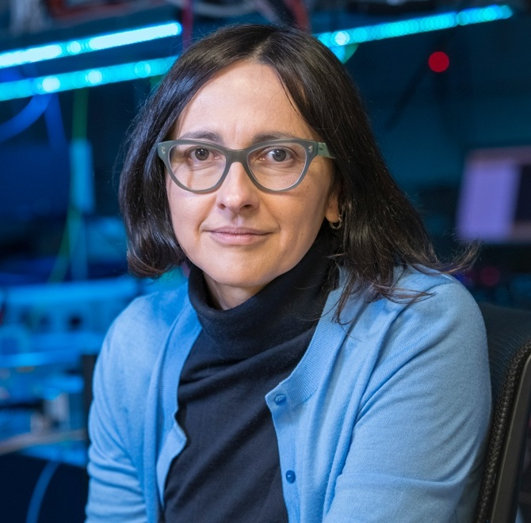

# Professor-Research-Quick-Insights

A repository for quickly accessing research insights into professors' expertise across various universities and fields. Each section is organized by university, school, and field, with individual professor links to in-depth Q&A summaries.

---

## Universities

### [Stanford](https://www.stanford.edu/)

#### [Mechanical Engineering](https://me.stanford.edu/)

- **Field**: Mix

  <table>
    <tr>
      <td align="center">
        <a href="research-quickview/stanford/me/matthew-edwards/research-overview.md">
           
          <b>Matthew Edwards</b>
        </a>
        
超快激光控制、等离子体光学、粒子加速技术

      </td>
      <td align="center">
        <a href="research-quickview/stanford/me/kenneth-goodson/research-overview.md">
           
          <b>Kenneth Goodson</b>
        </a>
        
微尺度散热、液气双相冷却、高热通量管理

      </td>
      <td align="center">
        <a href="research-quickview/stanford/me/ronald-hanson/research-overview.md">
           
          <b>Ronald Hanson</b>
        </a>
        
燃烧动力学、高温光谱诊断、激波管技术（模拟高温高压气体行为）

      </td>
    </tr>
  </table>

#### [Electrical Engineering](https://ee.stanford.edu/)

- **Learn about Professor**: Stanford EE website->People->Faculty->Areas

- **Field**: Nanotechnology, nanofabrication, materials, advanced packaging and manufacturing technologies

<table>
  <tr>
    <td align="center">
      <a href="research-quickview/stanford/ee/joonhee-choi/research-overview.md">
         
        <b>Joonhee Choi</b>
      </a>
      
量子态操控、量子计算与通信、多体量子动力学

    </td>
    <td align="center">
      <a href="research-quickview/stanford/ee/srabanti-chowdhury/research-overview.md">
         
        <b>Srabanti Chowdhury</b>
      </a>
      
纳米技术、集成电路与系统

    </td>
    <td align="center">
      <a href="research-quickview/stanford/ee/daniel-congreve/research-overview.md">
         
        <b>Daniel Congreve</b>
      </a>
      
光子学、能源与可持续性

    </td>
    <td align="center">
      <a href="research-quickview/stanford/ee/jonathan-fan/research-overview.md">
         
        <b>Jonathan Fan</b>
      </a>
      
纳米技术、量子科学与工程

    </td>
  </tr>
  <tr>
    <td align="center">
      <a href="research-quickview/stanford/ee/siddharth-krishnan/research-overview.md">
         
        <b>Siddharth Krishnan</b>
      </a>
      
生物医学设备、传感器和系统

    </td>
    <td align="center">
      <a href="research-quickview/stanford/ee/piero-pianetta/research-overview.md">
         
        <b>Piero A. Pianetta</b>
      </a>
      
纳米技术、集成电路与系统

    </td>
    <td align="center">
      <a href="research-quickview/stanford/ee/james-plummer/research-overview.md">
         
        <b>James D. Plummer</b>
      </a>
      
纳米技术、能源与可持续性

    </td>
    <td align="center">
      <a href="research-quickview/stanford/ee/eric-pop/research-overview.md">
         
        <b>Eric Pop</b>
      </a>
      
纳米尺度热管理、相变存储器、二维材料纳米电子器件

    </td>
  </tr>
  <tr>
    <td align="center">
      <a href="research-quickview/stanford/ee/juan-rivas/research-overview.md">
         
        <b>Juan Rivas</b>
      </a>
      
纳米技术、能源与可持续性

    </td>
    <td align="center">
      <a href="research-quickview/stanford/ee/krishna-saraswat/research-overview.md">
         
        <b>Krishna Saraswat</b>
      </a>
      
纳米技术、集成电路与系统

    </td>
    <td align="center">
      <a href="research-quickview/stanford/ee/debbie-senesky/research-overview.md">
         
        <b>Debbie Senesky</b>
      </a>
      
环境传感器、嵌入式系统

    </td>
    <td align="center">
      <a href="research-quickview/stanford/ee/jelena-vuckovic/research-overview.md">
         
        <b>Jelena Vuckovic</b>
      </a>
      
纳米光子器件、量子计算、光通信与光传感

    </td>
  </tr>
  <tr>
    <td align="center">
      <a href="research-quickview/stanford/ee/shan-wang/research-overview.md">
         
        <b>Shan X. Wang</b>
      </a>
      
生物医学设备、集成电路与系统

    </td>
    <td align="center">
      <a href="research-quickview/stanford/ee/h-s-philip-wong/research-overview.md">
         
        <b>H.-S. Philip Wong</b>
      </a>
      
碳纳米管晶体管，铁电场效应晶体管，存算一体架构，三维堆叠存储

    </td>
  </tr>
</table>

- **Field**: Quantum science and engineering, Photonics

  <table>
    <tr>
      <td align="center">
        <a href="research-quickview/stanford/ee/olav-solgaard/research-overview.md">
           
          <b>Olav Solgaard</b>
        </a>
        
纳米光学结构、MEMS相移器与空间光调制器、光子区块链与光子计算、介质激光加速

      </td>
    </tr>
  </table>

### [UCLA](https://www.ucla.edu/)

#### [Electrical & Computer Engineering](https://www.ee.ucla.edu/ucla-ee-research/)

- **Field**: Semiconductors and Packaging Technology

  <table>
    <tr>
      <td align="center">
        <a href="research-quickview/ucla/ece/elaheh-ahmadi/research-overview.md">
           
          <b>Elaheh Ahmadi</b>
        </a>
        
芯片掺杂、分子束外延

      </td>
      <td align="center">
        <a href="research-quickview/ucla/ece/robert-candler/research-overview.md">
           
          <b>Robert Candler</b>
        </a>
        
纳米磁铁材料设计制造、生物医学应用

      </td>
      <td align="center">
        <a href="research-quickview/ucla/ece/frank-chang/research-overview.md">
           
          <b>Frank Chang</b>
        </a>
        
射频芯片设计与集成

      </td>
      <td align="center">
        <a href="research-quickview/ucla/ece/sam-emamjinejad/research-overview.md">
           
          <b>Sam Emamjinejad</b>
        </a>
        
可穿戴生物电子传感器、健康监测

      </td>
    </tr>
    <tr>
      <td align="center">
        <a href="research-quickview/ucla/ece/puneet-gupta/research-overview.md">
           
          <b>Puneet Gupta</b>
        </a>
        
芯片设计、光子计算和存储

      </td>
      <td align="center">
        <a href="research-quickview/ucla/ece/subramanian-iyer/research-overview.md">
           
          <b>Subramanian Iyer</b>
        </a>
        
芯片封装和光刻

      </td>
      <td align="center">
        <a href="research-quickview/ucla/ece/sudhakar-pamarti/research-overview.md">
           
          <b>Sudhakar Pamarti</b>
        </a>
        
低功耗芯片设计

      </td>
      <td align="center">
        <a href="research-quickview/ucla/ece/kang-wang/research-overview.md">
           
          <b>Kang L. Wang</b>
        </a>
        
量子材料和自旋电子器

      </td>
    </tr>
    <tr>
      <td align="center">
        <a href="research-quickview/ucla/ece/benjamin-williams/research-overview.md">
           
          <b>Benjamin Williams</b>
        </a>
        
太赫兹，量子级联激光器，超表面激光器

      </td>
      <td align="center">
        <a href="research-quickview/ucla/ece/chee-wei-wong/research-overview.md">
           
          <b>Chee Wei Wong</b>
        </a>
        
频率梳，微腔光子器件，量子通信

      </td>
      <td align="center">
        <a href="research-quickview/ucla/ece/jason-woo/research-overview.md">
           
          <b>Jason Woo</b>
        </a>
        
疑似退休

      </td>
      <td align="center">
        <a href="research-quickview/ucla/ece/ken-yang/research-overview.md">
           
          <b>C. K. "Ken" Yang</b>
        </a>
        
无课题组网站

      </td>
    </tr>
    <tr>
      <td align="center">
        <a href="research-quickview/ucla/ece/mona-jarrahi/research-overview.md">
           
          <b>Mona Jarrahi</b>
        </a>
        
太赫兹成像、光学处理、光子计算

      </td>
    </tr>
  </table>

### [MIT](https://www.mit.edu/)

#### [Mechanical Engineering](https://meche.mit.edu/)

- **Field**: Micro and Nanotechnology
- [**Faculty**](https://meche.mit.edu/people?field_research_area_tid[]=12)

<table>
  <tr>
    <td align="center">
      <a href="research-quickview/mit/me/george-barbastathis/research-overview.md">
         
        <b>George Barbastathis</b>
      </a>
      
生物医学成像、药物冷冻干燥监控、计算光学与物理驱动AI

    </td>
    <td align="center">
      <a href="research-quickview/mit/me/gang-chen/research-overview.md">
         
        <b>Gang Chen</b>
      </a>
      
纳米尺度热传导、能量转换、热管理

    </td>
    <td align="center">
      <a href="research-quickview/mit/me/martin-culpepper/research-overview.md">
         
        <b>Martin Culpepper</b>
      </a>
      
精密机械设计、高精度仪器与系统、纳米技术

    </td>
    <td align="center">
      <a href="research-quickview/mit/me/alan-grodzinsky/research-overview.md">
         
        <b>Alan Grodzinsky</b>
      </a>
      
生物力学、生物组织电机械特性、关节疾病治疗

    </td>
  </tr>
  <tr>
    <td align="center">
      <a href="research-quickview/mit/me/nicolas-hadjiconstantinou/research-overview.md">
         
        <b>Nicolas Hadjiconstantinou</b>
      </a>
      
微纳尺度流体力学、热传导、传输现象计算方法

    </td>
    <td align="center">
      <a href="research-quickview/mit/me/john-hart/research-overview.md">
         
        <b>John Hart</b>
      </a>
      
碳纳米管纤维复合材料制造、增材制造

    </td>
    <td align="center">
      <a href="research-quickview/mit/me/joseph-jacobson/research-overview.md">
         
        <b>Joseph Jacobson</b>
      </a>
      
数字制造、分子电子学、生物与电子学界面

    </td>
    <td align="center">
      <a href="research-quickview/mit/me/rohit-karnik/research-overview.md">
         
        <b>Rohit Karnik</b>
      </a>
      
微流体和纳流体系统、流体传输、水净化和生物医学设备

    </td>
  </tr>
  <tr>
    <td align="center">
      <a href="research-quickview/mit/me/jeehwan-kim/research-overview.md">
         
        <b>Jeehwan Kim</b>
      </a>
      
二维材料、电子和光电子学、材料可扩展制造技术

    </td>
    <td align="center">
      <a href="research-quickview/mit/me/sang-gook-kim/research-overview.md">
         
        <b>Sang-Gook Kim</b>
      </a>
      
微机电系统、传感器和能量采集器、纳米技术

    </td>
    <td align="center">
      <a href="research-quickview/mit/me/robert-langer/research-overview.md">
         
        <b>Robert Langer</b>
      </a>
      
生物技术、材料科学、药物输送系统、组织工程

    </td>
    <td align="center">
      <a href="research-quickview/mit/me/scott-manalis/research-overview.md">
         
        <b>Scott Manalis</b>
      </a>
      
生物微机电系统、单细胞分析、诊断和治疗

    </td>
  </tr>
  <tr>
    <td align="center">
      <a href="research-quickview/mit/me/carlos-portela/research-overview.md">
         
        <b>Carlos Portela</b>
      </a>
      
军用超材料抗冲击承受高应力、声学聚焦超材料（水下）、自组装纳米超材料

    </td>
    <td align="center">
      <a href="research-quickview/mit/me/yang-shao-horn/research-overview.md">
         
        <b>Yang Shao-Horn</b>
      </a>
      
能量存储与转换、电池和燃料电池、催化剂材料

    </td>
    <td align="center">
      <a href="research-quickview/mit/me/vivishek-sudhir/research-overview.md">
         
        <b>Vivishek Sudhir</b>
      </a>
      
量子测量与控制、量子系统控制

    </td>
    <td align="center">
      <a href="research-quickview/mit/me/kripa-varanasi/research-overview.md">
         
        <b>Kripa Varanasi</b>
      </a>
      
界面现象、表面润湿性、能源与制造

    </td>
  </tr>
  <tr>
    <td align="center">
      <a href="research-quickview/mit/me/evelyn-wang/research-overview.md">
         
        <b>Evelyn Wang</b>
      </a>
      
热管理、能量收集、电子冷却和太阳能应用

    </td>
    <td align="center">
      <a href="research-quickview/mit/me/sherrie-wang/research-overview.md">
         
        <b>Sherrie Wang</b>
      </a>
      
可持续农业、食品系统、机器学习与遥感

    </td>
    <td align="center">
      <a href="research-quickview/mit/me/nicholas-x-fang/research-overview.md">
         
        <b>Nicholas X. Fang</b>
      </a>
      
声学超材料、3D打印纳米结构、医疗声学诊断成像(2024年刚转去HKU港大)

    </td>
  </tr>
</table>

#### [Electrical Engineering and Computer Science](https://www.eecs.mit.edu/)

- **Field**: Optics + Photonics
- [**Faculty**](https://www.eecs.mit.edu/people/?fwp_research=optics-and-photonics)

<table>
  <tr>
    <td align="center">
      <a href="research-quickview/mit/eecs/duane-boning/research-overview.md">
         
        <b>Duane Boning</b>
      </a>
      
半导体工艺优化、设备可靠性评估、光子集成制造

    </td>
    <td align="center">
      <a href="research-quickview/mit/eecs/vladimir-bulovic/research-overview.md">
         
        <b>Vladimir Bulović</b>
      </a>
      
钙钛矿光电材料、透明光伏技术（能源）、纳米尺度传感器

    </td>
    <td align="center">
      <a href="research-quickview/mit/eecs/dirk-englund/research-overview.md">
         
        <b>Dirk Englund</b>
      </a>
      
量子光子器件、光学神经计算、高灵敏传感器与成像

    </td>
    <td align="center">
      <a href="research-quickview/mit/eecs/james-fujimoto/research-overview.md">
         
        <b>James Fujimoto</b>
      </a>
      
光学相干断层扫描、高分辨率生物成像、临床诊断应用

    </td>
  </tr>
  <tr>
    <td align="center">
      <a href="research-quickview/mit/eecs/leslie-kolodziejski/research-overview.md">
         
        <b>Leslie Kolodziejski</b>
      </a>
      
（疑似退休或不在科研一线）

    </td>
    <td align="center">
      <a href="research-quickview/mit/eecs/wojciech-matusik/research-overview.md">
         
        <b>Wojciech Matusik</b>
      </a>
      
视觉反馈制造、AI调节生产过程、自动优化材料、智能制造

    </td>
    <td align="center">
      <a href="research-quickview/mit/eecs/jelena-notaros/research-overview.md">
         
        <b>Jelena Notaros</b>
      </a>
      
集成光子学、光学相控阵、量子信息处理

    </td>
    <td align="center">
      <a href="research-quickview/mit/eecs/william-d-oliver/research-overview.md">
         
        <b>William D. Oliver</b>
      </a>
      
超导量子计算、远程量子纠缠、量子噪声控制

    </td>
  </tr>
  <tr>
    <td align="center">
      <a href="research-quickview/mit/eecs/rajeev-ram/research-overview.md">
         
        <b>Rajeev Ram</b>
      </a>
      
光电集成光通信、生物医疗光学传感、CMOS兼容的光学器件

    </td>
    <td align="center">
      <a href="research-quickview/mit/eecs/sixian-you/research-overview.md">
         
        <b>Sixian You</b>
      </a>
      
无标记光学显微成像、AI应成像算法、生物医学诊断

    </td>
  </tr>
</table>

- **Field**: Nanoscale Materials, Devices, and Systems
- [**Faculty**](https://www.eecs.mit.edu/people/?fwp_research=nanoscale-materials-devices-and-systems)

<table>
  <tr>
    <td align="center">
      <a href="research-quickview/mit/eecs/akintunde-akinwande/research-overview.md">
         
        <b>Akintunde Akinwande</b>
      </a>
      
微机电系统（MEMS）、纳米电子器件、传感器技术

    </td>
    <td align="center">
      <a href="research-quickview/mit/eecs/dimitri-antoniadis/research-overview.md">
         
        <b>Dimitri Antoniadis</b>
      </a>
      
纳米尺度半导体器件、先进CMOS技术、器件建模

    </td>
    <td align="center">
      <a href="research-quickview/mit/eecs/karl-berggren/research-overview.md">
         
        <b>Karl Berggren</b>
      </a>
      
纳米制造、超导纳米线单光子探测器、电子束光刻

    </td>
    <td align="center">
      <a href="research-quickview/mit/eecs/sangeeta-bhatia/research-overview.md">
         
        <b>Sangeeta Bhatia</b>
      </a>
      
微型生物技术、纳米医学、组织工程

    </td>
  </tr>
  <tr>
    <td align="center">
      <a href="research-quickview/mit/eecs/duane-boning/research-overview.md">
         
        <b>Duane Boning</b>
      </a>
      
半导体制造、工艺控制、统计建模

    </td>
    <td align="center">
      <a href="research-quickview/mit/eecs/vladimir-bulovic/research-overview.md">
         
        <b>Vladimir Bulović</b>
      </a>
      
有机和纳米结构电子学、柔性电子器件、太阳能电池

    </td>
    <td align="center">
      <a href="research-quickview/mit/eecs/anantha-chandrakasan/research-overview.md">
         
        <b>Anantha Chandrakasan</b>
      </a>
      
超低功耗电路设计、无线传感器网络、嵌入式系统

    </td>
    <td align="center">
      <a href="research-quickview/mit/eecs/isaac-chuang/research-overview.md">
         
        <b>Isaac Chuang</b>
      </a>
      
量子计算、量子信息科学、量子电路设计

    </td>
  </tr>
  <tr>
    <td align="center">
      <a href="research-quickview/mit/eecs/luca-daniel/research-overview.md">
         
        <b>Luca Daniel</b>
      </a>
      
电磁场计算、电子设计自动化、微机电系统建模

    </td>
    <td align="center">
      <a href="research-quickview/mit/eecs/jesus-del-alamo/research-overview.md">
         
        <b>Jesús del Alamo</b>
      </a>
      
高电子迁移率晶体管、宽带隙半导体器件、器件可靠性

    </td>
    <td align="center">
      <a href="research-quickview/mit/eecs/dirk-englund/research-overview.md">
         
        <b>Dirk Englund</b>
      </a>
      
量子光子学、纳米光子器件、量子通信

    </td>
    <td align="center">
      <a href="research-quickview/mit/eecs/jongyoon-han/research-overview.md">
         
        <b>Jongyoon Han</b>
      </a>
      
微流控技术、生物分离、纳米生物技术

    </td>
  </tr>
  <tr>
    <td align="center">
      <a href="research-quickview/mit/eecs/qing-hu/research-overview.md">
         
        <b>Qing Hu</b>
      </a>
      
太赫兹科学与技术、宽频带探测、亚波长光子学

    </td>
    <td align="center">
      <a href="research-quickview/mit/eecs/leslie-kolodziejski/research-overview.md">
         
        <b>Leslie Kolodziejski</b>
      </a>
      
光学材料、光子集成、量子光学

    </td>
    <td align="center">
      <a href="research-quickview/mit/eecs/jing-kong/research-overview.md">
         
        <b>Jing Kong</b>
      </a>
      
二维材料、纳米碳材料、柔性电子学

    </td>
    <td align="center">
      <a href="research-quickview/mit/eecs/jeffrey-lang/research-overview.md">
         
        <b>Jeffrey Lang</b>
      </a>
      
电机设计与建模、电磁学、能量收集

    </td>
  </tr>
  <tr>
    <td align="center">
      <a href="research-quickview/mit/eecs/luqiao-liu/research-overview.md">
         
        <b>Luqiao Liu</b>
      </a>
      
自旋电子学、磁性材料、量子材料

    </td>
    <td align="center">
      <a href="research-quickview/mit/eecs/farnaz-niroui/research-overview.md">
         
        <b>Farnaz Niroui</b>
      </a>
      
纳米制造、纳米电子学、纳米材料的自组装

    </td>
    <td align="center">
      <a href="research-quickview/mit/eecs/jelena-notaros/research-overview.md">
         
        <b>Jelena Notaros</b>
      </a>
      
集成光子学、光学相控阵、量子信息处理

    </td>
    <td align="center">
      <a href="research-quickview/mit/eecs/kevin-obrien/research-overview.md">
         
        <b>Kevin P. O’Brien</b>
      </a>
      
量子计算、光学非线性、量子传感

    </td>
  </tr>
</table>

### [California Institute of Technology](https://www.caltech.edu/)

#### [Mechanical and Civil Engineering](https://mce.caltech.edu/)

- [**Faculty**](https://mce.caltech.edu/people)

<table>
  <tr>
    <td align="center">
      <a href="research-quickview/caltech/mce/aaron-ames/research-overview.md">
         
        <b>Aaron Ames</b>
      </a>
      
机器人学、控制理论、动态系统

    </td>
    <td align="center">
      <a href="research-quickview/caltech/mce/jose-andrade/research-overview.md">
         
        <b>José E. Andrade</b>
      </a>
      
固体力学、材料科学、地震工程

    </td>
    <td align="center">
      <a href="research-quickview/caltech/mce/domniki-asimaki/research-overview.md">
         
        <b>Domniki Asimaki</b>
      </a>
      
地震工程、结构健康监测、材料力学

    </td>
    <td align="center">
      <a href="research-quickview/caltech/mce/jean-philippe-avouac/research-overview.md">
         
        <b>Jean-Philippe Avouac</b>
      </a>
      
地质学、地震学、地球动力学

    </td>
  </tr>
  <tr>
    <td align="center">
      <a href="research-quickview/caltech/mce/kaushik-bhattacharya/research-overview.md">
         
        <b>Kaushik Bhattacharya</b>
      </a>
      
材料科学、力学、微观结构

    </td>
    <td align="center">
      <a href="research-quickview/caltech/mce/guillaume-blanquart/research-overview.md">
         
        <b>Guillaume Blanquart</b>
      </a>
      
计算流体力学、燃烧、传热

    </td>
    <td align="center">
      <a href="research-quickview/caltech/mce/john-brady/research-overview.md">
         
        <b>John F. Brady</b>
      </a>
      
流体力学、颗粒流、软物质

    </td>
    <td align="center">
      <a href="research-quickview/caltech/mce/joel-burdick/research-overview.md">
         
        <b>Joel W. Burdick</b>
      </a>
      
机器人学、生物力学、控制系统

    </td>
  </tr>
  <tr>
    <td align="center">
      <a href="research-quickview/caltech/mce/tim-colonius/research-overview.md">
         
        <b>Tim Colonius</b>
      </a>
      
声学、流体力学、计算科学

    </td>
    <td align="center">
      <a href="research-quickview/caltech/mce/john-dabiri/research-overview.md">
         
        <b>John O. Dabiri</b>
      </a>
      
生物力学、流体力学、能源

    </td>
    <td align="center">
      <a href="research-quickview/caltech/mce/chiara-daraio/research-overview.md">
         
        <b>Chiara Daraio</b>
      </a>
      
材料科学、纳米技术、机器人学

    </td>
    <td align="center">
      <a href="research-quickview/caltech/mce/ruby-fu/research-overview.md">
         
        <b>Xiaojing (Ruby) Fu</b>
      </a>
      
机器人学、控制理论、动态系统

    </td>
  </tr>
  <tr>
    <td align="center">
      <a href="research-quickview/caltech/mce/julia-greer/research-overview.md">
         
        <b>Julia R. Greer</b>
      </a>
      
材料科学、机械工程、医学工程

    </td>
    <td align="center">
      <a href="research-quickview/caltech/mce/melany-hunt/research-overview.md">
         
        <b>Melany L. Hunt</b>
      </a>
      
机械工程、工程教育、流体力学

    </td>
    <td align="center">
      <a href="research-quickview/caltech/mce/monica-kohler/research-overview.md">
         
        <b>Monica Kohler</b>
      </a>
      
结构工程、材料科学、可持续性

    </td>
    <td align="center">
      <a href="research-quickview/caltech/mce/nadia-lapusta/research-overview.md">
         
        <b>Nadia Lapusta</b>
      </a>
      
地震学、材料力学、地球动力学

    </td>
  </tr>
  <tr>
    <td align="center">
      <a href="research-quickview/caltech/mce/michael-mello/research-overview.md">
         
        <b>Michael Mello</b>
      </a>
      
机械与土木工程、教学、工程设计

    </td>
    <td align="center">
      <a href="research-quickview/caltech/mce/austin-minnich/research-overview.md">
         
        <b>Austin Minnich</b>
      </a>
      
机械工程、应用物理、热科学

    </td>
    <td align="center">
      <a href="research-quickview/caltech/mce/richard-murray/research-overview.md">
         
        <b>Richard M. Murray</b>
      </a>
      
控制与动态系统、生物工程、复杂系统

    </td>
    <td align="center">
      <a href="research-quickview/caltech/mce/gunter-niemeyer/research-overview.md">
         
        <b>Gunter Niemeyer</b>
      </a>
      
教学、机械与土木工程、工程教育

    </td>
  </tr>
  <tr>
    <td align="center">
      <a href="research-quickview/caltech/mce/sergio-pellegrino/research-overview.md">
         
        <b>Sergio Pellegrino</b>
      </a>
      
航空航天与土木工程、空间科学、材料设计

    </td>
    <td align="center">
      <a href="research-quickview/caltech/mce/guruswami-ravichandran/research-overview.md">
         
        <b>Guruswami (Ravi) Ravichandran</b>
      </a>
      
航空航天与机械工程、材料科学

    </td>
    <td align="center">
      <a href="research-quickview/caltech/mce/ares-rosakis/research-overview.md">
         
        <b>Ares J. Rosakis</b>
      </a>
      
气动与机械工程、材料科学、动态行为

    </td>
    <td align="center">
      <a href="research-quickview/caltech/mce/joseph-shepherd/research-overview.md">
         
        <b>Joseph E. Shepherd</b>
      </a>
      
航空航天与机械工程、流体力学、推进技术

    </td>
  </tr>
  <tr>
    <td align="center">
      <a href="research-quickview/caltech/mce/sandra-troian/research-overview.md">
         
        <b>Sandra M. Troian</b>
      </a>
      
应用物理、航空学、机械工程

    </td>
  </tr>
</table>

 

#### [Electrical Engineering](https://www.ee.caltech.edu/)

- [**Faculty**](https://www.ee.caltech.edu/people)

<table>
  <tr>
    <td align="center">
      <a href="research-quickview/caltech/ee/yaser-abu-mostafa/research-overview.md">
         
        <b>Yaser Abu-Mostafa</b>
      </a>
      
机器学习、计算智能、金融工程

    </td>
    <td align="center">
      <a href="research-quickview/caltech/ee/katherine-bouman/research-overview.md">
         
        <b>Katherine L. (Katie) Bouman</b>
      </a>
      
计算成像、计算摄影、机器学习

    </td>
    <td align="center">
      <a href="research-quickview/caltech/ee/jehoshua-bruck/research-overview.md">
         
        <b>Jehoshua (Shuki) Bruck</b>
      </a>
      
信息理论、数据存储、计算生物学

    </td>
    <td align="center">
      <a href="research-quickview/caltech/ee/venkat-chandrasekaran/research-overview.md">
         
        <b>Venkat Chandrasekaran</b>
      </a>
      
优化、统计推断、计算复杂性

    </td>
  </tr>
  <tr>
    <td align="center">
      <a href="research-quickview/caltech/ee/john-doyle/research-overview.md">
         
        <b>John Doyle</b>
      </a>
      
控制理论、复杂系统、系统生物学

    </td>
    <td align="center">
      <a href="research-quickview/caltech/ee/michelle-effros/research-overview.md">
         
        <b>Michelle Effros</b>
      </a>
      
信息理论、数据压缩、网络编码

    </td>
    <td align="center">
      <a href="research-quickview/caltech/ee/azita-emami/research-overview.md">
         
        <b>Azita Emami</b>
      </a>
      
集成电路设计、生物医学器件、光电系统

    </td>
    <td align="center">
      <a href="research-quickview/caltech/ee/andrei-faraon/research-overview.md">
         
        <b>Andrei Faraon</b>
      </a>
      
纳米光子学、量子光学、光学材料

    </td>
  </tr>
  <tr>
    <td align="center">
      <a href="research-quickview/caltech/ee/glen-george/research-overview.md">
         
        <b>Glen George</b>
      </a>
      
电路设计、嵌入式系统、工程教育

    </td>
    <td align="center">
      <a href="research-quickview/caltech/ee/georgia-gkioxari/research-overview.md">
         
        <b>Georgia Gkioxari</b>
      </a>
      
计算机视觉、机器学习、人工智能

    </td>
    <td align="center">
      <a href="research-quickview/caltech/ee/ali-hajimiri/research-overview.md">
         
        <b>Ali Hajimiri</b>
      </a>
      
电路与系统、微波光子学、无线电力传输

    </td>
    <td align="center">
      <a href="research-quickview/caltech/ee/babak-hassibi/research-overview.md">
         
        <b>Babak Hassibi</b>
      </a>
      
通信、信号处理、控制理论

    </td>
  </tr>
  <tr>
    <td align="center">
      <a href="research-quickview/caltech/ee/victoria-kostina/research-overview.md">
         
        <b>Victoria Kostina</b>
      </a>
      
信息理论、编码理论、统计学习

    </td>
    <td align="center">
      <a href="research-quickview/caltech/ee/steven-low/research-overview.md">
         
        <b>Steven Low</b>
      </a>
      
网络控制、优化、智能电网

    </td>
    <td align="center">
      <a href="research-quickview/caltech/ee/alireza-marandi/research-overview.md">
         
        <b>Alireza Marandi</b>
      </a>
      
非线性光学、量子光子学、激光科学

    </td>
    <td align="center">
      <a href="research-quickview/caltech/ee/mohammad-mirhosseini/research-overview.md">
         
        <b>Mohammad Mirhosseini</b>
      </a>
      
量子信息、光子学、超导量子电路

    </td>
  </tr>
  <tr>
    <td align="center">
      <a href="research-quickview/caltech/ee/pietro-perona/research-overview.md">
         
        <b>Pietro Perona</b>
      </a>
      
计算机视觉、机器学习、神经科学

    </td>
    <td align="center">
      <a href="research-quickview/caltech/ee/axel-scherer/research-overview.md">
         
        <b>Axel Scherer</b>
      </a>
      
纳米技术、微机电系统、光子学

    </td>
    <td align="center">
      <a href="research-quickview/caltech/ee/yu-chong-tai/research-overview.md">
         
        <b>Yu-Chong Tai</b>
      </a>
      
微机电系统、生物传感器、微流体

    </td>
    <td align="center">
      <a href="research-quickview/caltech/ee/p-p-vaidyanathan/research-overview.md">
         
        <b>P. P. Vaidyanathan</b>
      </a>
      
信号处理、滤波器设计、通信系统

    </td>
  </tr>
  <tr>
    <td align="center">
      <a href="research-quickview/caltech/ee/lihong-wang/research-overview.md">
         
        <b>Lihong Wang</b>
      </a>
      
光声成像、生物医学成像、光学成像

    </td>
    <td align="center">
      <a href="research-quickview/caltech/ee/changhuei-yang/research-overview.md">
         
        <b>Changhuei Yang</b>
      </a>
      
生物医学光学、成像技术、微流体

    </td>
    <td align="center">
      <a href="research-quickview/caltech/ee/amnon-yariv/research-overview.md">
         
        <b>Amnon Yariv</b>
      </a>
      
光子学、量子电子学、光通信

    </td>
  </tr>
</table>

#### [Applied Physics]([https://www.ee.caltech.edu/](https://aph.caltech.edu/))

- [**Faculty**](https://aph.caltech.edu/people)

<table>
  <tr>
    <td align="center">
      <a href="research-quickview/caltech/aph/harry-atwater/research-overview.md">
         
        <b>Harry A. Atwater, Jr.</b>
      </a>
      
量子与纳米光子学、超材料与超表面、人造光合作用、二维材料、纳米和微结构光伏、空间太阳能和等离子体学

    </td>
    <td align="center">
      <a href="research-quickview/caltech/aph/paul-bellan/research-overview.md">
         
        <b>Paul M. Bellan</b>
      </a>
      
等离子体物理，应用于聚变能、太阳物理、天体物理学、高空大气现象和土星环

    </td>
    <td align="center">
      <a href="research-quickview/caltech/aph/marco-bernardi/research-overview.md">
         
        <b>Marco Bernardi</b>
      </a>
      
理论与计算材料物理，开发新的第一性原理方法，研究材料中的电子传输、超快动力学和光-物质相互作用

    </td>
    <td align="center">
      <a href="research-quickview/caltech/aph/chiara-daraio/research-overview.md">
         
        <b>Chiara Daraio</b>
      </a>
      
工程新材料，具有先进的机械和传感特性，应用于机器人技术、医疗设备和振动吸收

    </td>
  </tr>
  <tr>
    <td align="center">
      <a href="research-quickview/caltech/aph/paul-dimotakis/research-overview.md">
         
        <b>Paul E. Dimotakis</b>
      </a>
      
实验和计算研究，关注亚音速和超音速自由剪切流中的湍流混合和化学反应；高超音速推进；湍流中的混合和表面几何

    </td>
    <td align="center">
      <a href="research-quickview/caltech/aph/michael-elowitz/research-overview.md">
         
        <b>Michael Elowitz</b>
      </a>
      
创建和分析生物“电路”，通过编程活细胞中的新功能，揭示电路设计的基本原理，开发下一代细胞和基因疗法

    </td>
    <td align="center">
      <a href="research-quickview/caltech/aph/andrei-faraon/research-overview.md">
         
        <b>Andrei Faraon</b>
      </a>
      
固态量子光学和纳米光子学，应用于量子信息处理、片上光信号处理、节能传感器和生物光子学

    </td>
    <td align="center">
      <a href="research-quickview/caltech/aph/brent-fultz/research-overview.md">
         
        <b>Brent Fultz</b>
      </a>
      
材料物理和材料化学，研究熵的起源，使用中子散射和计算；新型能源存储材料，特别是氢存储材料

    </td>
  </tr>
  <tr>
    <td align="center">
      <a href="research-quickview/caltech/aph/william-goddard/research-overview.md">
         
        <b>William A. Goddard, III</b>
      </a>
      
开发量子力学、力场、反应动力学、电子动力学、分子动力学和蒙特卡罗预测化学、催化和生化材料系统的方法

    </td>
    <td align="center">
      <a href="research-quickview/caltech/aph/alireza-marandi/research-overview.md">
         
        <b>Alireza Marandi</b>
      </a>
      
非线性光子学的基础技术发展，探索超快光学、光频梳、量子光学、光信息处理、中红外光子学和激光光谱学的前沿

    </td>
    <td align="center">
      <a href="research-quickview/caltech/aph/austin-minnich/research-overview.md">
         
        <b>Austin Minnich</b>
      </a>
      
先进的微波和毫米波技术在无线电天文学、量子信息科学等应用中的研究

    </td>
    <td align="center">
      <a href="research-quickview/caltech/aph/mohammad-mirhosseini/research-overview.md">
         
        <b>Mohammad Mirhosseini</b>
      </a>
      
量子工程的实验研究，开发和结合超导电路与基于芯片的声子和光子设备

    </td>
  </tr>
  <tr>
    <td align="center">
      <a href="research-quickview/caltech/aph/stevan-nadj-perge/research-overview.md">
         
        <b>Stevan Nadj-Perge</b>
      </a>
      
开发用于量子信息处理的介观设备，探索在纳米尺度的异域电子状态

    </td>
    <td align="center">
      <a href="research-quickview/caltech/aph/oskar-painter/research-overview.md">
         
        <b>Oskar J. Painter</b>
      </a>
      
纳米光子学、量子光学和光机械学在精密测量和量子信息科学中的应用

    </td>
    <td align="center">
      <a href="research-quickview/caltech/aph/rob-phillips/research-overview.md">
         
        <b>Rob Phillips</b>
      </a>
      
细胞的物理生物学：转录和活性物质模型、物理基因组学和进化的生物物理方法

    </td>
    <td align="center">
      <a href="research-quickview/caltech/aph/michael-roukes/research-overview.md">
         
        <b>Michael L. Roukes</b>
      </a>
      
纳米生物技术、纳米技术、纳米尺度物理、纳米和分子力学

    </td>
  </tr>
  <tr>
    <td align="center">
      <a href="research-quickview/caltech/aph/axel-scherer/research-overview.md">
         
        <b>Axel Scherer</b>
      </a>
      
微制造应用于集成微系统，专注于低成本疾病检测和精确健康监测的传感器和诊断工具开发

    </td>
    <td align="center">
      <a href="research-quickview/caltech/aph/keith-schwab/research-overview.md">
         
        <b>Keith C. Schwab</b>
      </a>
      
开发用于超流氦-4的约瑟夫森结，旨在构建量子设备，如干涉仪和量子比特

    </td>
    <td align="center">
      <a href="research-quickview/caltech/aph/sandra-troian/research-overview.md">
         
        <b>Sandra M. Troian</b>
      </a>
      
通过调节表面力的时空调制来控制微纳米尺度系统中的液体、热量或光的流动

    </td>
  </tr>
  <tr>
    <td align="center">
      <a href="research-quickview/caltech/aph/kerry-vahala/research-overview.md">
         
        <b>Kerry J. Vahala</b>
      </a>
      
高Q光微腔中的非线性光学，应用于精密计量系统和微型光学陀螺仪

    </td>
    <td align="center">
      <a href="research-quickview/caltech/aph/amnon-yariv/research-overview.md">
         
        <b>Amnon Yariv</b>
      </a>
      
光通信的理论和技术基础，包括新型半导体激光器和光相位锁系统

    </td>
  </tr>
</table>

### [Harvard](https://www.harvard.edu/)

#### [Electrical Engineering](https://seas.harvard.edu/faculty/all-research-areas)

- [**Faculty**](https://seas.harvard.edu/electrical-engineering/faculty-research)

- **Field**: Circuits and VLSI
<table>
  <tr>
    <td align="center">
      <a href="research-quickview/harvard/ee/donhee-ham/research-overview.md">
         
        <b>Donhee Ham</b>
      </a>
      
生物电子学、神经工程、集成电路设计

    </td>
    <td align="center">
      <a href="research-quickview/harvard/ee/gage-hills/research-overview.md">
         
        <b>Gage Hills</b>
      </a>
      
集成电路设计、射频电路、毫米波电路

    </td>
    <td align="center">
      <a href="research-quickview/harvard/ee/paul-horowitz/research-overview.md">
         
        <b>Paul Horowitz</b>
      </a>
      
电子学、实验物理、教育

    </td>
    <td align="center">
      <a href="research-quickview/harvard/ee/gu-yeon-wei/research-overview.md">
         
        <b>Gu-Yeon Wei</b>
      </a>
      
集成电路、计算机体系结构、机器学习硬件

    </td>
  </tr>
  <tr>
    <td align="center">
      <a href="research-quickview/harvard/ee/woodward-yang/research-overview.md">
         
        <b>Woodward Yang</b>
      </a>
      
集成电路设计、射频电路、毫米波电路

    </td>
  </tr>
</table>

- **Field**: Computer Engineering and Architecture
<table>
  <tr>
    <td align="center">
      <a href="research-quickview/harvard/ee/david-brooks/research-overview.md">
         
        <b>David Brooks</b>
      </a>
      
计算机体系结构、能源效率、机器学习

    </td>
    <td align="center">
      <a href="research-quickview/harvard/ee/donhee-ham/research-overview.md">
         
        <b>Donhee Ham</b>
      </a>
      
生物电子学、神经工程、集成电路设计

    </td>
    <td align="center">
      <a href="research-quickview/harvard/ee/gage-hills/research-overview.md">
         
        <b>Gage Hills</b>
      </a>
      
集成电路设计、射频电路、毫米波电路

    </td>
    <td align="center">
      <a href="research-quickview/harvard/ee/vijay-janapa-reddi/research-overview.md">
         
        <b>Vijay Janapa Reddi</b>
      </a>
      
计算机体系结构、能源效率、机器学习

    </td>
  </tr>
  <tr>
    <td align="center">
      <a href="research-quickview/harvard/ee/h-t-kung/research-overview.md">
         
        <b>H.T. Kung</b>
      </a>
      
计算机体系结构、并行计算、网络

    </td>
    <td align="center">
      <a href="research-quickview/harvard/ee/michael-d-smith/research-overview.md">
         
        <b>Michael D. Smith</b>
      </a>
      
计算机体系结构、并行计算、网络

    </td>
    <td align="center">
      <a href="research-quickview/harvard/ee/gu-yeon-wei/research-overview.md">
         
        <b>Gu-Yeon Wei</b>
      </a>
      
集成电路、计算机体系结构、机器学习硬件

    </td>
    <td align="center">
      <a href="research-quickview/harvard/ee/woodward-yang/research-overview.md">
         
        <b>Woodward Yang</b>
      </a>
      
集成电路设计、射频电路、毫米波电路

    </td>
  </tr>
</table>

- **Field**: Photonics
<table>
  <tr>
    <td align="center">
      <a href="research-quickview/harvard/ee/federico-capasso/research-overview.md">
         
        <b>Federico Capasso</b>
      </a>
      
光子学、纳米光子学、量子材料

    </td>
    <td align="center">
      <a href="research-quickview/harvard/ee/lene-v-hau/research-overview.md">
         
        <b>Lene V. Hau</b>
      </a>
      
光学、量子光学、冷原子物理

    </td>
    <td align="center">
      <a href="research-quickview/harvard/ee/gage-hills/research-overview.md">
         
        <b>Gage Hills</b>
      </a>
      
光子学、射频电路设计、毫米波电路

    </td>
    <td align="center">
      <a href="research-quickview/harvard/ee/evelyn-hu/research-overview.md">
         
        <b>Evelyn Hu</b>
      </a>
      
纳米光子学、量子工程、光电材料

    </td>
  </tr>
  <tr>
    <td align="center">
      <a href="research-quickview/harvard/ee/marko-loncar/research-overview.md">
         
        <b>Marko Loncar</b>
      </a>
      
纳米光子学、量子光学、集成光学

    </td>
    <td align="center">
      <a href="research-quickview/harvard/ee/eric-mazur/research-overview.md">
         
        <b>Eric Mazur</b>
      </a>
      
光子学、光学材料、教育技术

    </td>
    <td align="center">
      <a href="research-quickview/harvard/ee/maxim-prigozhin/research-overview.md">
         
        <b>Maxim Prigozhin</b>
      </a>
      
光学、非线性光学、光子学

    </td>
    <td align="center">
      <a href="research-quickview/harvard/ee/kiyoul-yang/research-overview.md">
         
        <b>Kiyoul Yang</b>
      </a>
      
光学、计算成像、机器学习

    </td>
  </tr>
</table>

- **Field**: Robotics and Control
<table>
  <tr>
    <td align="center">
      <a href="research-quickview/harvard/ee/martin-bechthold/research-overview.md">
         
        <b>Martin Bechthold</b>
      </a>
      
机器人控制、机械设计、自动化

    </td>
    <td align="center">
      <a href="research-quickview/harvard/ee/david-clarke/research-overview.md">
         
        <b>David Clarke</b>
      </a>
      
材料科学、机器人技术、传感器

    </td>
    <td align="center">
      <a href="research-quickview/harvard/ee/yilun-du/research-overview.md">
         
        <b>Yilun Du</b>
      </a>
      
机器人技术、人工智能、控制系统

    </td>
    <td align="center">
      <a href="research-quickview/harvard/ee/stephanie-gil/research-overview.md">
         
        <b>Stephanie Gil</b>
      </a>
      
机器学习、智能机器人、控制系统

    </td>
  </tr>
  <tr>
    <td align="center">
      <a href="research-quickview/harvard/ee/robert-d-howe/research-overview.md">
         
        <b>Robert D. Howe</b>
      </a>
      
机器人控制、机械设计、医疗机器人

    </td>
    <td align="center">
      <a href="research-quickview/harvard/ee/vijay-janapa-reddi/research-overview.md">
         
        <b>Vijay Janapa Reddi</b>
      </a>
      
计算机体系结构、机器人、机器学习

    </td>
    <td align="center">
      <a href="research-quickview/harvard/ee/na-li/research-overview.md">
         
        <b>Na Li</b>
      </a>
      
机器人、机器学习、控制系统

    </td>
    <td align="center">
      <a href="research-quickview/harvard/ee/l-mahadevan/research-overview.md">
         
        <b>L Mahadevan</b>
      </a>
      
生物力学、软体机器人、流体力学

    </td>
  </tr>
  <tr>
    <td align="center">
      <a href="research-quickview/harvard/ee/patrick-slade/research-overview.md">
         
        <b>Patrick Slade</b>
      </a>
      
机器人学、控制理论、机械设计

    </td>
    <td align="center">
      <a href="research-quickview/harvard/ee/maurice-smith/research-overview.md">
         
        <b>Maurice Smith</b>
      </a>
      
材料科学、机器人技术、传感器技术

    </td>
    <td align="center">
      <a href="research-quickview/harvard/ee/shriya-srinivasan/research-overview.md">
         
        <b>Shriya Srinivasan</b>
      </a>
      
生物机器人、人工智能、控制系统

    </td>
    <td align="center">
      <a href="research-quickview/harvard/ee/conor-j-walsh/research-overview.md">
         
        <b>Conor J Walsh</b>
      </a>
      
生物医疗机器人、控制系统、传感器

    </td>
  </tr>
  <tr>
    <td align="center">
      <a href="research-quickview/harvard/ee/justin-werfel/research-overview.md">
         
        <b>Justin Werfel</b>
      </a>
      
机器人、人工智能、控制理论

    </td>
    <td align="center">
      <a href="research-quickview/harvard/ee/robert-j-wood/research-overview.md">
         
        <b>Robert J. Wood</b>
      </a>
      
微型机器人、人工智能、控制理论

    </td>
    <td align="center">
      <a href="research-quickview/harvard/ee/heng-yang/research-overview.md">
         
        <b>Heng Yang</b>
      </a>
      
机器学习、计算机视觉、机器人技术

    </td>
  </tr>
</table>

- **Field**: Science and Engineering for ClimateTech
<table>
  <tr>
    <td align="center">
      <a href="research-quickview/harvard/ee/joanna-aizenberg/research-overview.md">
         
        <b>Joanna Aizenberg</b>
      </a>
      
材料科学、可持续技术、气候变化研究

    </td>
    <td align="center">
      <a href="research-quickview/harvard/ee/michael-j-aziz/research-overview.md">
         
        <b>Michael J. Aziz</b>
      </a>
      
能量存储、材料科学、气候变化技术

    </td>
    <td align="center">
      <a href="research-quickview/harvard/ee/michael-p-brenner/research-overview.md">
         
        <b>Michael P. Brenner</b>
      </a>
      
流体力学、气候科学、计算物理

    </td>
    <td align="center">
      <a href="research-quickview/harvard/ee/david-brooks/research-overview.md">
         
        <b>David Brooks</b>
      </a>
      
气候技术、可持续计算、网络架构

    </td>
  </tr>
  <tr>
    <td align="center">
      <a href="research-quickview/harvard/ee/david-clarke/research-overview.md">
         
        <b>David Clarke</b>
      </a>
      
材料科学、机器人技术、气候变化技术

    </td>
    <td align="center">
      <a href="research-quickview/harvard/ee/lene-v-hau/research-overview.md">
         
        <b>Lene V. Hau</b>
      </a>
      
量子光学、气候科学、光子学

    </td>
    <td align="center">
      <a href="research-quickview/harvard/ee/frank-n-keutsch/research-overview.md">
         
        <b>Frank N Keutsch</b>
      </a>
      
大气科学、气候变化、气候技术

    </td>
    <td align="center">
      <a href="research-quickview/harvard/ee/petros-koumoutsakos/research-overview.md">
         
        <b>Petros Koumoutsakos</b>
      </a>
      
计算流体力学、气候变化模拟、气候技术

    </td>
  </tr>
  <tr>
    <td align="center">
      <a href="research-quickview/harvard/ee/boris-kozinsky/research-overview.md">
         
        <b>Boris Kozinsky</b>
      </a>
      
材料科学、计算材料学、气候技术

    </td>
    <td align="center">
      <a href="research-quickview/harvard/ee/jennifer-lewis/research-overview.md">
         
        <b>Jennifer Lewis</b>
      </a>
      
材料科学、3D打印、气候技术

    </td>
    <td align="center">
      <a href="research-quickview/harvard/ee/na-li/research-overview.md">
         
        <b>Na Li</b>
      </a>
      
机器人、机器学习、气候技术

    </td>
    <td align="center">
      <a href="research-quickview/harvard/ee/vinothan-n-manoharan/research-overview.md">
         
        <b>Vinothan N. Manoharan</b>
      </a>
      
材料科学、气候技术、流体力学

    </td>
  </tr>
  <tr>
    <td align="center">
      <a href="research-quickview/harvard/ee/zachary-schiffer/research-overview.md">
         
        <b>Zachary Schiffer</b>
      </a>
      
气候技术、环境工程、材料科学

    </td>
    <td align="center">
      <a href="research-quickview/harvard/ee/john-h-shaw/research-overview.md">
         
        <b>John H. Shaw</b>
      </a>
      
气候技术、环境科学、材料科学

    </td>
    <td align="center">
      <a href="research-quickview/harvard/ee/le-xie/research-overview.md">
         
        <b>Le Xie</b>
      </a>
      
电力系统、智能电网、气候变化技术

    </td>
  </tr>
</table>

- **Field**: Signal Processing
<table>
  <tr>
    <td align="center">
      <a href="research-quickview/harvard/ee/demba-ba/research-overview.md">
         
        <b>Demba Ba</b>
      </a>
      
信号处理、统计学习、信息理论

    </td>
    <td align="center">
      <a href="research-quickview/harvard/ee/flavio-p-calmon/research-overview.md">
         
        <b>Flavio P. Calmon</b>
      </a>
      
信息理论、统计信号处理、机器学习

    </td>
    <td align="center">
      <a href="research-quickview/harvard/ee/frank-j-doyle/research-overview.md">
         
        <b>Frank J. Doyle</b>
      </a>
      
生物工程、信号处理、控制系统

    </td>
    <td align="center">
      <a href="research-quickview/harvard/ee/h-t-kung/research-overview.md">
         
        <b>H.T. Kung</b>
      </a>
      
计算机体系结构、并行计算、信号处理

    </td>
  </tr>
  <tr>
    <td align="center">
      <a href="research-quickview/harvard/ee/jia-liu/research-overview.md">
         
        <b>Jia Liu</b>
      </a>
      
信号处理、机器学习、数据分析

    </td>
    <td align="center">
      <a href="research-quickview/harvard/ee/yue-lu/research-overview.md">
         
        <b>Yue Lu</b>
      </a>
      
图像处理、信号处理、深度学习

    </td>
    <td align="center">
      <a href="research-quickview/harvard/ee/christin-y-sander/research-overview.md">
         
        <b>Christin Y. Sander</b>
      </a>
      
信号处理、统计学习、机器学习

    </td>
    <td align="center">
      <a href="research-quickview/harvard/ee/conor-j-walsh/research-overview.md">
         
        <b>Conor J Walsh</b>
      </a>
      
生物医疗信号处理、智能机器人、机器学习

    </td>
  </tr>
  <tr>
    <td align="center">
      <a href="research-quickview/harvard/ee/heng-yang/research-overview.md">
         
        <b>Heng Yang</b>
      </a>
      
信号处理、机器学习、图像处理

    </td>
    <td align="center">
      <a href="research-quickview/harvard/ee/woodward-yang/research-overview.md">
         
        <b>Woodward Yang</b>
      </a>
      
信号处理、机器学习、图像分析

    </td>
    <td align="center">
      <a href="research-quickview/harvard/ee/todd-zickler/research-overview.md">
         
        <b>Todd Zickler</b>
      </a>
      
计算机视觉、信号处理、图像重建

    </td>
  </tr>
</table>

 

### [Columbia University](https://www.columbia.edu/)

#### [Mechanical Engineering](https://www.me.columbia.edu/)

- **Field**: Manufacturing and Robotics

<table>
  <tr>
    <td align="center">
      <a href="research-quickview/columbia/me/y-lawrence-yao/research-overview.md">
         
        <b>Y. Lawrence Yao</b>
      </a>
      
激光加工

    </td>
    <td align="center">
      <a href="research-quickview/columbia/me/richard-longman/research-overview.md">
         
        <b>Richard W. Longman</b>
      </a>
      
迭代学习控制、重复控制算法、航天器姿态控制/机器人/智能医疗设备控制

    </td>
  </tr>
</table>

#### [Electrical Engineering](https://www.ee.columbia.edu/)

- **Field**: Nanoscale Structures and Integrated Devices

  <table>
    <tr>
      <td align="center">
        <a href="research-quickview/columbia/ee/michal-lipson/research-overview.md">
           
          <b>Michal Lipson</b>
        </a>
        
集成/硅基光子学、克尔频率梳、异质集成、量子信息处理

      </td>
    </tr>
  </table>

#### [Applied Physics and Applied Mathematics](https://www.apam.columbia.edu/)

  <table>
    <tr>
      <td align="center">
        <a href="research-quickview/columbia/apam/alexander-gaeta/research-overview.md">
           
          <b>Alexander Gaeta</b>
        </a>
        
非线性光学、芯片级光学器件、量子计算通信、生物医学成像、光子数据传输

      </td>
    </tr>
  </table>
