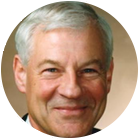

# Professor-Research-Quick-Insights

A repository for quickly accessing research insights into professors' expertise across various universities and fields. Each section is organized by university, school, and field, with individual professor links to in-depth Q&A summaries.

---

## Universities

### [Stanford](https://www.stanford.edu/)

#### [Mechanical Engineering](https://me.stanford.edu/)

- **Field**: Unknown

  <table>
    <tr>
      <td align="center">
        <a href="research-quickview/stanford/me/matthew-edwards/research-overview.md">
           
          <b>Matthew Edwards</b>
        </a>
        
超快激光控制、等离子体光学、粒子加速技术

      </td>
      <td align="center">
        <a href="research-quickview/stanford/me/kenneth-goodson/research-overview.md">
           
          <b>Kenneth Goodson</b>
        </a>
        
微尺度散热、液气双相冷却、高热通量管理

      </td>
      <td align="center">
        <a href="research-quickview/stanford/me/ronald-hanson/research-overview.md">
           
          <b>Ronald Hanson</b>
        </a>
        
燃烧动力学、高温光谱诊断、激波管技术（模拟高温高压气体行为）

      </td>
    </tr>
  </table>

#### [Electrical Engineering](https://ee.stanford.edu/)

- **Learn about Professor** Stanford EE website->People->Faculty->Areas

- **Field**: Nanotechnology, nanofabrication, materials, advanced packaging and manufacturing technologies

<table>
  <tr>
    <td align="center">
      <a href="research-quickview/stanford/ee/joonhee-choi/research-overview.md">
         
        <b>Joonhee Choi</b>
      </a>
      
光子学、量子科学与工程

    </td>
    <td align="center">
      <a href="research-quickview/stanford/ee/srabanti-chowdhury/research-overview.md">
         
        <b>Srabanti Chowdhury</b>
      </a>
      
纳米技术、集成电路与系统

    </td>
    <td align="center">
      <a href="research-quickview/stanford/ee/daniel-congreve/research-overview.md">
         
        <b>Daniel Congreve</b>
      </a>
      
光子学、能源与可持续性

    </td>
    <td align="center">
      <a href="research-quickview/stanford/ee/jonathan-fan/research-overview.md">
         
        <b>Jonathan Fan</b>
      </a>
      
纳米技术、量子科学与工程

    </td>
    <td align="center">
      <a href="research-quickview/stanford/ee/siddharth-krishnan/research-overview.md">
         
        <b>Siddharth Krishnan</b>
      </a>
      
生物医学设备、传感器和系统

    </td>
  </tr>
  <tr>
    <td align="center">
      <a href="research-quickview/stanford/ee/piero-pianetta/research-overview.md">
         
        <b>Piero A. Pianetta</b>
      </a>
      
纳米技术、集成电路与系统

    </td>
    <td align="center">
      <a href="research-quickview/stanford/ee/james-plummer/research-overview.md">
         
        <b>James D. Plummer</b>
      </a>
      
纳米技术、能源与可持续性

    </td>
    <td align="center">
      <a href="research-quickview/stanford/ee/eric-pop/research-overview.md">
         
        <b>Eric Pop</b>
      </a>
      
纳米尺度热管理、相变存储器、二维材料纳米电子器件

    </td>
    <td align="center">
      <a href="research-quickview/stanford/ee/juan-rivas/research-overview.md">
         
        <b>Juan Rivas</b>
      </a>
      
纳米技术、能源与可持续性

    </td>
    <td align="center">
      <a href="research-quickview/stanford/ee/krishna-saraswat/research-overview.md">
         
        <b>Krishna Saraswat</b>
      </a>
      
纳米技术、集成电路与系统

    </td>
  </tr>
  <tr>
    <td align="center">
      <a href="research-quickview/stanford/ee/debbie-senesky/research-overview.md">
         
        <b>Debbie Senesky</b>
      </a>
      
环境传感器、嵌入式系统

    </td>
    <td align="center">
      <a href="research-quickview/stanford/ee/jelena-vuckovic/research-overview.md">
         
        <b>Jelena Vuckovic</b>
      </a>
      
光子学、量子科学与工程

    </td>
    <td align="center">
      <a href="research-quickview/stanford/ee/shan-wang/research-overview.md">
         
        <b>Shan X. Wang</b>
      </a>
      
生物医学设备、集成电路与系统

    </td>
    <td align="center">
      <a href="research-quickview/stanford/ee/h-s-philip-wong/research-overview.md">
         
        <b>H.-S. Philip Wong</b>
      </a>
      
碳纳米管晶体管，铁电场效应晶体管，存算一体架构，三维堆叠存储

    </td>
  </tr>
</table>

### [UCLA](https://www.ucla.edu/)

#### [Electrical & Computer Engineering](https://www.ee.ucla.edu/ucla-ee-research/)

- **Field**: Semiconductors and Packaging Technology

  <table>
    <tr>
      <td align="center">
        <a href="research-quickview/ucla/ece/elaheh-ahmadi/research-overview.md">
           
          <b>Elaheh Ahmadi</b>
        </a>
        
芯片掺杂、分子束外延

      </td>
      <td align="center">
        <a href="research-quickview/ucla/ece/robert-candler/research-overview.md">
           
          <b>Robert Candler</b>
        </a>
        
纳米磁铁材料设计制造、生物医学应用

      </td>
      <td align="center">
        <a href="research-quickview/ucla/ece/frank-chang/research-overview.md">
           
          <b>Frank Chang</b>
        </a>
        
射频芯片设计与集成

      </td>
      <td align="center">
        <a href="research-quickview/ucla/ece/sam-emamjinejad/research-overview.md">
           
          <b>Sam Emamjinejad</b>
        </a>
        
可穿戴生物电子传感器、健康监测

      </td>
    </tr>
    <tr>
      <td align="center">
        <a href="research-quickview/ucla/ece/puneet-gupta/research-overview.md">
           
          <b>Puneet Gupta</b>
        </a>
        
芯片设计、光子计算和存储

      </td>
      <td align="center">
        <a href="research-quickview/ucla/ece/subramanian-iyer/research-overview.md">
           
          <b>Subramanian Iyer</b>
        </a>
        
芯片封装和光刻

      </td>
      <td align="center">
        <a href="research-quickview/ucla/ece/sudhakar-pamarti/research-overview.md">
           
          <b>Sudhakar Pamarti</b>
        </a>
        
低功耗芯片设计

      </td>
      <td align="center">
        <a href="research-quickview/ucla/ece/kang-wang/research-overview.md">
           
          <b>Kang L. Wang</b>
        </a>
        
量子材料和自旋电子器

      </td>
    </tr>
    <tr>
      <td align="center">
        <a href="research-quickview/ucla/ece/benjamin-williams/research-overview.md">
           
          <b>Benjamin Williams</b>
        </a>
        
太赫兹，量子级联激光器，超表面激光器

      </td>
      <td align="center">
        <a href="research-quickview/ucla/ece/chee-wei-wong/research-overview.md">
           
          <b>Chee Wei Wong</b>
        </a>
        
频率梳，微腔光子器件，量子通信

      </td>
      <td align="center">
        <a href="research-quickview/ucla/ece/jason-woo/research-overview.md">
           
          <b>Jason Woo</b>
        </a>
        
疑似退休

      </td>
      <td align="center">
        <a href="research-quickview/ucla/ece/ken-yang/research-overview.md">
           
          <b>C. K. "Ken" Yang</b>
        </a>
        
无课题组网站

      </td>
    </tr>
    <tr>
      <td align="center">
        <a href="research-quickview/ucla/ece/mona-jarrahi/research-overview.md">
           
          <b>Mona Jarrahi</b>
        </a>
        
太赫兹成像、光学处理、光子计算

      </td>
    </tr>
  </table>
